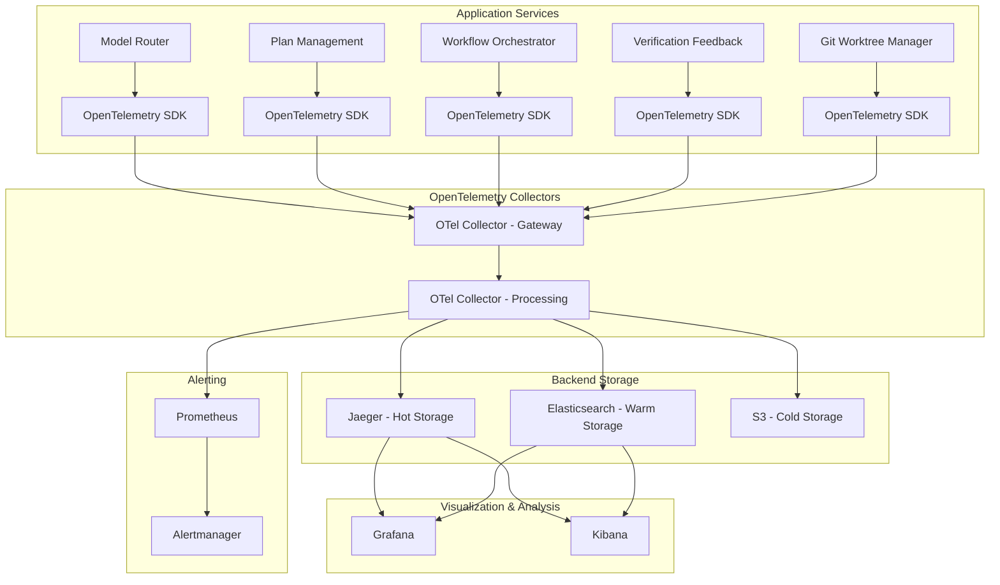

# Distributed Tracing Architecture for MCP System
## OpenTelemetry Implementation Strategy

---

## Executive Summary

This document outlines the comprehensive distributed tracing architecture for the MCP (Multimodal Content Processor) system using OpenTelemetry. The implementation will provide end-to-end observability across all services, enabling detailed performance analysis, troubleshooting, and business insights.

---

## 1. Architecture Overview

### 1.1 OpenTelemetry Components



### 1.2 Deployment Strategy

#### Deployment Modes
- **Development**: Single collector instance with in-memory storage
- **Staging**: Multi-collector setup with persistent storage
- **Production**: High-availability collector cluster with multi-tier storage

#### Scaling Considerations
- **Horizontal Scaling**: Collector instances can be scaled based on trace volume
- **Load Balancing**: Traces distributed across multiple collectors
- **High Availability**: Redundant collectors with automatic failover

---

## 2. OpenTelemetry Collector Configuration

### 2.1 Gateway Collector Configuration

```yaml
# otel-collector-gateway.yaml
receivers:
  otlp:
    protocols:
      grpc:
        endpoint: 0.0.0.0:4317
      http:
        endpoint: 0.0.0.0:4318
  
  jaeger:
    protocols:
      thrift_compact:
        endpoint: 0.0.0.0:6831
      thrift_binary:
        endpoint: 0.0.0.0:6832
      thrift_http:
        endpoint: 0.0.0.0:14268

processors:
  batch:
    timeout: 1s
    send_batch_size: 1024
  
  memory_limiter:
    check_interval: 1s
    limit_mib: 512
  
  resource:
    attributes:
      - key: environment
        value: production
        from_attribute: ENVIRONMENT
      - key: cluster
        value: mcp-prod
        from_attribute: CLUSTER_NAME

exporters:
  otlp:
    endpoint: otel-collector-processing:4317
    tls:
      insecure: true

service:
  pipelines:
    traces:
      receivers: [otlp, jaeger]
      processors: [memory_limiter, batch, resource]
      exporters: [otlp]
```

### 2.2 Processing Collector Configuration

```yaml
# otel-collector-processing.yaml
receivers:
  otlp:
    protocols:
      grpc:
        endpoint: 0.0.0.0:4317

processors:
  batch:
    timeout: 5s
    send_batch_size: 4096
  
  tail_sampling:
    policies:
      - name: error-policy
        type: status_code
        status_code:
          status_codes: [ERROR]
      - name: latency-policy
        type: latency
        latency:
          threshold_ms: 1000
      - name: probabilistic-policy
        type: probabilistic
        probabilistic:
          sampling_percentage: 10
  
  attributes:
    actions:
      - key: service.namespace
        value: mcp-system
        action: upsert
      - key: deployment.environment
        value: production
        action: upsert

exporters:
  jaeger:
    endpoint: jaeger-collector:14250
    tls:
      insecure: true
  
  elasticsearch:
    endpoints: [http://elasticsearch:9200]
    index: mcp-traces
    pipeline: mcp-traces-pipeline
  
  debug:
    verbosity: detailed

service:
  pipelines:
    traces:
      receivers: [otlp]
      processors: [batch, tail_sampling, attributes]
      exporters: [jaeger, elasticsearch, debug]
```

---

## 3. Auto-Instrumentation Strategy

### 3.1 Python Services Auto-Instrumentation

#### Dockerfile Configuration
```dockerfile
# Python auto-instrumentation
FROM python:3.11-slim

# Install OpenTelemetry auto-instrumentation
RUN pip install opentelemetry-distro \
    opentelemetry-instrumentation-requests \
    opentelemetry-instrumentation-sqlalchemy \
    opentelemetry-instrumentation-redis \
    opentelemetry-instrumentation-fastapi \
    opentelemetry-instrumentation-httpx \
    opentelemetry-exporter-otlp

# Set environment variables for auto-instrumentation
ENV OTEL_PYTHON_LOG_CORRELATION=true
ENV OTEL_PYTHON_LOGGING_AUTO_INSTRUMENTATION_ENABLED=true
ENV OTEL_RESOURCE_ATTRIBUTES=service.name=${SERVICE_NAME},service.version=${SERVICE_VERSION}
ENV OTEL_EXPORTER_OTLP_ENDPOINT=http://otel-collector-gateway:4317
ENV OTEL_TRACES_SAMPLER=parentbased_traceidratio
ENV OTEL_TRACES_SAMPLER_ARG=0.1

# Auto-instrument the application
CMD ["opentelemetry-instrument", "python", "app.py"]
```

#### Environment Configuration
```yaml
# environment-variables.yaml
environment:
  OTEL_SERVICE_NAME: "model-router"
  OTEL_SERVICE_VERSION: "1.0.0"
  OTEL_RESOURCE_ATTRIBUTES: "service.namespace=mcp-system,deployment.environment=production"
  OTEL_EXPORTER_OTLP_ENDPOINT: "http://otel-collector-gateway:4317"
  OTEL_EXPORTER_OTLP_PROTOCOL: "grpc"
  OTEL_TRACES_SAMPLER: "parentbased_traceidratio"
  OTEL_TRACES_SAMPLER_ARG: "0.1"
  OTEL_PYTHON_LOG_CORRELATION: "true"
  OTEL_PYTHON_LOGGING_AUTO_INSTRUMENTATION_ENABLED: "true"
  OTEL_PYTHON_EXCLUDED_URLS: "localhost,127.0.0.1"
```

### 3.2 JavaScript/Node.js Services Auto-Instrumentation

#### Dockerfile Configuration
```dockerfile
# Node.js auto-instrumentation
FROM node:18-alpine

# Install OpenTelemetry auto-instrumentation
RUN npm install @opentelemetry/auto-instrumentations-node \
    @opentelemetry/exporter-trace-otlp-grpc \
    @opentelemetry/instrumentation-http \
    @opentelemetry/instrumentation-express \
    @opentelemetry/instrumentation-redis \
    @opentelemetry/instrumentation-pg

# Set environment variables
ENV NODE_OPTIONS="--require @opentelemetry/auto-instrumentations-node"
ENV OTEL_NODE_RESOURCE_DETECTORS="env,host,os"
ENV OTEL_SERVICE_NAME="frontend"
ENV OTEL_RESOURCE_ATTRIBUTES="service.namespace=mcp-system,deployment.environment=production"
ENV OTEL_EXPORTER_OTLP_ENDPOINT="http://otel-collector-gateway:4317"
ENV OTEL_TRACES_SAMPLER="parentbased_traceidratio"
ENV OTEL_TRACES_SAMPLER_ARG="0.1"

CMD ["node", "app.js"]
```

---

## 4. Custom Instrumentation Patterns

### 4.1 MCP-Specific Trace Attributes

```python
# Python custom instrumentation example
from opentelemetry import trace
from opentelemetry.trace import Status, StatusCode

tracer = trace.get_tracer(__name__)

class ModelRouterTracer:
    @staticmethod
    def trace_model_routing(model_type: str, prompt: str, response_time: float):
        with tracer.start_as_current_span(
            "model_routing",
            attributes={
                "mcp.model_type": model_type,
                "mcp.prompt_length": len(prompt),
                "mcp.response_time_ms": response_time,
                "mcp.operation": "model_inference"
            }
        ) as span:
            try:
                # Model routing logic here
                result = route_model(model_type, prompt)
                
                span.set_attributes({
                    "mcp.model_success": True,
                    "mcp.model_response_length": len(result.get('response', '')),
                    "mcp.model_tokens_used": result.get('tokens_used', 0)
                })
                
                return result
            except Exception as e:
                span.set_status(Status(StatusCode.ERROR, str(e)))
                span.record_exception(e)
                raise
```

### 4.2 Workflow Orchestration Tracing

```python
# Workflow tracing example
class WorkflowTracer:
    @staticmethod
    def trace_workflow_execution(workflow_id: str, workflow_type: str, steps: List[str]):
        with tracer.start_as_current_span(
            "workflow_execution",
            attributes={
                "mcp.workflow_id": workflow_id,
                "mcp.workflow_type": workflow_type,
                "mcp.workflow_steps": len(steps),
                "mcp.operation": "workflow_orchestration"
            }
        ) as workflow_span:
            
            for step_name in steps:
                with tracer.start_as_current_span(
                    f"workflow_step_{step_name}",
                    parent=workflow_span.context
                ) as step_span:
                    try:
                        # Execute workflow step
                        result = execute_workflow_step(step_name, workflow_id)
                        
                        step_span.set_attributes({
                            "mcp.step_name": step_name,
                            "mcp.step_success": True,
                            "mcp.step_duration_ms": result.get('duration_ms', 0)
                        })
                        
                    except Exception as e:
                        step_span.set_status(Status(StatusCode.ERROR, str(e)))
                        step_span.record_exception(e)
                        raise
```

---

## 5. Trace Sampling Strategies

### 5.1 Adaptive Sampling Configuration

```yaml
# sampling-strategies.yaml
sampling_strategies:
  default_strategy:
    type: "probabilistic"
    param: 0.1  # 10% sampling rate
    
  per_service_strategies:
    - service: "model-router"
      type: "probabilistic"
      param: 1.0  # 100% sampling for critical service
      
    - service: "workflow-orchestrator"
      type: "rate_limiting"
      max_traces_per_second: 100
      
    - service: "frontend"
      type: "adaptive"
      target_samples_per_second: 50
      delta: 0.1
      
  per_operation_strategies:
    - operation: "health_check"
      type: "probabilistic"
      param: 0.01  # 1% sampling for health checks
      
    - operation: "model_inference"
      type: "probabilistic"
      param: 1.0  # 100% sampling for business-critical operations
      
    - operation: "workflow_execution"
      type: "latency"
      latency_threshold_ms: 5000  # Sample all traces > 5s
```

### 5.2 Tail Sampling Policies

```yaml
# tail-sampling.yaml
tail_sampling:
  policies:
    - name: error-policy
      type: status_code
      status_code:
        status_codes: [ERROR]
        
    - name: latency-policy
      type: latency
      latency:
        threshold_ms: 1000
        
    - name: probabilistic-policy
      type: probabilistic
      probabilistic:
        sampling_percentage: 10
        
    - name: custom-attribute-policy
      type: and
      and:
        - type: string_attribute
          string_attribute:
            key: mcp.critical_operation
            values: ["true"]
        - type: probabilistic
          probabilistic:
            sampling_percentage: 100
```

---

## 6. Trace Correlation with Logs and Metrics

### 6.1 Log Correlation Configuration

```python
# Enhanced logging with trace correlation
import structlog
from opentelemetry import trace

# Configure structured logging with trace correlation
structlog.configure(
    processors=[
        structlog.stdlib.filter_by_level,
        structlog.stdlib.add_logger_name,
        structlog.stdlib.add_log_level,
        structlog.stdlib.PositionalArgumentsFormatter(),
        structlog.processors.TimeStamper(fmt="iso"),
        structlog.processors.StackInfoRenderer(),
        structlog.processors.format_exc_info,
        structlog.processors.UnicodeDecoder(),
        # Add trace correlation
        structlog.processors.add_log_level,
        lambda logger, method_name, event_dict: {
            **event_dict,
            "trace_id": trace.get_current_span().get_span_context().trace_id,
            "span_id": trace.get_current_span().get_span_context().span_id,
            "trace_flags": trace.get_current_span().get_span_context().trace_flags,
        },
        structlog.processors.JSONRenderer()
    ],
    context_class=dict,
    logger_factory=structlog.stdlib.LoggerFactory(),
    wrapper_class=structlog.stdlib.BoundLogger,
    cache_logger_on_first_use=True,
)
```

### 6.2 Metrics Correlation

```python
# Metrics with trace correlation
from prometheus_client import Counter, Histogram, Gauge
from opentelemetry import trace

# Business metrics with trace context
model_inference_counter = Counter(
    'mcp_model_inference_total',
    'Total model inference requests',
    ['model_type', 'trace_id', 'service_name']
)

model_inference_duration = Histogram(
    'mcp_model_inference_duration_seconds',
    'Model inference duration',
    ['model_type', 'trace_id', 'service_name'],
    buckets=[0.1, 0.5, 1.0, 2.0, 5.0, 10.0, 30.0]
)

def record_model_inference(model_type: str, duration: float):
    current_span = trace.get_current_span()
    trace_id = current_span.get_span_context().trace_id if current_span else "unknown"
    
    model_inference_counter.labels(
        model_type=model_type,
        trace_id=trace_id,
        service_name="model-router"
    ).inc()
    
    model_inference_duration.labels(
        model_type=model_type,
        trace_id=trace_id,
        service_name="model-router"
    ).observe(duration)
```

---

## 7. Deployment Architecture

### 7.1 Kubernetes Deployment

```yaml
# otel-collector-gateway-deployment.yaml
apiVersion: apps/v1
kind: Deployment
metadata:
  name: otel-collector-gateway
  namespace: mcp-system
spec:
  replicas: 3
  selector:
    matchLabels:
      app: otel-collector-gateway
  template:
    metadata:
      labels:
        app: otel-collector-gateway
    spec:
      containers:
      - name: otel-collector
        image: otel/opentelemetry-collector-contrib:0.87.0
        args:
        - --config=/conf/otel-collector-config.yaml
        ports:
        - containerPort: 4317
          name: otlp-grpc
        - containerPort: 4318
          name: otlp-http
        - containerPort: 6831
          name: jaeger-compact
        - containerPort: 6832
          name: jaeger-binary
        - containerPort: 14268
          name: jaeger-http
        volumeMounts:
        - name: config-volume
          mountPath: /conf
        resources:
          limits:
            cpu: 500m
            memory: 512Mi
          requests:
            cpu: 100m
            memory: 128Mi
      volumes:
      - name: config-volume
        configMap:
          name: otel-collector-gateway-config
```

### 7.2 Service Configuration

```yaml
# otel-collector-service.yaml
apiVersion: v1
kind: Service
metadata:
  name: otel-collector-gateway
  namespace: mcp-system
  labels:
    app: otel-collector-gateway
spec:
  type: ClusterIP
  ports:
  - name: otlp-grpc
    port: 4317
    targetPort: 4317
    protocol: TCP
  - name: otlp-http
    port: 4318
    targetPort: 4318
    protocol: TCP
  - name: jaeger-compact
    port: 6831
    targetPort: 6831
    protocol: UDP
  - name: jaeger-binary
    port: 6832
    targetPort: 6832
    protocol: UDP
  - name: jaeger-http
    port: 14268
    targetPort: 14268
    protocol: TCP
  selector:
    app: otel-collector-gateway
```

---

## 8. Monitoring and Alerting

### 8.1 Trace-Based Metrics

```yaml
# trace-metrics-alerts.yml
groups:
  - name: trace_metrics_alerts
    rules:
      - alert: HighTraceErrorRate
        expr: rate(traces_span_metrics_dropped_spans_total[5m]) > 10
        for: 2m
        labels:
          severity: warning
          category: tracing
        annotations:
          summary: "High trace error rate detected"
          description: "Trace error rate is {{ $value }} spans/sec"
          runbook_url: "https://docs.example.com/runbooks/trace-errors"
          
      - alert: TraceLatencyHigh
        expr: histogram_quantile(0.95, rate(traces_span_metrics_latency_bucket[5m])) > 5000
        for: 5m
        labels:
          severity: warning
          category: tracing
        annotations:
          summary: "High trace latency detected"
          description: "95th percentile trace latency is {{ $value }}ms"
          runbook_url: "https://docs.example.com/runbooks/trace-latency"
          
      - alert: TraceSamplingRateLow
        expr: rate(traces_span_metrics_sampled_spans_total[5m]) / rate(traces_span_metrics_received_spans_total[5m]) * 100 < 5
        for: 10m
        labels:
          severity: info
          category: tracing
        annotations:
          summary: "Low trace sampling rate detected"
          description: "Trace sampling rate is {{ $value }}%"
          runbook_url: "https://docs.example.com/runbooks/trace-sampling"
```

---

## 9. Security Considerations

### 9.1 Data Security

- **Encryption**: All trace data in transit using TLS
- **Authentication**: Mutual TLS between collectors and backends
- **Authorization**: Role-based access control for trace data
- **Data Masking**: Automatic masking of sensitive data in traces

### 9.2 Privacy Protection

- **PII Detection**: Automatic detection and masking of personally identifiable information
- **Data Retention**: Configurable retention policies for trace data
- **Compliance**: GDPR, HIPAA, and other regulatory compliance

---

## 10. Implementation Roadmap

### Phase 1: Foundation (Weeks 1-2)
- Deploy OpenTelemetry collectors
- Implement auto-instrumentation for core services
- Set up Jaeger backend
- Configure basic sampling strategies

### Phase 2: Enhancement (Weeks 3-4)
- Implement custom instrumentation for MCP operations
- Set up trace correlation with logs and metrics
- Create Grafana dashboards for trace visualization
- Implement trace-based alerting

### Phase 3: Optimization (Weeks 5-6)
- Optimize sampling strategies
- Implement advanced analytics
- Set up automated testing for tracing
- Create comprehensive documentation

### Phase 4: Production Readiness (Weeks 7-8)
- High-availability deployment
- Performance optimization
- Security hardening
- GitOps workflow implementation

---

## 11. Best Practices

### 11.1 Instrumentation Best Practices
- Use semantic conventions for span naming
- Include relevant attributes in all spans
- Implement proper error handling and status codes
- Use context propagation for distributed transactions

### 11.2 Performance Best Practices
- Implement appropriate sampling strategies
- Monitor collector resource usage
- Optimize batch processing configurations
- Use appropriate storage tiers based on access patterns

### 11.3 Operational Best Practices
- Implement comprehensive monitoring of the tracing system
- Create detailed runbooks for common issues
- Regular performance reviews and optimizations
- Continuous improvement based on usage patterns