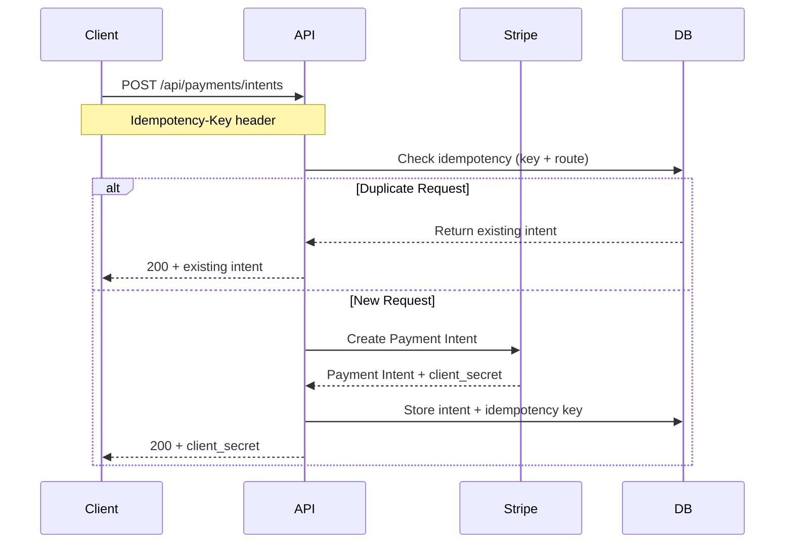
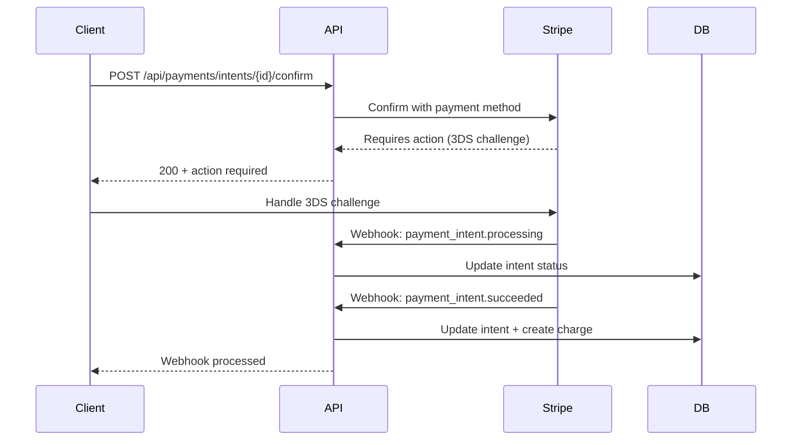
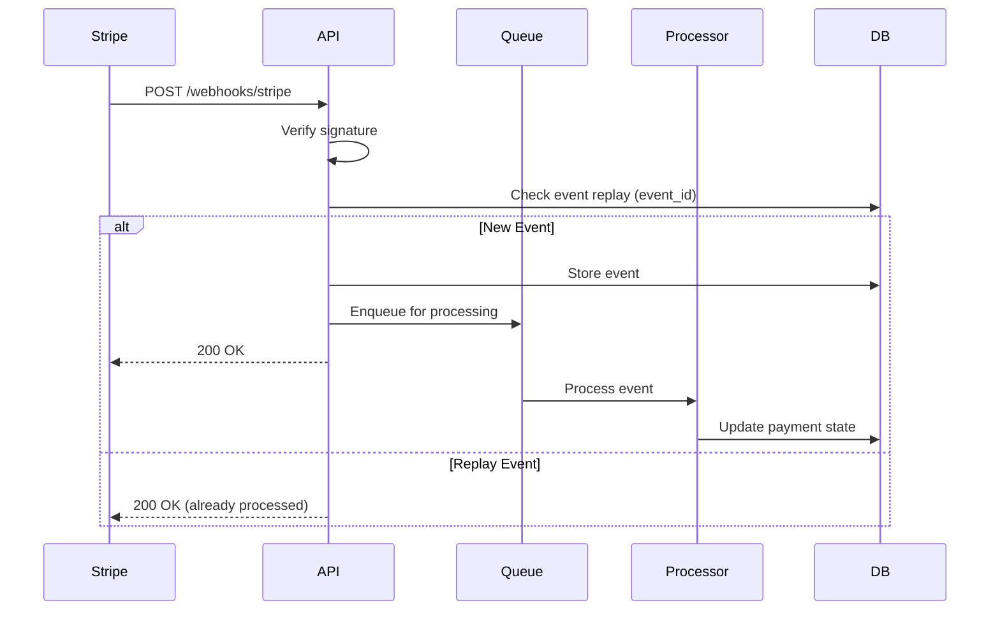

# Payment Processing Architecture

## Overview

This document outlines the production-grade payment processing system designed for global deployment with enterprise security guardrails. The system supports multiple payment methods, Strong Customer Authentication (SCA), and maintains PCI compliance through SAQ A scope.

## Architecture Principles

### Security & Compliance
- **PCI Scope**: SAQ A - No PAN handling on our servers
- **Tokenization**: All card data handled via Stripe Elements/Checkout
- **Encryption**: Secrets encrypted at rest, minimal privilege access
- **Audit Trail**: Complete payment lifecycle logging with PII protection

### Global Readiness
- **Multi-currency**: Pricing in minor units with currency-specific rounding
- **SCA Compliance**: 3DS2 flows for EU/UK, regional mandate requirements
- **Localization**: Currency display rules, mandate text in local languages
- **Time Zones**: UTC timestamps with local display conversion

### Reliability & Observability
- **Idempotency**: All operations idempotent via Stripe + local deduplication
- **Webhook Security**: Signature verification + replay protection
- **Monitoring**: Payment metrics, failure alerts, performance dashboards
- **Rollback**: Code, config, and pricing rollback capabilities

## System Components

### 1. Payment Gateways
- **Stripe Gateway**: Production payment processing with SCA/3DS2
- **Mock Gateway**: Development/testing with full Stripe response simulation
- **Provider Switch**: Environment-based routing via `PROVIDER` env var

### 2. Data Layer
- **Core Tables**: customers, payment_methods, payment_intents, charges, refunds
- **Audit Tables**: webhook_events, audit_logs, mandates
- **State Management**: Payment intent lifecycle with status transitions

### 3. API Layer
- **REST Endpoints**: Intent creation, capture, refund, status
- **Webhook Handler**: Secure event processing with signature verification
- **Idempotency**: Request deduplication via headers + database constraints

### 4. Frontend Integration
- **Stripe Elements**: Inline card collection with 3DS challenge handling
- **Payment Request Button**: Apple Pay/Google Pay with eligibility checks
- **Stripe Checkout**: Redirect flow for simplified integration

## Payment Flows

### 1. Payment Intent Creation Flow



### 2. 3DS Challenge Flow



### 3. Webhook Processing Flow



## Data Model

### Core Entities

#### Payment Intent
```sql
CREATE TABLE payment_intents (
    id UUID PRIMARY KEY DEFAULT gen_random_uuid(),
    provider_id VARCHAR(255) NOT NULL, -- Stripe PI ID
    customer_id UUID NOT NULL REFERENCES customers(id),
    amount_minor INTEGER NOT NULL, -- Amount in minor units
    currency VARCHAR(3) NOT NULL,
    status VARCHAR(50) NOT NULL, -- requires_payment_method, requires_confirmation, requires_action, processing, requires_capture, canceled, succeeded
    capture_method VARCHAR(20) NOT NULL, -- automatic, manual
    confirmation_method VARCHAR(20) NOT NULL, -- automatic, manual
    three_ds_status VARCHAR(50), -- succeeded, failed, requires_action
    idempotency_key VARCHAR(255) NOT NULL,
    metadata JSONB,
    created_at TIMESTAMP WITH TIME ZONE DEFAULT NOW(),
    updated_at TIMESTAMP WITH TIME ZONE DEFAULT NOW()
);
```

#### Payment Methods
```sql
CREATE TABLE payment_methods (
    id UUID PRIMARY KEY DEFAULT gen_random_uuid(),
    provider VARCHAR(20) NOT NULL, -- stripe, mock
    pm_token VARCHAR(255) NOT NULL, -- Stripe PM ID
    brand VARCHAR(50), -- visa, mastercard, etc.
    last4 VARCHAR(4),
    exp_month INTEGER,
    exp_year INTEGER,
    customer_id UUID NOT NULL REFERENCES customers(id),
    mandate_id UUID REFERENCES mandates(id),
    created_at TIMESTAMP WITH TIME ZONE DEFAULT NOW()
);
```

#### Webhook Events
```sql
CREATE TABLE webhook_events (
    id UUID PRIMARY KEY DEFAULT gen_random_uuid(),
    provider VARCHAR(20) NOT NULL,
    event_id VARCHAR(255) NOT NULL UNIQUE,
    type VARCHAR(100) NOT NULL,
    payload JSONB NOT NULL,
    processed_at TIMESTAMP WITH TIME ZONE,
    processing_status VARCHAR(20) DEFAULT 'pending',
    error TEXT,
    created_at TIMESTAMP WITH TIME ZONE DEFAULT NOW()
);
```

### State Transitions

#### Payment Intent States
```
requires_payment_method → requires_confirmation → requires_action → processing → succeeded
                                    ↓
                              requires_capture → succeeded
                                    ↓
                              canceled
```

#### Charge States
```
pending → succeeded
    ↓
failed
```

#### Refund States
```
pending → succeeded
    ↓
failed
```

## SCA & Mandate Requirements

### Strong Customer Authentication (SCA)
- **EU/UK**: 3DS2 mandatory for most transactions
- **US**: 3DS optional but recommended for fraud reduction
- **Fallback**: Authentication failure → payment failure (no bypass)

### Mandate Requirements

#### SEPA Direct Debit
- **Consent Text**: Must include amount, frequency, start date
- **Retention**: 8 years minimum
- **Language**: Local language of customer's country

#### ACH Debit
- **Authorization**: Written or electronic consent
- **Retention**: 2 years minimum
- **Notification**: Advance notice of debits

### Regional Compliance
- **EU**: PSD2 compliance, 3DS2 mandatory
- **UK**: Post-Brexit PSD2 equivalent
- **US**: NACHA rules for ACH, PCI DSS
- **Canada**: PIPEDA compliance, local payment regulations

## Design Rationale

### Stripe Elements vs Checkout

**Elements (Chosen for Primary Flow)**
- ✅ Full control over UI/UX
- ✅ Better integration with existing design system
- ✅ Real-time validation and error handling
- ✅ Custom 3DS challenge handling
- ❌ More development effort
- ❌ Requires custom error handling

**Checkout (Secondary Option)**
- ✅ Faster implementation
- ✅ Stripe handles 3DS automatically
- ✅ Built-in compliance features
- ❌ Less control over appearance
- ❌ Redirect flow (potential UX friction)

**Decision**: Elements for primary flow, Checkout as fallback option

### Payment Request Button (Apple Pay/Google Pay)

**When to Use**
- ✅ Customer has supported device/browser
- ✅ Transaction amount > $0.50 (Apple Pay minimum)
- ✅ Supported currencies (USD, EUR, GBP, etc.)
- ✅ Customer has payment methods set up

**Fallback Strategy**
- Elements form when PRB unavailable
- Graceful degradation with feature detection
- Mock verification in development

### Idempotency Strategy

**Dual Layer Protection**
1. **Stripe Level**: Idempotency-Key header for API calls
2. **Application Level**: Database constraint on (key, route) combination

**Benefits**
- Prevents duplicate charges on network retries
- Handles client-side retry logic safely
- Maintains consistency across distributed systems

### Webhook Processing

**Asynchronous + Queue**
- **Why**: Prevents webhook timeout, enables retry logic
- **Implementation**: Redis queue with exponential backoff
- **Monitoring**: Event processing latency, failure rates

**Replay Protection**
- **Why**: Webhooks can be sent multiple times
- **Implementation**: Unique constraint on event_id
- **Benefits**: Idempotent processing, audit trail integrity

## Security Considerations

### PCI Compliance
- **SAQ A Route**: No card data on our servers
- **Tokenization**: All PANs replaced with Stripe tokens
- **Audit**: Regular security assessments, penetration testing

### Secret Management
- **Environment Variables**: Pydantic validation, no hardcoded values
- **Key Rotation**: Automated rotation with zero-downtime
- **Access Control**: Minimal privilege, role-based access

### Rate Limiting
- **Endpoints**: Create intent, refund operations
- **Strategy**: Token bucket with IP + user limits
- **Monitoring**: Rate limit violations, potential abuse

## Monitoring & Observability

### Key Metrics
- **Authorization Rate**: Successful payments / total attempts
- **3DS Challenge Rate**: 3DS required / total payments
- **Time to Payment**: Intent creation → success
- **Refund Rate**: Refunds / successful payments
- **Failure Reasons**: Top N failure categories

### Dashboards
- **Payment Health**: Real-time status, error rates
- **Performance**: Response times, throughput
- **Business**: Revenue by currency, payment method distribution

### Alerts
- **Payment Failures**: Threshold-based alerts on failure surges
- **Service Health**: Health check failures, response time degradation
- **Security**: Unusual webhook patterns, authentication failures

## Rollback Strategy

### Code Rollback
- **Git Tags**: Versioned releases with semantic versioning
- **Docker Images**: Immutable tags, rollback to previous version
- **Database**: Forward-only migrations, no destructive changes

### Configuration Rollback
- **Environment Variables**: Version-controlled configs
- **Feature Flags**: Gradual rollout with kill switches
- **Monitoring**: A/B testing for configuration changes

### Pricing Rollback
- **Stripe Dashboard**: Immediate price rule updates
- **Database**: Price history tracking for audit
- **Notifications**: Customer communication for price changes

## Testing Strategy

### Unit Tests
- **Gateway Classes**: Mock Stripe responses, error scenarios
- **Service Layer**: Business logic, validation rules
- **Webhook Handler**: Signature verification, replay detection

### Integration Tests
- **Stripe Test Mode**: Real API calls with test cards
- **3DS Simulation**: Test card numbers for challenge flows
- **Webhook Verification**: End-to-end event processing

### End-to-End Tests
- **Playwright/Cypress**: Complete payment flows
- **Mock Gateway**: Development without Stripe keys
- **CI Pipeline**: Automated testing in GitHub Actions

## Deployment Considerations

### Environment Setup
- **Development**: Mock gateway, test data seeding
- **Staging**: Stripe test mode, production-like configuration
- **Production**: Stripe live mode, monitoring, alerting

### Feature Flags
- **apple_pay**: Apple Pay availability (default: true)
- **google_pay**: Google Pay availability (default: true)
- **sepa**: SEPA Direct Debit (default: true)
- **ach**: ACH Debit (default: true)
- **faster_payments**: UK Faster Payments (default: true)

### Health Checks
- **Readiness**: Database connectivity, Stripe API access
- **Liveness**: Payment endpoint responsiveness
- **Dependencies**: Redis queue, external service status
