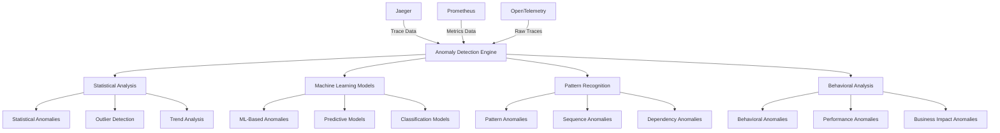

# Anomaly Detection Guide for Distributed Tracing

This document provides comprehensive guidance on implementing anomaly detection for distributed tracing data in the MCP system.

---

## 1. Overview

### 1.1 Anomaly Detection Purpose

Anomaly detection enables identification of unusual patterns and behaviors in distributed tracing data, providing:

- **Early Problem Detection**: Identify issues before they impact users
- **Pattern Recognition**: Detect unusual patterns in trace data
- **Behavioral Analysis**: Understand normal vs. abnormal service behavior
- **Predictive Alerting**: Predict potential issues based on historical patterns
- **Automated Root Cause**: Automatically identify potential root causes

### 1.2 Anomaly Detection Architecture



---

## 2. Statistical Anomaly Detection

### 2.1 Statistical Methods

#### Z-Score Based Anomaly Detection

```yaml
# statistical-anomaly-detection.yml
groups:
  - name: statistical_anomaly_detection
    interval: 30s
    rules:
      # Latency Z-Score Anomaly
      - alert: LatencyZScoreAnomaly
        expr: abs(histogram_quantile(0.95, sum(rate(mcp_request_duration_seconds_bucket[5m])) by (le, service_name)) - avg(histogram_quantile(0.95, sum(rate(mcp_request_duration_seconds_bucket[1h])) by (le, service_name)))) / stddev(histogram_quantile(0.95, sum(rate(mcp_request_duration_seconds_bucket[1h])) by (le, service_name))) > 3.0
        for: 5m
        labels:
          severity: warning
          category: anomaly
          detection_method: z_score
          metric_type: latency
        annotations:
          summary: "Latency Z-score anomaly detected in {{ $labels.service_name }}"
          description: "P95 latency Z-score is {{ $value }}, indicating a statistical anomaly"
          runbook_url: "https://docs.example.com/runbooks/latency-z-score-anomaly"
          dashboard_url: "https://grafana.example.com/d/mcp-trace-performance"
          
      # Throughput Z-Score Anomaly
      - alert: ThroughputZScoreAnomaly
        expr: abs(sum(rate(mcp_requests_total[5m])) by (service_name) - avg(sum(rate(mcp_requests_total[1h])) by (service_name))) / stddev(sum(rate(mcp_requests_total[1h])) by (service_name)) > 3.0
        for: 5m
        labels:
          severity: warning
          category: anomaly
          detection_method: z_score
          metric_type: throughput
        annotations:
          summary: "Throughput Z-score anomaly detected in {{ $labels.service_name }}"
          description: "Throughput Z-score is {{ $value }}, indicating a statistical anomaly"
          runbook_url: "https://docs.example.com/runbooks/throughput-z-score-anomaly"
          dashboard_url: "https://grafana.example.com/d/mcp-trace-performance"
          
      # Error Rate Z-Score Anomaly
      - alert: ErrorRateZScoreAnomaly
        expr: abs((sum(rate(mcp_errors_total[5m])) by (service_name) / sum(rate(mcp_requests_total[5m])) by (service_name)) - avg((sum(rate(mcp_errors_total[1h])) by (service_name) / sum(rate(mcp_requests_total[1h])) by (service_name)))) / stddev((sum(rate(mcp_errors_total[1h])) by (service_name) / sum(rate(mcp_requests_total[1h])) by (service_name))) > 3.0
        for: 5m
        labels:
          severity: warning
          category: anomaly
          detection_method: z_score
          metric_type: error_rate
        annotations:
          summary: "Error rate Z-score anomaly detected in {{ $labels.service_name }}"
          description: "Error rate Z-score is {{ $value }}, indicating a statistical anomaly"
          runbook_url: "https://docs.example.com/runbooks/error-rate-z-score-anomaly"
          dashboard_url: "https://grafana.example.com/d/mcp-trace-performance"
```

#### Moving Average Based Anomaly Detection

```yaml
# moving-average-anomaly-detection.yml
groups:
  - name: moving_average_anomaly_detection
    interval: 30s
    rules:
      # Latency Moving Average Anomaly
      - alert: LatencyMovingAverageAnomaly
        expr: histogram_quantile(0.95, sum(rate(mcp_request_duration_seconds_bucket[5m])) by (le, service_name)) / avg_over_time(histogram_quantile(0.95, sum(rate(mcp_request_duration_seconds_bucket[1h])) by (le, service_name))[1h:]) > 2.0
        for: 5m
        labels:
          severity: warning
          category: anomaly
          detection_method: moving_average
          metric_type: latency
        annotations:
          summary: "Latency moving average anomaly detected in {{ $labels.service_name }}"
          description: "Current P95 latency is {{ $value }}x the 1-hour moving average"
          runbook_url: "https://docs.example.com/runbooks/latency-moving-average-anomaly"
          dashboard_url: "https://grafana.example.com/d/mcp-trace-performance"
          
      # Throughput Moving Average Anomaly
      - alert: ThroughputMovingAverageAnomaly
        expr: sum(rate(mcp_requests_total[5m])) by (service_name) / avg_over_time(sum(rate(mcp_requests_total[1h])) by (service_name)[1h:]) > 2.0
        for: 5m
        labels:
          severity: warning
          category: anomaly
          detection_method: moving_average
          metric_type: throughput
        annotations:
          summary: "Throughput moving average anomaly detected in {{ $labels.service_name }}"
          description: "Current throughput is {{ $value }}x the 1-hour moving average"
          runbook_url: "https://docs.example.com/runbooks/throughput-moving-average-anomaly"
          dashboard_url: "https://grafana.example.com/d/mcp-trace-performance"
          
      # Error Rate Moving Average Anomaly
      - alert: ErrorRateMovingAverageAnomaly
        expr: (sum(rate(mcp_errors_total[5m])) by (service_name) / sum(rate(mcp_requests_total[5m])) by (service_name)) / avg_over_time((sum(rate(mcp_errors_total[1h])) by (service_name) / sum(rate(mcp_requests_total[1h])) by (service_name))[1h:]) > 2.0
        for: 5m
        labels:
          severity: warning
          category: anomaly
          detection_method: moving_average
          metric_type: error_rate
        annotations:
          summary: "Error rate moving average anomaly detected in {{ $labels.service_name }}"
          description: "Current error rate is {{ $value }}x the 1-hour moving average"
          runbook_url: "https://docs.example.com/runbooks/error-rate-moving-average-anomaly"
          dashboard_url: "https://grafana.example.com/d/mcp-trace-performance"
```

#### Exponential Smoothing Based Anomaly Detection

```yaml
# exponential-smoothing-anomaly-detection.yml
groups:
  - name: exponential_smoothing_anomaly_detection
    interval: 30s
    rules:
      # Latency Exponential Smoothing Anomaly
      - alert: LatencyExponentialSmoothingAnomaly
        expr: abs(histogram_quantile(0.95, sum(rate(mcp_request_duration_seconds_bucket[5m])) by (le, service_name)) - predict_linear(histogram_quantile(0.95, sum(rate(mcp_request_duration_seconds_bucket[1h])) by (le, service_name))[1h], 3600)) / stddev_over_time(histogram_quantile(0.95, sum(rate(mcp_request_duration_seconds_bucket[1h])) by (le, service_name))[1h:]) > 2.0
        for: 5m
        labels:
          severity: warning
          category: anomaly
          detection_method: exponential_smoothing
          metric_type: latency
        annotations:
          summary: "Latency exponential smoothing anomaly detected in {{ $labels.service_name }}"
          description: "Current P95 latency deviates significantly from exponential smoothing prediction"
          runbook_url: "https://docs.example.com/runbooks/latency-exponential-smoothing-anomaly"
          dashboard_url: "https://grafana.example.com/d/mcp-trace-performance"
          
      # Throughput Exponential Smoothing Anomaly
      - alert: ThroughputExponentialSmoothingAnomaly
        expr: abs(sum(rate(mcp_requests_total[5m])) by (service_name) - predict_linear(sum(rate(mcp_requests_total[1h])) by (service_name)[1h], 3600)) / stddev_over_time(sum(rate(mcp_requests_total[1h])) by (service_name)[1h:]) > 2.0
        for: 5m
        labels:
          severity: warning
          category: anomaly
          detection_method: exponential_smoothing
          metric_type: throughput
        annotations:
          summary: "Throughput exponential smoothing anomaly detected in {{ $labels.service_name }}"
          description: "Current throughput deviates significantly from exponential smoothing prediction"
          runbook_url: "https://docs.example.com/runbooks/throughput-exponential-smoothing-anomaly"
          dashboard_url: "https://grafana.example.com/d/mcp-trace-performance"
```

---

## 3. Machine Learning Based Anomaly Detection

### 3.1 Predictive Models

```yaml
# ml-predictive-anomaly-detection.yml
groups:
  - name: ml_predictive_anomaly_detection
    interval: 30s
    rules:
      # Latency Prediction Anomaly
      - alert: LatencyPredictionAnomaly
        expr: abs(histogram_quantile(0.95, sum(rate(mcp_request_duration_seconds_bucket[5m])) by (le, service_name)) - predict_linear(histogram_quantile(0.95, sum(rate(mcp_request_duration_seconds_bucket[6h])) by (le, service_name))[6h], 3600)) / stddev_over_time(histogram_quantile(0.95, sum(rate(mcp_request_duration_seconds_bucket[6h])) by (le, service_name))[6h:]) > 2.5
        for: 5m
        labels:
          severity: warning
          category: anomaly
          detection_method: ml_prediction
          metric_type: latency
        annotations:
          summary: "Latency prediction anomaly detected in {{ $labels.service_name }}"
          description: "Current P95 latency deviates significantly from ML prediction"
          runbook_url: "https://docs.example.com/runbooks/latency-prediction-anomaly"
          dashboard_url: "https://grafana.example.com/d/mcp-trace-performance"
          
      # Throughput Prediction Anomaly
      - alert: ThroughputPredictionAnomaly
        expr: abs(sum(rate(mcp_requests_total[5m])) by (service_name) - predict_linear(sum(rate(mcp_requests_total[6h])) by (service_name)[6h], 3600)) / stddev_over_time(sum(rate(mcp_requests_total[6h])) by (service_name)[6h:]) > 2.5
        for: 5m
        labels:
          severity: warning
          category: anomaly
          detection_method: ml_prediction
          metric_type: throughput
        annotations:
          summary: "Throughput prediction anomaly detected in {{ $labels.service_name }}"
          description: "Current throughput deviates significantly from ML prediction"
          runbook_url: "https://docs.example.com/runbooks/throughput-prediction-anomaly"
          dashboard_url: "https://grafana.example.com/d/mcp-trace-performance"
          
      # Error Rate Prediction Anomaly
      - alert: ErrorRatePredictionAnomaly
        expr: abs((sum(rate(mcp_errors_total[5m])) by (service_name) / sum(rate(mcp_requests_total[5m])) by (service_name)) - predict_linear((sum(rate(mcp_errors_total[6h])) by (service_name) / sum(rate(mcp_requests_total[6h])) by (service_name))[6h], 3600)) / stddev_over_time((sum(rate(mcp_errors_total[6h])) by (service_name) / sum(rate(mcp_requests_total[6h])) by (service_name))[6h:]) > 2.5
        for: 5m
        labels:
          severity: warning
          category: anomaly
          detection_method: ml_prediction
          metric_type: error_rate
        annotations:
          summary: "Error rate prediction anomaly detected in {{ $labels.service_name }}"
          description: "Current error rate deviates significantly from ML prediction"
          runbook_url: "https://docs.example.com/runbooks/error-rate-prediction-anomaly"
          dashboard_url: "https://grafana.example.com/d/mcp-trace-performance"
```

### 3.2 Classification Models

```yaml
# ml-classification-anomaly-detection.yml
groups:
  - name: ml_classification_anomaly_detection
    interval: 30s
    rules:
      # Service Behavior Classification Anomaly
      - alert: ServiceBehaviorClassificationAnomaly
        expr: mcp_service_behavior_anomaly_score{service_name=~".+"} > 0.8
        for: 5m
        labels:
          severity: warning
          category: anomaly
          detection_method: ml_classification
          metric_type: behavior
        annotations:
          summary: "Service behavior classification anomaly detected in {{ $labels.service_name }}"
          description: "ML classification model detected anomalous behavior with score {{ $value }}"
          runbook_url: "https://docs.example.com/runbooks/service-behavior-classification-anomaly"
          dashboard_url: "https://grafana.example.com/d/mcp-trace-performance"
          
      # Trace Pattern Classification Anomaly
      - alert: TracePatternClassificationAnomaly
        expr: mcp_trace_pattern_anomaly_score{service_name=~".+"} > 0.7
        for: 5m
        labels:
          severity: warning
          category: anomaly
          detection_method: ml_classification
          metric_type: pattern
        annotations:
          summary: "Trace pattern classification anomaly detected in {{ $labels.service_name }}"
          description: "ML classification model detected anomalous trace pattern with score {{ $value }}"
          runbook_url: "https://docs.example.com/runbooks/trace-pattern-classification-anomaly"
          dashboard_url: "https://grafana.example.com/d/mcp-distributed-tracing"
          
      # Dependency Classification Anomaly
      - alert: DependencyClassificationAnomaly
        expr: mcp_dependency_anomaly_score{service_name=~".+", dependency_service_name=~".+"} > 0.75
        for: 5m
        labels:
          severity: warning
          category: anomaly
          detection_method: ml_classification
          metric_type: dependency
        annotations:
          summary: "Dependency classification anomaly detected between {{ $labels.service_name }} and {{ $labels.dependency_service_name }}"
          description: "ML classification model detected anomalous dependency with score {{ $value }}"
          runbook_url: "https://docs.example.com/runbooks/dependency-classification-anomaly"
          dashboard_url: "https://grafana.example.com/d/mcp-service-dependency"
```

### 3.3 Clustering Models

```yaml
# ml-clustering-anomaly-detection.yml
groups:
  - name: ml_clustering_anomaly_detection
    interval: 30s
    rules:
      # Service Clustering Anomaly
      - alert: ServiceClusteringAnomaly
        expr: mcp_service_cluster_distance{service_name=~".+"} > 2.0
        for: 5m
        labels:
          severity: warning
          category: anomaly
          detection_method: ml_clustering
          metric_type: service
        annotations:
          summary: "Service clustering anomaly detected in {{ $labels.service_name }}"
          description: "ML clustering model detected service anomaly with distance {{ $value }}"
          runbook_url: "https://docs.example.com/runbooks/service-clustering-anomaly"
          dashboard_url: "https://grafana.example.com/d/mcp-trace-performance"
          
      # Trace Clustering Anomaly
      - alert: TraceClusteringAnomaly
        expr: mcp_trace_cluster_distance{service_name=~".+"} > 1.5
        for: 5m
        labels:
          severity: warning
          category: anomaly
          detection_method: ml_clustering
          metric_type: trace
        annotations:
          summary: "Trace clustering anomaly detected in {{ $labels.service_name }}"
          description: "ML clustering model detected trace anomaly with distance {{ $value }}"
          runbook_url: "https://docs.example.com/runbooks/trace-clustering-anomaly"
          dashboard_url: "https://grafana.example.com/d/mcp-distributed-tracing"
```

---

## 4. Pattern Recognition Anomaly Detection

### 4.1 Sequence Pattern Anomalies

```yaml
# sequence-pattern-anomaly-detection.yml
groups:
  - name: sequence_pattern_anomaly_detection
    interval: 30s
    rules:
      # Trace Sequence Anomaly
      - alert: TraceSequenceAnomaly
        expr: sum(rate(mcp_trace_sequence_anomalies_total[5m])) by (service_name, sequence_type) > 0.05
        for: 5m
        labels:
          severity: warning
          category: anomaly
          detection_method: sequence_pattern
          metric_type: trace
        annotations:
          summary: "Trace sequence anomaly detected in {{ $labels.service_name }}"
          description: "Anomalous trace sequence pattern '{{ $labels.sequence_type }}' detected at rate of {{ $value }} anomalies per second"
          runbook_url: "https://docs.example.com/runbooks/trace-sequence-anomaly"
          dashboard_url: "https://grafana.example.com/d/mcp-distributed-tracing"
          
      # Service Call Sequence Anomaly
      - alert: ServiceCallSequenceAnomaly
        expr: sum(rate(mcp_service_call_sequence_anomalies_total[5m])) by (service_name, call_sequence) > 0.03
        for: 5m
        labels:
          severity: warning
          category: anomaly
          detection_method: sequence_pattern
          metric_type: service_call
        annotations:
          summary: "Service call sequence anomaly detected in {{ $labels.service_name }}"
          description: "Anomalous service call sequence '{{ $labels.call_sequence }}' detected at rate of {{ $value }} anomalies per second"
          runbook_url: "https://docs.example.com/runbooks/service-call-sequence-anomaly"
          dashboard_url: "https://grafana.example.com/d/mcp-service-dependency"
          
      # Dependency Sequence Anomaly
      - alert: DependencySequenceAnomaly
        expr: sum(rate(mcp_dependency_sequence_anomalies_total[5m])) by (service_name, dependency_service_name) > 0.02
        for: 5m
        labels:
          severity: warning
          category: anomaly
          detection_method: sequence_pattern
          metric_type: dependency
        annotations:
          summary: "Dependency sequence anomaly detected between {{ $labels.service_name }} and {{ $labels.dependency_service_name }}"
          description: "Anomalous dependency sequence detected at rate of {{ $value }} anomalies per second"
          runbook_url: "https://docs.example.com/runbooks/dependency-sequence-anomaly"
          dashboard_url: "https://grafana.example.com/d/mcp-service-dependency"
```

### 4.2 Temporal Pattern Anomalies

```yaml
# temporal-pattern-anomaly-detection.yml
groups:
  - name: temporal_pattern_anomaly_detection
    interval: 30s
    rules:
      # Temporal Pattern Anomaly
      - alert: TemporalPatternAnomaly
        expr: sum(rate(mcp_temporal_pattern_anomalies_total[5m])) by (service_name, pattern_type) > 0.04
        for: 5m
        labels:
          severity: warning
          category: anomaly
          detection_method: temporal_pattern
          metric_type: temporal
        annotations:
          summary: "Temporal pattern anomaly detected in {{ $labels.service_name }}"
          description: "Anomalous temporal pattern '{{ $labels.pattern_type }}' detected at rate of {{ $value }} anomalies per second"
          runbook_url: "https://docs.example.com/runbooks/temporal-pattern-anomaly"
          dashboard_url: "https://grafana.example.com/d/mcp-trace-performance"
          
      # Seasonal Pattern Anomaly
      - alert: SeasonalPatternAnomaly
        expr: sum(rate(mcp_seasonal_pattern_anomalies_total[5m])) by (service_name, seasonal_pattern) > 0.03
        for: 5m
        labels:
          severity: warning
          category: anomaly
          detection_method: temporal_pattern
          metric_type: seasonal
        annotations:
          summary: "Seasonal pattern anomaly detected in {{ $labels.service_name }}"
          description: "Anomalous seasonal pattern '{{ $labels.seasonal_pattern }}' detected at rate of {{ $value }} anomalies per second"
          runbook_url: "https://docs.example.com/runbooks/seasonal-pattern-anomaly"
          dashboard_url: "https://grafana.example.com/d/mcp-trace-performance"
          
      # Periodic Pattern Anomaly
      - alert: PeriodicPatternAnomaly
        expr: sum(rate(mcp_periodic_pattern_anomalies_total[5m])) by (service_name, periodic_pattern) > 0.02
        for: 5m
        labels:
          severity: warning
          category: anomaly
          detection_method: temporal_pattern
          metric_type: periodic
        annotations:
          summary: "Periodic pattern anomaly detected in {{ $labels.service_name }}"
          description: "Anomalous periodic pattern '{{ $labels.periodic_pattern }}' detected at rate of {{ $value }} anomalies per second"
          runbook_url: "https://docs.example.com/runbooks/periodic-pattern-anomaly"
          dashboard_url: "https://grafana.example.com/d/mcp-trace-performance"
```

---

## 5. Behavioral Anomaly Detection

### 5.1 Service Behavior Anomalies

```yaml
# service-behavior-anomaly-detection.yml
groups:
  - name: service_behavior_anomaly_detection
    interval: 30s
    rules:
      # Service Behavior Deviation
      - alert: ServiceBehaviorDeviation
        expr: mcp_service_behavior_deviation_score{service_name=~".+"} > 0.7
        for: 5m
        labels:
          severity: warning
          category: anomaly
          detection_method: behavioral
          metric_type: service_behavior
        annotations:
          summary: "Service behavior deviation detected in {{ $labels.service_name }}"
          description: "Service behavior deviation score is {{ $value }}, indicating anomalous behavior"
          runbook_url: "https://docs.example.com/runbooks/service-behavior-deviation"
          dashboard_url: "https://grafana.example.com/d/mcp-trace-performance"
          
      # Service Performance Anomaly
      - alert: ServicePerformanceAnomaly
        expr: mcp_service_performance_anomaly_score{service_name=~".+"} > 0.8
        for: 5m
        labels:
          severity: warning
          category: anomaly
          detection_method: behavioral
          metric_type: service_performance
        annotations:
          summary: "Service performance anomaly detected in {{ $labels.service_name }}"
          description: "Service performance anomaly score is {{ $value }}, indicating performance issues"
          runbook_url: "https://docs.example.com/runbooks/service-performance-anomaly"
          dashboard_url: "https://grafana.example.com/d/mcp-trace-performance"
          
      # Service Resource Usage Anomaly
      - alert: ServiceResourceUsageAnomaly
        expr: mcp_service_resource_anomaly_score{service_name=~".+"} > 0.75
        for: 5m
        labels:
          severity: warning
          category: anomaly
          detection_method: behavioral
          metric_type: resource_usage
        annotations:
          summary: "Service resource usage anomaly detected in {{ $labels.service_name }}"
          description: "Service resource usage anomaly score is {{ $value }}, indicating resource issues"
          runbook_url: "https://docs.example.com/runbooks/service-resource-usage-anomaly"
          dashboard_url: "https://grafana.example.com/d/mcp-trace-performance"
```

### 5.2 User Behavior Anomalies

```yaml
# user-behavior-anomaly-detection.yml
groups:
  - name: user_behavior_anomaly_detection
    interval: 30s
    rules:
      # User Behavior Anomaly
      - alert: UserBehaviorAnomaly
        expr: sum(rate(mcp_user_behavior_anomalies_total[5m])) by (user_id, behavior_type) > 0.1
        for: 5m
        labels:
          severity: warning
          category: anomaly
          detection_method: behavioral
          metric_type: user_behavior
        annotations:
          summary: "User behavior anomaly detected for user {{ $labels.user_id }}"
          description: "Anomalous user behavior '{{ $labels.behavior_type }}' detected at rate of {{ $value }} anomalies per second"
          runbook_url: "https://docs.example.com/runbooks/user-behavior-anomaly"
          dashboard_url: "https://grafana.example.com/d/mcp-business-operations"
          
      # User Session Anomaly
      - alert: UserSessionAnomaly
        expr: sum(rate(mcp_user_session_anomalies_total[5m])) by (user_id, session_type) > 0.05
        for: 5m
        labels:
          severity: warning
          category: anomaly
          detection_method: behavioral
          metric_type: user_session
        annotations:
          summary: "User session anomaly detected for user {{ $labels.user_id }}"
          description: "Anomalous user session '{{ $labels.session_type }}' detected at rate of {{ $value }} anomalies per second"
          runbook_url: "https://docs.example.com/runbooks/user-session-anomaly"
          dashboard_url: "https://grafana.example.com/d/mcp-business-operations"
          
      # User Request Pattern Anomaly
      - alert: UserRequestPatternAnomaly
        expr: sum(rate(mcp_user_request_pattern_anomalies_total[5m])) by (user_id, request_pattern) > 0.03
        for: 5m
        labels:
          severity: warning
          category: anomaly
          detection_method: behavioral
          metric_type: user_request
        annotations:
          summary: "User request pattern anomaly detected for