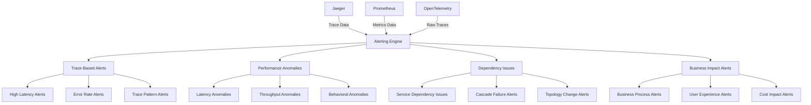

# Trace-Based Alerting and Anomaly Detection Guide

This document provides comprehensive guidance on implementing trace-based alerting and anomaly detection for the MCP system.

---

## 1. Overview

### 1.1 Trace-Based Alerting Purpose

Trace-based alerting enables detection of issues based on distributed tracing data, providing:

- **Early Issue Detection**: Identify problems before they impact users
- **Root Cause Analysis**: Quickly identify the root cause of issues
- **Performance Anomaly Detection**: Detect unusual performance patterns
- **Service Dependency Impact**: Understand the impact of service issues
- **Business Impact Assessment**: Assess the business impact of technical issues

### 1.2 Alerting Architecture



---

## 2. Trace-Based Alerting Rules

### 2.1 Latency-Based Alerts

```yaml
# latency-alerts.yml
groups:
  - name: trace_latency_alerts
    interval: 30s
    rules:
      # High P99 Latency Alert
      - alert: HighP99Latency
        expr: histogram_quantile(0.99, sum(rate(mcp_request_duration_seconds_bucket[5m])) by (le, service_name)) > 2.0
        for: 5m
        labels:
          severity: warning
          category: latency
          alert_type: performance
        annotations:
          summary: "High P99 latency detected in {{ $labels.service_name }}"
          description: "P99 latency for {{ $labels.service_name }} is {{ $value }}s, which is above the threshold of 2s"
          runbook_url: "https://docs.example.com/runbooks/high-p99-latency"
          dashboard_url: "https://grafana.example.com/d/mcp-trace-performance"
          
      # Critical P99 Latency Alert
      - alert: CriticalP99Latency
        expr: histogram_quantile(0.99, sum(rate(mcp_request_duration_seconds_bucket[5m])) by (le, service_name)) > 5.0
        for: 2m
        labels:
          severity: critical
          category: latency
          alert_type: performance
        annotations:
          summary: "Critical P99 latency detected in {{ $labels.service_name }}"
          description: "P99 latency for {{ $labels.service_name }} is {{ $value }}s, which is above the critical threshold of 5s"
          runbook_url: "https://docs.example.com/runbooks/critical-p99-latency"
          dashboard_url: "https://grafana.example.com/d/mcp-trace-performance"
          
      # High P95 Latency Alert
      - alert: HighP95Latency
        expr: histogram_quantile(0.95, sum(rate(mcp_request_duration_seconds_bucket[5m])) by (le, service_name)) > 1.0
        for: 5m
        labels:
          severity: warning
          category: latency
          alert_type: performance
        annotations:
          summary: "High P95 latency detected in {{ $labels.service_name }}"
          description: "P95 latency for {{ $labels.service_name }} is {{ $value }}s, which is above the threshold of 1s"
          runbook_url: "https://docs.example.com/runbooks/high-p95-latency"
          dashboard_url: "https://grafana.example.com/d/mcp-trace-performance"
          
      # Dependency Latency Alert
      - alert: HighDependencyLatency
        expr: histogram_quantile(0.95, sum(rate(mcp_request_duration_seconds_bucket[5m])) by (le, service_name, dependency_service_name)) > 1.5
        for: 5m
        labels:
          severity: warning
          category: latency
          alert_type: dependency
        annotations:
          summary: "High dependency latency detected between {{ $labels.service_name }} and {{ $labels.dependency_service_name }}"
          description: "P95 latency for {{ $labels.service_name }} -> {{ $labels.dependency_service_name }} is {{ $value }}s, which is above the threshold of 1.5s"
          runbook_url: "https://docs.example.com/runbooks/high-dependency-latency"
          dashboard_url: "https://grafana.example.com/d/mcp-service-dependency"
          
      # Latency Spike Alert
      - alert: LatencySpike
        expr: histogram_quantile(0.95, sum(rate(mcp_request_duration_seconds_bucket[5m])) by (le, service_name)) / histogram_quantile(0.95, sum(rate(mcp_request_duration_seconds_bucket[1h])) by (le, service_name)) > 3.0
        for: 2m
        labels:
          severity: warning
          category: latency
          alert_type: anomaly
        annotations:
          summary: "Latency spike detected in {{ $labels.service_name }}"
          description: "Current P95 latency ({{ $value }}x) is significantly higher than the 1-hour average for {{ $labels.service_name }}"
          runbook_url: "https://docs.example.com/runbooks/latency-spike"
          dashboard_url: "https://grafana.example.com/d/mcp-trace-performance"
```

### 2.2 Error-Based Alerts

```yaml
# error-alerts.yml
groups:
  - name: trace_error_alerts
    interval: 30s
    rules:
      # High Error Rate Alert
      - alert: HighErrorRate
        expr: sum(rate(mcp_errors_total[5m])) by (service_name) / sum(rate(mcp_requests_total[5m])) by (service_name) > 0.05
        for: 5m
        labels:
          severity: warning
          category: error
          alert_type: availability
        annotations:
          summary: "High error rate detected in {{ $labels.service_name }}"
          description: "Error rate for {{ $labels.service_name }} is {{ $value | humanizePercentage }}, which is above the threshold of 5%"
          runbook_url: "https://docs.example.com/runbooks/high-error-rate"
          dashboard_url: "https://grafana.example.com/d/mcp-trace-performance"
          
      # Critical Error Rate Alert
      - alert: CriticalErrorRate
        expr: sum(rate(mcp_errors_total[5m])) by (service_name) / sum(rate(mcp_requests_total[5m])) by (service_name) > 0.1
        for: 2m
        labels:
          severity: critical
          category: error
          alert_type: availability
        annotations:
          summary: "Critical error rate detected in {{ $labels.service_name }}"
          description: "Error rate for {{ $labels.service_name }} is {{ $value | humanizePercentage }}, which is above the critical threshold of 10%"
          runbook_url: "https://docs.example.com/runbooks/critical-error-rate"
          dashboard_url: "https://grafana.example.com/d/mcp-trace-performance"
          
      # Dependency Error Rate Alert
      - alert: HighDependencyErrorRate
        expr: sum(rate(mcp_errors_total[5m])) by (service_name, dependency_service_name) / sum(rate(mcp_requests_total[5m])) by (service_name, dependency_service_name) > 0.08
        for: 5m
        labels:
          severity: warning
          category: error
          alert_type: dependency
        annotations:
          summary: "High dependency error rate detected between {{ $labels.service_name }} and {{ $labels.dependency_service_name }}"
          description: "Error rate for {{ $labels.service_name }} -> {{ $labels.dependency_service_name }} is {{ $value | humanizePercentage }}, which is above the threshold of 8%"
          runbook_url: "https://docs.example.com/runbooks/high-dependency-error-rate"
          dashboard_url: "https://grafana.example.com/d/mcp-service-dependency"
          
      # Error Rate Spike Alert
      - alert: ErrorRateSpike
        expr: (sum(rate(mcp_errors_total[5m])) by (service_name) / sum(rate(mcp_requests_total[5m])) by (service_name)) / (sum(rate(mcp_errors_total[1h])) by (service_name) / sum(rate(mcp_requests_total[1h])) by (service_name)) > 3.0
        for: 2m
        labels:
          severity: warning
          category: error
          alert_type: anomaly
        annotations:
          summary: "Error rate spike detected in {{ $labels.service_name }}"
          description: "Current error rate ({{ $value }}x) is significantly higher than the 1-hour average for {{ $labels.service_name }}"
          runbook_url: "https://docs.example.com/runbooks/error-rate-spike"
          dashboard_url: "https://grafana.example.com/d/mcp-trace-performance"
          
      # Trace Error Pattern Alert
      - alert: TraceErrorPattern
        expr: sum(rate(mcp_trace_errors_total[5m])) by (error_pattern) > 0.1
        for: 5m
        labels:
          severity: warning
          category: error
          alert_type: pattern
        annotations:
          summary: "Error pattern detected: {{ $labels.error_pattern }}"
          description: "Error pattern '{{ $labels.error_pattern }}' is occurring at a rate of {{ $value }} errors per second"
          runbook_url: "https://docs.example.com/runbooks/trace-error-pattern"
          dashboard_url: "https://grafana.example.com/d/mcp-distributed-tracing"
```

### 2.3 Throughput-Based Alerts

```yaml
# throughput-alerts.yml
groups:
  - name: trace_throughput_alerts
    interval: 30s
    rules:
      # Low Throughput Alert
      - alert: LowThroughput
        expr: sum(rate(mcp_requests_total[5m])) by (service_name) < 10
        for: 10m
        labels:
          severity: warning
          category: throughput
          alert_type: availability
        annotations:
          summary: "Low throughput detected in {{ $labels.service_name }}"
          description: "Throughput for {{ $labels.service_name }} is {{ $value }} requests per second, which is below the threshold of 10 req/s"
          runbook_url: "https://docs.example.com/runbooks/low-throughput"
          dashboard_url: "https://grafana.example.com/d/mcp-trace-performance"
          
      # Throughput Drop Alert
      - alert: ThroughputDrop
        expr: sum(rate(mcp_requests_total[5m])) by (service_name) / sum(rate(mcp_requests_total[1h])) by (service_name) < 0.3
        for: 5m
        labels:
          severity: warning
          category: throughput
          alert_type: anomaly
        annotations:
          summary: "Throughput drop detected in {{ $labels.service_name }}"
          description: "Current throughput ({{ $value | humanizePercentage }}) is significantly lower than the 1-hour average for {{ $labels.service_name }}"
          runbook_url: "https://docs.example.com/runbooks/throughput-drop"
          dashboard_url: "https://grafana.example.com/d/mcp-trace-performance"
          
      # High Throughput Alert
      - alert: HighThroughput
        expr: sum(rate(mcp_requests_total[5m])) by (service_name) > 1000
        for: 5m
        labels:
          severity: warning
          category: throughput
          alert_type: scalability
        annotations:
          summary: "High throughput detected in {{ $labels.service_name }}"
          description: "Throughput for {{ $labels.service_name }} is {{ $value }} requests per second, which is above the threshold of 1000 req/s"
          runbook_url: "https://docs.example.com/runbooks/high-throughput"
          dashboard_url: "https://grafana.example.com/d/mcp-trace-performance"
          
      # Throughput Spike Alert
      - alert: ThroughputSpike
        expr: sum(rate(mcp_requests_total[5m])) by (service_name) / sum(rate(mcp_requests_total[1h])) by (service_name) > 3.0
        for: 2m
        labels:
          severity: warning
          category: throughput
          alert_type: anomaly
        annotations:
          summary: "Throughput spike detected in {{ $labels.service_name }}"
          description: "Current throughput ({{ $value }}x) is significantly higher than the 1-hour average for {{ $labels.service_name }}"
          runbook_url: "https://docs.example.com/runbooks/throughput-spike"
          dashboard_url: "https://grafana.example.com/d/mcp-trace-performance"
```

---

## 3. Anomaly Detection Rules

### 3.1 Performance Anomaly Detection

```yaml
# performance-anomaly-alerts.yml
groups:
  - name: performance_anomaly_alerts
    interval: 30s
    rules:
      # Latency Anomaly Detection
      - alert: LatencyAnomaly
        expr: abs(histogram_quantile(0.95, sum(rate(mcp_request_duration_seconds_bucket[5m])) by (le, service_name)) - avg(histogram_quantile(0.95, sum(rate(mcp_request_duration_seconds_bucket[1h])) by (le, service_name)))) / stddev(histogram_quantile(0.95, sum(rate(mcp_request_duration_seconds_bucket[1h])) by (le, service_name))) > 3.0
        for: 5m
        labels:
          severity: warning
          category: anomaly
          alert_type: performance
        annotations:
          summary: "Latency anomaly detected in {{ $labels.service_name }}"
          description: "Current P95 latency is more than 3 standard deviations from the 1-hour average for {{ $labels.service_name }}"
          runbook_url: "https://docs.example.com/runbooks/latency-anomaly"
          dashboard_url: "https://grafana.example.com/d/mcp-trace-performance"
          
      # Throughput Anomaly Detection
      - alert: ThroughputAnomaly
        expr: abs(sum(rate(mcp_requests_total[5m])) by (service_name) - avg(sum(rate(mcp_requests_total[1h])) by (service_name))) / stddev(sum(rate(mcp_requests_total[1h])) by (service_name)) > 3.0
        for: 5m
        labels:
          severity: warning
          category: anomaly
          alert_type: throughput
        annotations:
          summary: "Throughput anomaly detected in {{ $labels.service_name }}"
          description: "Current throughput is more than 3 standard deviations from the 1-hour average for {{ $labels.service_name }}"
          runbook_url: "https://docs.example.com/runbooks/throughput-anomaly"
          dashboard_url: "https://grafana.example.com/d/mcp-trace-performance"
          
      # Error Rate Anomaly Detection
      - alert: ErrorRateAnomaly
        expr: abs((sum(rate(mcp_errors_total[5m])) by (service_name) / sum(rate(mcp_requests_total[5m])) by (service_name)) - avg((sum(rate(mcp_errors_total[1h])) by (service_name) / sum(rate(mcp_requests_total[1h])) by (service_name)))) / stddev((sum(rate(mcp_errors_total[1h])) by (service_name) / sum(rate(mcp_requests_total[1h])) by (service_name))) > 3.0
        for: 5m
        labels:
          severity: warning
          category: anomaly
          alert_type: error
        annotations:
          summary: "Error rate anomaly detected in {{ $labels.service_name }}"
          description: "Current error rate is more than 3 standard deviations from the 1-hour average for {{ $labels.service_name }}"
          runbook_url: "https://docs.example.com/runbooks/error-rate-anomaly"
          dashboard_url: "https://grafana.example.com/d/mcp-trace-performance"
```

### 3.2 Behavioral Anomaly Detection

```yaml
# behavioral-anomaly-alerts.yml
groups:
  - name: behavioral_anomaly_alerts
    interval: 30s
    rules:
      # Service Behavior Anomaly
      - alert: ServiceBehaviorAnomaly
        expr: predict_linear(sum(rate(mcp_requests_total[1h])) by (service_name)[1h], 3600) / sum(rate(mcp_requests_total[1h])) by (service_name) < 0.5 or predict_linear(sum(rate(mcp_requests_total[1h])) by (service_name)[1h], 3600) / sum(rate(mcp_requests_total[1h])) by (service_name) > 2.0
        for: 10m
        labels:
          severity: warning
          category: anomaly
          alert_type: behavioral
        annotations:
          summary: "Service behavior anomaly detected in {{ $labels.service_name }}"
          description: "Predicted throughput for {{ $labels.service_name }} deviates significantly from current patterns"
          runbook_url: "https://docs.example.com/runbooks/service-behavior-anomaly"
          dashboard_url: "https://grafana.example.com/d/mcp-trace-performance"
          
      # Trace Pattern Anomaly
      - alert: TracePatternAnomaly
        expr: sum(rate(mcp_trace_pattern_anomalies_total[5m])) by (service_name, pattern_type) > 0.05
        for: 5m
        labels:
          severity: warning
          category: anomaly
          alert_type: pattern
        annotations:
          summary: "Trace pattern anomaly detected in {{ $labels.service_name }}"
          description: "Anomalous trace pattern '{{ $labels.pattern_type }}' detected in {{ $labels.service_name }} at rate of {{ $value }} anomalies per second"
          runbook_url: "https://docs.example.com/runbooks/trace-pattern-anomaly"
          dashboard_url: "https://grafana.example.com/d/mcp-distributed-tracing"
          
      # Dependency Pattern Anomaly
      - alert: DependencyPatternAnomaly
        expr: sum(rate(mcp_dependency_pattern_anomalies_total[5m])) by (service_name, dependency_service_name) > 0.03
        for: 5m
        labels:
          severity: warning
          category: anomaly
          alert_type: dependency
        annotations:
          summary: "Dependency pattern anomaly detected between {{ $labels.service_name }} and {{ $labels.dependency_service_name }}"
          description: "Anomalous dependency pattern detected between {{ $labels.service_name }} and {{ $labels.dependency_service_name }} at rate of {{ $value }} anomalies per second"
          runbook_url: "https://docs.example.com/runbooks/dependency-pattern-anomaly"
          dashboard_url: "https://grafana.example.com/d/mcp-service-dependency"
```

---

## 4. Dependency-Based Alerting

### 4.1 Service Dependency Alerts

```yaml
# dependency-alerts.yml
groups:
  - name: service_dependency_alerts
    interval: 30s
    rules:
      # Critical Service Dependency Alert
      - alert: CriticalServiceDependencyFailure
        expr: sum(rate(mcp_errors_total[5m])) by (service_name, dependency_service_name) / sum(rate(mcp_requests_total[5m])) by (service_name, dependency_service_name) > 0.1 and sum(rate(mcp_requests_total[5m])) by (service_name) > 100
        for: 2m
        labels:
          severity: critical
          category: dependency
          alert_type: availability
        annotations:
          summary: "Critical service dependency failure between {{ $labels.service_name }} and {{ $labels.dependency_service_name }}"
          description: "High error rate ({{ $value | humanizePercentage }}) detected in critical dependency between {{ $labels.service_name }} and {{ $labels.dependency_service_name }}"
          runbook_url: "https://docs.example.com/runbooks/critical-service-dependency-failure"
          dashboard_url: "https://grafana.example.com/d/mcp-service-dependency"
          
      # Service Dependency Latency Alert
      - alert: ServiceDependencyLatency
        expr: histogram_quantile(0.95, sum(rate(mcp_request_duration_seconds_bucket[5m])) by (le, service_name, dependency_service_name)) > 2.0
        for: 5m
        labels:
          severity: warning
          category: dependency
          alert_type: performance
        annotations:
          summary: "Service dependency latency between {{ $labels.service_name }} and {{ $labels.dependency_service_name }}"
          description: "High latency ({{ $value }}s) detected in dependency between {{ $labels.service_name }} and {{ $labels.dependency_service_name }}"
          runbook_url: "https://docs.example.com/runbooks/service-dependency-latency"
          dashboard_url: "https://grafana.example.com/d/mcp-service-dependency"
          
      # Cascade Failure Alert
      - alert: CascadeFailure
        expr: count(sum(rate(mcp_errors_total[5m])) by (service_name, dependency_service_name) / sum(rate(mcp_requests_total[5m])) by (service_name, dependency_service_name) > 0.1) > 3
        for: 2m
        labels:
          severity: critical
          category: dependency
          alert_type: cascade
        annotations:
          summary: "Potential cascade failure detected across multiple service dependencies"
          description: "Multiple service dependencies showing high error rates, indicating potential cascade failure"
          runbook_url: "https://docs.example.com/runbooks/cascade-failure"
          dashboard_url: "https://grafana.example.com/d/mcp-service-dependency"
          
      # Service Topology Change Alert
      - alert: ServiceTopologyChange
        expr: changes(mcp_service_dependencies_count[1h]) > 0
        for: 5m
        labels:
          severity: info
          category: dependency
          alert_type: topology
        annotations:
          summary: "Service topology change detected"
          description: "Changes detected in service dependency topology"
          runbook_url: "https://docs.example.com/runbooks/service-topology-change"
          dashboard_url: "https://grafana.example.com/d/mcp-service-dependency"
```

---

## 5. Business Impact Alerting

### 5.1 Business Process Alerts

```yaml
# business-impact-alerts.yml
groups:
  - name: business_impact_alerts
    interval: 30s
    rules:
      # Business Process Failure Alert
      - alert: BusinessProcessFailure
        expr: sum(rate(mcp_business_process_failures_total[5m])) by (business_process) > 0.1
        for: 2m
        labels:
          severity: critical
          category: business
          alert_type: process
        annotations:
          summary: "Business process failure detected: {{ $labels.business_process }}"
          description: "Business process '{{ $labels.business_process }}' is failing at rate of {{ $value }} failures per second"
          runbook_url: "https://docs.example.com/runbooks/business-process-failure"
          dashboard_url: "https://grafana.example.com/d/mcp-business-operations"
          
      # Business Process Latency Alert
      - alert: BusinessProcessLatency
        expr: histogram_quantile(0.95, sum(rate(mcp_business_process_duration_seconds_bucket[5m])) by (le, business_process)) > 30.0
        for: 5m
        labels:
          severity: warning
          category: business
          alert_type: performance
        annotations:
          summary: "Business process latency detected: {{ $labels.business_process }}"
          description: "Business process '{{ $labels.business_process }}' has P95 latency of {{ $value }}s, which is above the threshold of 30s"
          runbook_url: "https://docs.example.com/runbooks/business-process-latency"
          dashboard_url: "https://grafana.example.com/d/mcp-business-operations"
          
      # User Experience Impact Alert
      - alert: UserExperienceImpact
        expr: sum(rate(mcp_user_experience_impact_total[5m])) by (impact_type) > 0.05
        for: 5m
        labels:
          severity: warning
          category: business
          alert_type: experience
        annotations:
          summary: "User experience impact detected: {{ $labels.impact_type }}"
          description: "User experience impact '{{ $labels.impact_type }}' detected at rate of {{ $value }} impacts per second"
          runbook_url: "https://docs.example.com/runbooks/user-experience-impact"
          dashboard_url: "https://grafana.example.com/d/mcp-business-operations"
          
      # Cost Impact Alert
      - alert: CostImpact
        expr: sum(rate(mcp_cost_impact_total[5m])) by (cost_type) > 100
        for: 5m
        labels:
          severity: warning
          category: business
          alert_type: cost
        annotations:
          summary: "Cost impact detected: {{ $labels.cost_type }}"
          description: "Cost impact '{{ $labels.cost_type }}' detected at rate of ${{ $value }} per second"
          runbook_url: "https://docs.example.com/runbooks/cost-impact"
          dashboard_url: "https://grafana.example.com/d/mcp-business-operations"
```

---

## 6. Alertmanager Configuration

### 6.1 Alertmanager Routing Configuration

```yaml
# alertmanager-config.yml
global:
  smtp_smarthost: 'localhost:587'
  smtp_from: 'alerts@example.com'
  smtp_auth_username: 'alerts@example.com'
  smtp_auth_password: 'password'

route:
  group_by: ['alertname', 'severity', 'category']
  group_wait: 10s
  group_interval: 10s
  repeat_interval: 1h
  receiver: 'web.hook'
  routes:
    # Critical alerts route
    - match:
        severity: critical
      receiver: 'critical-alerts'
      group_wait: 10s
      group_interval: 10s
      repeat_interval: 5m
      continue: true
      
    # Warning alerts route
    - match:
        severity: warning
      receiver: 'warning-alerts'
      group_wait: 30s
      group_interval: 30s
      repeat_interval: 15m
      continue: true
      
    # Business impact alerts route
    - match:
        category: business
      receiver: 'business-alerts'
      group_wait: 30s
      group_interval: 30s
      repeat_interval: 1h
      continue: true
      
    # Dependency alerts route
    - match:
        category: dependency
      receiver: 'dependency-alerts'
      group_wait: 30s
      group_interval: 30s
      repeat_interval: 15m
      continue: true
      
    # Anomaly alerts route
    - match:
        category: anomaly
      receiver: 'anomaly-alerts'
      group_wait: 30s
      group_interval: 30s
      repeat_interval: 1h
      continue: true

receivers:
  - name: 'web.hook'
    webhook_configs:
      - url: 'http://127.0.0.1:5001/'
        
  - name: 'critical-alerts'
    email_configs:
      - to: 'critical-alerts@example.com'
        subject: 'Critical Alert: {{ .GroupLabels.alertname }}'
        body: |
          {{ range .Alerts }}
          Alert: {{ .Annotations.summary }}
          Description: {{ .Annotations.description }}
          Dashboard: {{ .Annotations.dashboard_url }}
          Runbook: {{ .Annotations.runbook_url }}
          {{ end }}
    webhook_configs:
      - url: 'http://pagerduty-webhook/'
        send_resolved: true
        
  - name: 'warning-alerts'
    email_configs:
      - to: 'warning-alerts@example.com'
        subject: 'Warning Alert: {{ .GroupLabels.alertname }}'
        body: |
          {{ range .Alerts }}
          Alert: {{ .Annotations.summary }}
          Description: {{ .Annotations.description }}
          Dashboard: {{ .Annotations.dashboard_url }}
          Runbook: {{ .Annotations.runbook_url }}
          {{ end }}
    slack_configs:
      - api_url: 'SLACK_WEBHOOK_URL'
        channel: '#alerts-warning'
        title: 'Warning Alert'
        text: |
          {{ range .Alerts }}
          *Alert*: {{ .Annotations.summary }}
          *Description*: {{ .Annotations.description }}
          *Dashboard*: {{ .Annotations.dashboard_url }}
          *Runbook*: {{ .Annotations.runbook_url }}
          {{ end }}
          
  - name: 'business-alerts'
    email_configs:
      - to: 'business-alerts@example.com'
        subject: 'Business Impact Alert: {{ .GroupLabels.alertname }}'
        body: |
          {{ range .Alerts }}
          Alert: {{ .Annotations.summary }}
          Description: {{ .Annotations.description }}
          Dashboard: {{ .Annotations.dashboard_url }}
          Runbook: {{ .Annotations.runbook_url }}
          {{ end }}
    slack_configs:
      - api_url: 'SLACK_WEBHOOK_URL'
        channel: '#alerts-business'
        title: 'Business Impact Alert'
        text: |
          {{ range .Alerts }}
          *Alert*: {{ .Annotations.summary }}
          *Description*: {{ .Annotations.description }}
          *Dashboard*: {{ .Annotations.dashboard_url }}
          *Runbook*: {{ .Annotations.runbook_url }}
          {{ end }}
          
  - name: 'dependency-alerts'
    email_configs:
      - to: 'dependency-alerts@example