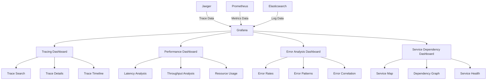

# Distributed Tracing Grafana Dashboard Guide

This document provides comprehensive guidance on creating and configuring Grafana dashboards for distributed tracing visualization in the MCP system.

---

## 1. Overview

### 1.1 Dashboard Purpose

The distributed tracing dashboard provides a unified view of tracing data, enabling:

- **Trace Visualization**: Visual representation of distributed traces
- **Performance Analysis**: Analysis of trace performance metrics
- **Error Detection**: Identification of errors and anomalies in traces
- **Service Dependencies**: Visualization of service dependencies and interactions
- **Correlation with Metrics**: Integration with other observability data

### 1.2 Dashboard Architecture



---

## 2. Core Dashboard Components

### 2.1 Trace Search and Overview Panel

```json
{
  "id": 1,
  "title": "Trace Search",
  "type": "table",
  "targets": [
    {
      "expr": "sum(rate(mcp_requests_total[5m])) by (trace_id, service_name)",
      "legendFormat": "{{trace_id}} - {{service_name}}"
    }
  ],
  "columns": [
    { "text": "Trace ID", "value": "trace_id" },
    { "text": "Service", "value": "service_name" },
    { "text": "Request Rate", "value": "Value" },
    { "text": "Duration", "value": "duration" },
    { "text": "Status", "value": "status" }
  ],
  "transformations": [
    {
      "id": "organize",
      "options": {
        "excludeByName": {},
        "indexByName": {},
        "renameByName": {}
      }
    }
  ],
  "fieldConfig": {
    "defaults": {
      "custom": {
        "align": "left",
        "filterable": true
      },
      "mappings": [],
      "thresholds": {
        "mode": "absolute",
        "steps": [
          { "color": "green", "value": null },
          { "color": "red", "value": 80 }
        ]
      }
    }
  }
}
```

### 2.2 Trace Timeline Visualization

```json
{
  "id": 2,
  "title": "Trace Timeline",
  "type": "trace",
  "targets": [
    {
      "expr": "jaeger_traces",
      "legendFormat": "{{trace_id}}"
    }
  ],
  "fieldConfig": {
    "defaults": {
      "custom": {
        "spanName": "span_name",
        "serviceName": "service_name",
        "duration": "duration",
        "startTime": "start_time",
        "tags": "tags"
      }
    }
  },
  "options": {
    "showLegend": true,
    "legend": {
      "displayMode": "list",
      "placement": "bottom"
    },
    "tooltip": {
      "mode": "single",
      "sort": "desc"
    }
  }
}
```

### 2.3 Service Performance Metrics

```json
{
  "id": 3,
  "title": "Service Performance",
  "type": "timeseries",
  "targets": [
    {
      "expr": "histogram_quantile(0.95, sum(rate(mcp_request_duration_seconds_bucket[5m])) by (le, service_name))",
      "legendFormat": "{{service_name}} - P95"
    },
    {
      "expr": "histogram_quantile(0.50, sum(rate(mcp_request_duration_seconds_bucket[5m])) by (le, service_name))",
      "legendFormat": "{{service_name}} - P50"
    }
  ],
  "fieldConfig": {
    "defaults": {
      "unit": "s",
      "custom": {
        "drawStyle": "line",
        "lineInterpolation": "linear",
        "fillOpacity": 0.1,
        "spanNulls": false
      }
    }
  },
  "options": {
    "legend": {
      "displayMode": "list",
      "placement": "bottom"
    },
    "tooltip": {
      "mode": "multi",
      "sort": "desc"
    }
  }
}
```

### 2.4 Error Rate Analysis

```json
{
  "id": 4,
  "title": "Error Rate Analysis",
  "type": "timeseries",
  "targets": [
    {
      "expr": "sum(rate(mcp_errors_total[5m])) by (service_name) / sum(rate(mcp_requests_total[5m])) by (service_name)",
      "legendFormat": "{{service_name}}"
    }
  ],
  "fieldConfig": {
    "defaults": {
      "unit": "percentunit",
      "custom": {
        "drawStyle": "line",
        "lineInterpolation": "linear",
        "fillOpacity": 0.1,
        "spanNulls": false
      },
      "thresholds": {
        "mode": "absolute",
        "steps": [
          { "color": "green", "value": null },
          { "color": "yellow", "value": 0.05 },
          { "color": "red", "value": 0.1 }
        ]
      }
    }
  },
  "options": {
    "legend": {
      "displayMode": "list",
      "placement": "bottom"
    },
    "tooltip": {
      "mode": "multi",
      "sort": "desc"
    }
  }
}
```

---

## 3. Complete Dashboard Configuration

### 3.1 Main Distributed Tracing Dashboard

```json
{
  "dashboard": {
    "id": null,
    "title": "MCP Distributed Tracing Dashboard",
    "description": "Comprehensive dashboard for distributed tracing visualization and analysis",
    "tags": ["mcp", "tracing", "distributed", "observability"],
    "timezone": "browser",
    "panels": [
      {
        "id": 1,
        "title": "Trace Search",
        "type": "table",
        "gridPos": { "h": 8, "w": 24, "x": 0, "y": 0 },
        "targets": [
          {
            "expr": "sum(rate(mcp_requests_total[5m])) by (trace_id, service_name)",
            "legendFormat": "{{trace_id}} - {{service_name}}"
          }
        ],
        "columns": [
          { "text": "Trace ID", "value": "trace_id" },
          { "text": "Service", "value": "service_name" },
          { "text": "Request Rate", "value": "Value" },
          { "text": "Duration", "value": "duration" },
          { "text": "Status", "value": "status" }
        ],
        "transformations": [
          {
            "id": "organize",
            "options": {
              "excludeByName": {},
              "indexByName": {},
              "renameByName": {}
            }
          }
        ],
        "fieldConfig": {
          "defaults": {
            "custom": {
              "align": "left",
              "