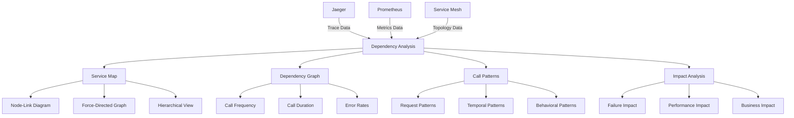

# Service Dependency Dashboard Guide

This document provides comprehensive guidance on creating and configuring Grafana dashboards for service dependency visualization and analysis in the MCP system.

---

## 1. Overview

### 1.1 Service Dependency Dashboard Purpose

The service dependency dashboard provides visualization of service dependencies and interactions, enabling:

- **Service Map Visualization**: Visual representation of service dependencies
- **Dependency Analysis**: Analysis of service interaction patterns
- **Impact Analysis**: Understanding the impact of service changes or failures
- **Performance Correlation**: Correlating performance across service dependencies
- **Topology Discovery**: Automatic discovery and visualization of service topology

### 1.2 Service Dependency Architecture



---

## 2. Service Map Visualization Panels

### 2.1 Node-Link Service Map

```json
{
  "id": 1,
  "title": "Service Dependency Map",
  "type": "nodeGraph",
  "gridPos": { "h": 12, "w": 24, "x": 0, "y": 0 },
  "targets": [
    {
      "expr": "sum(rate(mcp_requests_total[5m])) by (service_name, dependency_service_name)",
      "legendFormat": "{{service_name}} -> {{dependency_service_name}}"
    }
  ],
  "fieldConfig": {
    "defaults": {
      "custom": {
        "node": {
          "mainStatField": "service_name",
          "colorField": "error_rate",
          "sizeField": "request_rate"
        },
        "edge": {
          "mainStatField": "request_rate",
          "colorField": "latency",
          "sizeField": "request_rate"
        }
      },
      "color": {
        "mode": "continuous-GrYlRd",
        "thresholds": {
          "steps": [
            { "color": "green", "value": null },
            { "color": "yellow", "value": 0.05 },
            { "color": "red", "value": 0.1 }
          ]
        }
      }
    }
  },
  "options": {
    "nodes": {
      "shape": "circle",
      "size": {
        "min": 10,
        "max": 50
      }
    },
    "edges": {
      "width": {
        "min": 1,
        "max": 10
      }
    },
    "layout": {
      "type": "forceDirected",
      "iterations": 100
    }
  }
}
```

### 2.2 Force-Directed Dependency Graph

```json
{
  "id": 2,
  "title": "Force-Directed Dependency Graph",
  "type": "graph",
  "gridPos": { "h": 12, "w": 24, "x": 0, "y": 12 },
  "targets": [
    {
      "expr": "histogram_quantile(0.95, sum(rate(mcp_request_duration_seconds_bucket[5m])) by (le, service_name, dependency_service_name))",
      "legendFormat": "{{service_name}} -> {{dependency_service_name}}"
    }
  ],
  "fieldConfig": {
    "defaults": {
      "unit": "s",
      "custom": {
        "drawStyle": "line",
        "lineInterpolation": "linear",
        "fillOpacity": 0.1,
        "spanNulls": false
      }
    }
  },
  "options": {
    "graph": {
      "type": "forceDirected",
      "nodeSize": {
        "field": "request_rate",
        "min": 10,
        "max": 50
      },
      "edgeWidth": {
        "field": "latency",
        "min": 1,
        "max": 10
      }
    }
  }
}
```

### 2.3 Hierarchical Service View

```json
{
  "id": 3,
  "title": "Hierarchical Service View",
  "type": "table",
  "gridPos": { "h": 8, "w": 24, "x": 0, "y": 24 },
  "targets": [
    {
      "expr": "sum(rate(mcp_requests_total[5m])) by (service_name, dependency_service_name)",
      "legendFormat": "{{service_name}} -> {{dependency_service_name}}"
    }
  ],
  "columns": [
    { "text": "Service", "value": "service_name" },
    { "text": "Dependency", "value": "dependency_service_name" },
    { "text": "Request Rate", "value": "request_rate" },
    { "text": "Latency", "value": "latency" },
    { "text": "Error Rate", "value": "error_rate" }
  ],
  "transformations": [
    {
      "id": "groupBy",
      "options": {
        "fields": {
          "service_name": { "aggregations": [], "groupBy": true },
          "dependency_service_name": { "aggregations": [], "groupBy": true },
          "request_rate": { "aggregations": ["sum"], "groupBy": false },
          "latency": { "aggregations": ["avg"], "groupBy": false },
          "error_rate": { "aggregations": ["avg"], "groupBy": false }
        }
      }
    }
  ],
  "fieldConfig": {
    "defaults": {
      "custom": {
        "align": "left",
        "filterable": true
      }
    }
  }
}
```

---

## 3. Dependency Analysis Panels

### 3.1 Call Frequency Analysis

```json
{
  "id": 4,
  "title": "Service Call Frequency",
  "type": "heatmap",
  "gridPos": { "h": 8, "w": 24, "x": 0, "y": 32 },
  "targets": [
    {
      "expr": "sum(rate(mcp_requests_total[5m])) by (service_name, dependency_service_name)",
      "legendFormat": "{{service_name}} -> {{dependency_service_name}}"
    }
  ],
  "fieldConfig": {
    "defaults": {
      "unit": "reqps",
      "custom": {
        "drawStyle": "line",
        "lineInterpolation": "linear",
        "fillOpacity": 0.1,
        "spanNulls": false
      },
      "color": {
        "mode": "continuous-GrYlRd",
        "thresholds": {
          "steps": [
            { "color": "green", "value": null },
            { "color": "yellow", "value": 10 },
            { "color": "red", "value": 50 }
          ]
        }
      }
    }
  },
  "options": {
    "heatmap": {
      "colorMode": "value",
      "showLegend": true
    }
  }
}
```

### 3.2 Dependency Latency Analysis

```json
{
  "id": 5,
  "title": "Dependency Latency Analysis",
  "type": "timeseries",
  "gridPos": { "h": 8, "w": 24, "x": 0, "y": 40 },
  "targets": [
    {
      "expr": "histogram_quantile(0.95, sum(rate(mcp_request_duration_seconds_bucket[5m])) by (le, service_name, dependency_service_name))",
      "legendFormat": "{{service_name}} -> {{dependency_service_name}} - P95"
    },
    {
      "expr": "histogram_quantile(0.50, sum(rate(mcp_request_duration_seconds_bucket[5m])) by (le, service_name, dependency_service_name))",
      "legendFormat": "{{service_name}} -> {{dependency_service_name}} - P50"
    }
  ],
  "fieldConfig": {
    "defaults": {
      "unit": "s",
      "custom": {
        "drawStyle": "line",
        "lineInterpolation": "linear",
        "fillOpacity": 0.1,
        "spanNulls": false
      }
    }
  },
  "options": {
    "legend": {
      "displayMode": "list",
      "placement": "bottom"
    },
    "tooltip": {
      "mode": "multi",
      "sort": "desc"
    }
  }
}
```

### 3.3 Error Rate by Dependency

```json
{
  "id": 6,
  "title": "Error Rate by Dependency",
  "type": "timeseries",
  "gridPos": { "h": 8, "w": 24, "x": 0, "y": 48 },
  "targets": [
    {
      "expr": "sum(rate(mcp_errors_total[5m])) by (service_name, dependency_service_name) / sum(rate(mcp_requests_total[5m])) by (service_name, dependency_service_name)",
      "legendFormat": "{{service_name}} -> {{dependency_service_name}}"
    }
  ],
  "fieldConfig": {
    "defaults": {
      "unit": "percentunit",
      "custom": {
        "drawStyle": "line",
        "lineInterpolation": "linear",
        "fillOpacity": 0.1,
        "spanNulls": false
      },
      "thresholds": {
        "mode": "absolute",
        "steps": [
          { "color": "green", "value": null },
          { "color": "yellow", "value": 0.05 },
          { "color": "red", "value": 0.1 }
        ]
      }
    }
  },
  "options": {
    "legend": {
      "displayMode": "list",
      "placement": "bottom"
    },
    "tooltip": {
      "mode": "multi",
      "sort": "desc"
    }
  }
}
```

---

## 4. Impact Analysis Panels

### 4.1 Service Impact Analysis

```json
{
  "id": 7,
  "title": "Service Impact Analysis",
  "type": "table",
  "gridPos": { "h": 8, "w": 12, "x": 0, "y": 56 },
  "targets": [
    {
      "expr": "sum(rate(mcp_requests_total[5m])) by (service_name)",
      "legendFormat": "{{service_name}}"
    }
  ],
  "columns": [
    { "text": "Service", "value": "service_name" },
    { "text": "Total Requests", "value": "total_requests" },
    { "text": "Dependent Services", "value": "dependent_services" },
    { "text": "Impact Score", "value": "impact_score" },
    { "text": "Criticality", "value": "criticality" }
  ],
  "transformations": [
    {
      "id": "calculateField",
      "options": {
        "mode": "reduceRow",
        "reduce": {
          "reducer": "sum",
          "field": "total_requests"
        },
        "alias": "impact_score"
      }
    }
  ],
  "fieldConfig": {
    "defaults": {
      "custom": {
        "align": "left",
        "filterable": true
      },
      "thresholds": {
        "mode": "absolute",
        "steps": [
          { "color": "green", "value": null },
          { "color": "yellow", "value": 100 },
          { "color": "red", "value": 500 }
        ]
      }
    }
  }
}
```

### 4.2 Failure Impact Analysis

```json
{
  "id": 8,
  "title": "Failure Impact Analysis",
  "type": "table",
  "gridPos": { "h": 8, "w": 12, "x": 12, "y": 56 },
  "targets": [
    {
      "expr": "sum(rate(mcp_errors_total[5m])) by (service_name)",
      "legendFormat": "{{service_name}}"
    }
  ],
  "columns": [
    { "text": "Service", "value": "service_name" },
    { "text": "Error Rate", "value": "error_rate" },
    { "text": "Affected Services", "value": "affected_services" },
    { "text": "Business Impact", "value": "business_impact" },
    { "text": "Risk Level", "value": "risk_level" }
  ],
  "transformations": [
    {
      "id": "calculateField",
      "options": {
        "mode": "reduceRow",
        "reduce": {
          "reducer": "sum",
          "field": "error_rate"
        },
        "alias": "business_impact"
      }
    }
  ],
  "fieldConfig": {
    "defaults": {
      "custom": {
        "align": "left",
        "filterable": true
      },
      "thresholds": {
        "mode": "absolute",
        "steps": [
          { "color": "green", "value": null },
          { "color": "yellow", "value": 0.05 },
          { "color": "red", "value": 0.1 }
        ]
      }
    }
  }
}
```

### 4.3 Performance Impact Analysis

```json
{
  "id": 9,
  "title": "Performance Impact Analysis",
  "type": "timeseries",
  "gridPos": { "h": 8, "w": 24, "x": 0, "y": 64 },
  "targets": [
    {
      "expr": "histogram_quantile(0.95, sum(rate(mcp_request_duration_seconds_bucket[5m])) by (le, service_name))",
      "legendFormat": "{{service_name}} - P95"
    }
  ],
  "fieldConfig": {
    "defaults": {
      "unit": "s",
      "custom": {
        "drawStyle": "line",
        "lineInterpolation": "linear",
        "fillOpacity": 0.1,
        "spanNulls": false
      }
    }
  },
  "options": {
    "legend": {
      "displayMode": "list",
      "placement": "bottom"
    },
    "tooltip": {
      "mode": "multi",
      "sort": "desc"
    }
  }
}
```

---

## 5. Complete Service Dependency Dashboard Configuration

### 5.1 Main Service Dependency Dashboard

```json
{
  "dashboard": {
    "id": null,
    "title": "MCP Service Dependency Dashboard",
    "description": "Comprehensive dashboard for service dependency visualization and analysis",
    "tags": ["mcp", "tracing", "dependency", "service"],
    "timezone": "browser",
    "panels": [
      {
        "id": 1,
        "title": "Service Dependency Map",
        "type": "nodeGraph",
        "gridPos": { "h": 12, "w": 24, "x": 0, "y": 0 },
        "targets": [
          {
            "expr": "sum(rate(mcp_requests_total[5m])) by (service_name, dependency_service_name)",
            "legendFormat": "{{service_name}} -> {{dependency_service_name}}"
          }
        ],
        "fieldConfig": {
          "defaults": {
            "custom": {
              "node": {
                "mainStatField": "service_name",
                "colorField": "error_rate",
                "sizeField": "request_rate"
              },
              "edge": {
                "mainStatField": "request_rate",
                "colorField": "latency",
                "sizeField": "request_rate"
              }
            },
            "color": {
              "mode": "continuous-GrYlRd",
              "thresholds": {
                "steps": [
                  { "color": "green", "value": null },
                  { "color": "yellow", "value": 0.05 },
                  { "color": "red", "value": 0.1 }
                ]
              }
            }
          }
        },
        "options": {
          "nodes": {
            "shape": "circle",
            "size": {
              "min": 10,
              "max": 50
            }
          },
          "edges": {
            "width": {
              "min": 1,
              "max": 10
            }
          },
          "layout": {
            "type": "forceDirected",
            "iterations": 100
          }
        }
      },
      {
        "id": 2,
        "title": "Force-Directed Dependency Graph",
        "type": "graph",
        "gridPos": { "h": 12, "w": 24, "x": 0, "y": 12 },
        "targets": [
          {
            "expr": "histogram_quantile(0.95, sum(rate(mcp_request_duration_seconds_bucket[5m])) by (le, service_name, dependency_service_name))",
            "legendFormat": "{{service_name}} -> {{dependency_service_name}}"
          }
        ],
        "fieldConfig": {
          "defaults": {
            "unit": "s",
            "custom": {
              "drawStyle": "line",
              "lineInterpolation": "linear",
              "fillOpacity": 0.1,
              "spanNulls": false
            }
          }
        },
        "options": {
          "graph": {
            "type": "forceDirected",
            "nodeSize": {
              "field": "request_rate",
              "min": 10,
              "max": 50
            },
            "edgeWidth": {
              "field": "latency",
              "min": 1,
              "max": 10
            }
          }
        }
      },
      {
        "id": 3,
        "title": "Hierarchical Service View",
        "type": "table",
        "gridPos": { "h": 8, "w": 24, "x": 0, "y": 24 },
        "targets": [
          {
            "expr": "sum(rate(mcp_requests_total[5m])) by (service_name, dependency_service_name)",
            "legendFormat": "{{service_name}} -> {{dependency_service_name}}"
          }
        ],
        "columns": [
          { "text": "Service", "value": "service_name" },
          { "text": "Dependency", "value": "dependency_service_name" },
          { "text": "Request Rate", "value": "request_rate" },
          { "text": "Latency", "value": "latency" },
          { "text": "Error Rate", "value": "error_rate" }
        ],
        "transformations": [
          {
            "id": "groupBy",
            "options": {
              "fields": {
                "service_name": { "aggregations": [], "groupBy": true },
                "dependency_service_name": { "aggregations": [], "groupBy": true },
                "request_rate": { "aggregations": ["sum"], "groupBy": false },
                "latency": { "aggregations": ["avg"], "groupBy": false },
                "error_rate": { "aggregations": ["avg"], "groupBy": false }
              }
            }
          }
        ],
        "fieldConfig": {
          "defaults": {
            "custom": {
              "align": "left",
              "filterable": true
            }
          }
        }
      },
      {
        "id": 4,
        "title": "Service Call Frequency",
        "type": "heatmap",
        "gridPos": { "h": 8, "w": 24, "x": 0, "y": 32 },
        "targets": [
          {
            "expr": "sum(rate(mcp_requests_total[5m])) by (service_name, dependency_service_name)",
            "legendFormat": "{{service_name}} -> {{dependency_service_name}}"
          }
        ],
        "fieldConfig": {
          "defaults": {
            "unit": "reqps",
            "custom": {
              "drawStyle": "line",
              "lineInterpolation": "linear",
              "fillOpacity": 0.1,
              "spanNulls": false
            },
            "color": {
              "mode": "continuous-GrYlRd",
              "thresholds": {
                "steps": [
                  { "color": "green", "value": null },
                  { "color": "yellow", "value": 10 },
                  { "color": "red", "value": 50 }
                ]
              }
            }
          }
        },
        "options": {
          "heatmap": {
            "colorMode": "value",
            "showLegend": true
          }
        }
      },
      {
        "id": 5,
        "title": "Dependency Latency Analysis",
        "type": "timeseries",
        "gridPos": { "h": 8, "w": 24, "x": 0, "y": 40 },
        "targets": [
          {
            "expr": "histogram_quantile(0.95, sum(rate(mcp_request_duration_seconds_bucket[5m])) by (le, service_name, dependency_service_name))",
            "legendFormat": "{{service_name}} -> {{dependency_service_name}} - P95"
          },
          {
            "expr": "histogram_quantile(0.50, sum(rate(mcp_request_duration_seconds_bucket[5m])) by (le, service_name, dependency_service_name))",
            "legendFormat": "{{service_name}} -> {{dependency_service_name}} - P50"
          }
        ],
        "fieldConfig": {
          "defaults": {
            "unit": "s",
            "custom": {
              "drawStyle": "line",
              "lineInterpolation": "linear",
              "fillOpacity": 0.1,
              "spanNulls": false
            }
          }
        },
        "options": {
          "legend": {
            "displayMode": "list",
            "placement": "bottom"
          },
          "tooltip": {
            "mode": "multi",
            "sort": "desc"
          }
        }
      },
      {
        "id": 6,
        "title": "Error Rate by Dependency",
        "type": "timeseries",
        "gridPos": { "h": 8, "w": 24, "x": 0, "y": 48 },
        "targets": [
          {
            "expr": "sum(rate(mcp_errors_total[5m])) by (service_name, dependency_service_name) / sum(rate(mcp_requests_total[5m])) by (service_name, dependency_service_name)",
            "legendFormat": "{{service_name}} -> {{dependency_service_name}}"
          }
        ],
        "fieldConfig": {
          "defaults": {
            "unit": "percentunit",
            "custom": {
              "drawStyle": "line",
              "lineInterpolation": "linear",
              "fillOpacity": 0.1,
              "spanNulls": false
            },
            "thresholds": {
              "mode": "absolute",
              "steps": [
                { "color": "green", "value": null },
                { "color": "yellow", "value": 0.05 },
                { "color": "red", "value": 0.1 }
              ]
            }
          }
        },
        "options": {
          "legend": {
            "displayMode": "list",
            "placement": "bottom"
          },
          "tooltip": {
            "mode": "multi",
            "sort": "desc"
          }
        }
      },
      {
        "id": 7,
        "title": "Service Impact Analysis",
        "type": "table",
        "gridPos": { "h": 8, "w": 12, "x": 0, "y": 56 },
        "targets": [
          {
            "expr": "sum(rate(mcp_requests_total[5m])) by (service_name)",
            "legendFormat": "{{service_name}}"
          }
        ],
        "columns": [
          { "text": "Service", "value": "service_name" },
          { "text": "Total Requests", "value": "total_requests" },
          { "text": "Dependent Services", "value": "dependent_services" },
          { "text": "Impact Score", "value": "impact_score" },
          { "text": "Criticality", "value": "criticality" }
        ],
        "transformations": [
          {
            "id": "calculateField",
            "options": {
              "mode": "reduceRow",
              "reduce": {
                "reducer": "sum",
                "field": "total_requests"
              },
              "alias": "impact_score"
            }
          }
        ],
        "fieldConfig": {
          "defaults": {
            "custom": {
              "align": "left",
              "filterable": true
            },
            "thresholds": {
              "mode": "absolute",
              "steps": [
                { "color": "green", "value": null },
                { "color": "yellow", "value": 100 },
                { "color": "red", "value": 500 }
              ]
            }
          }
        }
      },
      {
        "id": 8,
        "title": "Failure Impact Analysis",
        "type": "table",
        "gridPos": { "h": 8, "w": 12, "x": 12, "y": 56 },
        "targets": [
          {
            "expr": "sum(rate(mcp_errors_total[5m])) by (service_name)",
            "legendFormat": "{{service_name}}"
          }
        ],
        "columns": [
          { "text": "Service", "value": "service_name" },
          { "text": "Error Rate", "value": "error_rate" },
          { "text": "Affected Services", "value": "affected_services" },
          { "text": "Business Impact", "value": "business_impact" },
          { "text": "Risk Level", "value": "risk_level" }
        ],
        "transformations": [
          {
            "id": "calculateField",
            "options": {
              "mode": "reduceRow",
              "reduce": {
                "reducer": "sum",
                "field": "error_rate"
              },
              "alias": "business_impact"
            }
          }
        ],
        "fieldConfig": {
          "defaults": {
            "custom": {
              "align": "left",
              "filterable": true
            },
            "thresholds": {
              "mode": "absolute",
              "steps": [
                { "color": "green", "value": null },
                { "color": "yellow", "value": 0.05 },
                { "color": "red", "value": 0.1 }
              ]
            }
          }
        }
      },
      {
        "id": 9,
        "title": "Performance Impact Analysis",
        "type": "timeseries",
        "gridPos": { "h": 8, "w": 24, "x": 0, "y": 64 },
        "targets": [
          {
            "expr": "histogram_quantile(0.95, sum(rate(mcp_request_duration_seconds_bucket[5m])) by (le, service_name))",
            "legendFormat": "{{service_name}} - P95"
          }
        ],
        "fieldConfig": {
          "defaults": {
            "unit": "s",
            "custom": {
              "drawStyle": "line",
              "lineInterpolation": "linear",
              "fillOpacity": 0.1,
              "spanNulls": false
            }
          }
        },
        "options": {
          "legend": {
            "displayMode": "list",
            "placement": "bottom"
          },
          "tooltip": {
            "mode": "multi",
            "sort": "desc"
          }
        }
      }
    ],
    "templating": {
      "list": [
        {
          "name": "service_name",
          "type": "query",
          "query": "label_values(mcp_requests_total, service_name)",
          "refresh": 1,
          "includeAll": true,
          "allValue": ".*"
        },
        {
          "name": "dependency_service_name",
          "type": "query",
          "query": "label_values(mcp_requests_total, dependency_service_name)",
          "refresh": 1,
          "includeAll": true,
          "allValue": ".*"
        }
      ]
    },
    "time": {
      "from": "now-1h",
      "to": "now"
    },
    "timepicker": {
      "refresh_intervals": ["5s", "10s", "30s", "1m", "5m", "15m", "30m", "1h", "2h", "1d"],
      "time_options": ["5m", "15m", "1h", "6h", "12h", "24h", "2d", "7d", "30d"]
    },
    "links": [
      {
        "title": "View in Jaeger",
        "url": "http://jaeger:16686",
        "icon": "external link"
      },
      {
        "title": "Main Tracing Dashboard",
        "url": "/d/mcp-distributed-tracing",
        "icon": "dashboard"
      },
      {
        "title": "Performance Dashboard",
        "url": "/d/mcp-trace-performance",
        "icon": "dashboard"
      }
    ]
  }
}
```

---

## 6. Advanced Dependency Analysis Dashboards

### 6.1 Service Topology Discovery Dashboard

```json
{
  "dashboard": {
    "id": null,
    "title": "MCP Service Topology Discovery Dashboard",
    "description": "Dashboard for automatic service topology discovery and analysis",
    "tags": ["mcp", "tracing", "topology", "discovery"],
    "timezone": "browser",
    "panels": [
      {
        "id": 1,
        "title": "Discovered Service Topology",
        "type": "nodeGraph",
        "gridPos": { "h": 12, "w": 24, "x": 0, "y": 0 },
        "targets": [
          {
            "expr": "sum(rate(mcp_requests_total[5m])) by (service_name, dependency_service_name)",
            "legendFormat": "{{service_name}} -> {{dependency_service_name}}"
          }
        ],
        "fieldConfig": {
          "defaults": {
            "custom": {
              "node": {
                "mainStatField": "service_name",
                "colorField": "discovery_status",
                "sizeField": "request_rate"
              },
              "edge": {
                "mainStatField": "request_rate",
                "colorField": "connection_type",
                "sizeField": "request_rate"
              }
            }
          }
        },
        "options": {
          "nodes": {
            "shape": "circle",
            "size": {
              "min": 10,
              "max": 50
            }
          },
          "edges": {
            "width": {
              "min": 1,
              "max": 10
            }
          },
          "layout": {
            "type": "forceDirected",
            "iterations": 100
          }
        }
      },
      {
        "id": 2,
        "title": "Service Discovery Status",
        "type": "table",
        "gridPos": { "h": 8, "w": 24, "x": 0, "y": 12 },
        "targets": [
          {
            "expr": "sum(rate(mcp_requests_total[5m])) by (service_name)",
            "legendFormat": "{{service_name}}"
          }
        ],
        "columns": [
          { "text": "Service", "value": "service_name" },
          { "text": "Discovery Status", "value": "discovery_status" },
          { "text": "Last Seen", "value": "last_seen" },
          { "text": "Dependencies", "value": "dependencies" },
          { "text": "Health Status", "value": "health_status" }
        ],
        "fieldConfig": {
          "defaults": {
            "custom": {
              "align": "left",
              "filterable": true
            }
          }
        }
      }
    ]
  }
}
```

### 6.2 Service Behavior Analysis Dashboard

```json
{
  "dashboard": {
    "id": null,
    "title": "MCP Service Behavior Analysis Dashboard",
    "description": "Dashboard for analyzing service behavior patterns and anomalies",
    "tags": ["mcp", "tracing", "behavior", "anomaly"],
    "timezone": "browser",
    "panels": [
      {
        "id": 1,
        "title": "Service Behavior Patterns",
        "type": "timeseries",
        "gridPos": { "h": 8, "w": 24, "x": 0, "y": 0 },
        "targets": [
          {
            "expr": "sum(rate(mcp_requests_total[5m])) by (service_name)",
            "legendFormat": "{{service_name}} - Request Rate"
          },
          {
            "expr": "sum(rate(mcp_errors_total[5m])) by (service_name)",
            "legendFormat": "{{service_name}} - Error Rate"
          }
        ],
        "fieldConfig": {
          "defaults": {
            "custom": {
              "drawStyle": "line",
              "lineInterpolation": "linear",
              "fillOpacity": 0.1,
              "spanNulls": false
            }
          }
        }
      },
      {
        "id": 2,
        "title": "Behavioral Anomalies",
        "type": "table",
        "gridPos": { "h": 8, "w": 24, "x": 0, "y": 8 },
        "targets": [
          {
            "expr": "abs(sum(rate(mcp_requests_total[5m])) by (service_name) - avg(sum(rate(mcp_requests_total[1h])) by (service_name))) / avg(sum(rate(mcp_requests_total[1h])) by (service_name))",
            "legendFormat": "{{service_name}}"
          }
        ],
        "columns": [
          { "text": "Service", "value": "service_name" },
          { "text": "Anomaly Score", "value": "anomaly_score" },
          { "text": "Expected Rate", "value": "expected_rate" },
          { "text": "Actual Rate", "value": "actual_rate" },
          { "text": "Deviation", "value": "deviation" }
        ],
        "fieldConfig": {
          "defaults": {
            "custom": {
              "align": "left",
              "filterable": true
            },
            "thresholds": {
              "mode": "absolute",
              "steps": [
                { "color": "green", "value": null },
                { "color": "yellow", "value": 0.2 },
                { "color": "red", "value": 0.5 }
              ]
            }
          }
        }
      }
    ]
  }
}
```

---

## 7. Best Practices

### 7.1 Service Dependency Visualization Guidelines

1. **Clear Visual Hierarchy**: Use size, color, and position to show importance
2. **Interactive Exploration**: Enable zoom, pan, and drill-down capabilities
3. **Real-time Updates**: Provide real-time updates for dynamic environments
4. **Contextual Information**: Include relevant metrics and annotations
5. **Performance Optimization**: Optimize for large-scale service topologies

### 7.2 Dependency Analysis Guidelines

```yaml
# dependency-analysis-guidelines.yaml
analysis_guidelines:
  topology_discovery:
    - "Automatically discover service dependencies"
    - "Update topology in real-time"
    - "Handle dynamic service registration"
    - "Support multiple discovery mechanisms"
  
  dependency_analysis:
    - "Analyze call patterns and frequencies"
    - "Identify critical dependencies"
    - "Detect dependency changes"
    - "Monitor dependency health"
  
  impact_analysis:
    - "Assess impact of service changes"
    - "Predict failure propagation"
    - "Analyze performance impact"
    - "Evaluate business impact"
  
  behavioral_analysis:
    - "Identify normal behavior patterns"
    - "Detect behavioral anomalies"
    - "Predict future behavior"
    - "Correlate with business events"
```

### 7.3 Dashboard Optimization

```yaml
# dashboard-optimization.yaml
optimization_strategies:
  performance:
    - "Use efficient graph layout algorithms"
    - "Implement level-of-detail rendering"
    - "Use data aggregation for large topologies"
    - "Optimize query performance"
  
  usability:
    - "Provide intuitive navigation"
    - "Use consistent visual encoding"
    - "Include helpful tooltips and legends"
    - "Support multiple view modes"
  
  scalability:
    - "Handle large numbers of services"
    - "Support hierarchical views"
    - "Implement filtering and search"
    - "Provide export capabilities"
```

---

## 8. Troubleshooting

### 8.1 Common Dependency Dashboard Issues

#### Problem: Missing Service Dependencies

**Symptoms:**
- Service map shows incomplete dependencies
- Missing connections between services
- Inconsistent topology information

**Solutions:**
1. Verify trace data collection
2. Check service discovery configuration
3. Ensure proper span context propagation
4. Validate dependency extraction logic

#### Problem: Performance Issues with Large Topologies

**Symptoms:**
- Dashboard loading slowly
- Graph rendering performance issues
- High resource usage on client side

**Solutions:**
1. Implement data aggregation
2. Use level-of-detail rendering
3. Optimize graph layout algorithms
4. Implement server-side rendering

#### Problem: Incorrect Dependency Information

**Symptoms:**
- Wrong service connections shown
- Incorrect dependency metrics
- Outdated topology information

**Solutions:**
1. Verify trace data quality
2. Check dependency extraction logic
3. Ensure proper data refresh
4. Validate metric calculations

### 8.2 Debug Commands

```bash
# Check service dependency metrics
curl -s "http://prometheus:9090/api/v1/query?query=sum(rate(mcp_requests_total[5m])) by (service_name, dependency_service_name)"

# Check service topology data
curl -s "http://prometheus:9090/api/v1/query?query=mcp_service_topology_info"

# Check service discovery status
curl -s "http://prometheus:9090/api/v1/query?query=mcp_service_discovery_status"

# Check dependency health metrics
curl -s "http://prometheus:9090/api/v1/query?query=mcp_dependency_health_score"

# Test dashboard queries
curl -s "http://grafana:3000/api/datasources/proxy/1/api/v1/query?query=sum(rate(mcp_requests_total[5m])) by (service_name)"
```

---

## 9. Future Enhancements

### 9.1 Advanced Visualization Features

- **3D Topology Visualization**: Advanced 3D visualization of service topologies
- **Interactive Timeline**: Interactive timeline with topology evolution
- **Real-time Collaboration**: Real-time collaborative topology exploration
- **Augmented Reality**: AR-based topology visualization

### 9.2 Machine Learning Integration

- **Anomaly Detection**: ML-based anomaly detection in service behavior
- **Predictive Analysis**: Predictive analysis of service dependencies
- **Automated Root Cause**: Automated root cause analysis
- **Intelligent Recommendations**: Intelligent optimization recommendations

### 9.3 Enhanced Analysis Capabilities

- **Multi-Cluster Topology**: Cross-cluster service topology analysis
- **Business Impact Analysis**: Advanced business impact analysis
- **Cost Optimization**: Cost optimization based on dependency analysis
- **Security Analysis**: Security analysis based on service dependencies