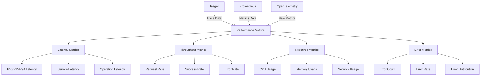

# Trace Performance Dashboard Guide

This document provides comprehensive guidance on creating and configuring Grafana dashboards for trace performance analysis in the MCP system.

---

## 1. Overview

### 1.1 Performance Dashboard Purpose

The trace performance dashboard provides detailed analysis of trace performance metrics, enabling:

- **Latency Analysis**: Detailed analysis of trace and span latency
- **Throughput Analysis**: Analysis of request throughput and capacity
- **Resource Usage**: Monitoring of resource consumption by traces
- **Bottleneck Identification**: Identification of performance bottlenecks
- **Trend Analysis**: Long-term performance trend analysis

### 1.2 Performance Metrics Architecture



---

## 2. Latency Analysis Panels

### 2.1 Overall Latency Distribution

```json
{
  "id": 1,
  "title": "Overall Latency Distribution",
  "type": "histogram",
  "gridPos": { "h": 8, "w": 12, "x": 0, "y": 0 },
  "targets": [
    {
      "expr": "histogram_quantile(0.50, sum(rate(mcp_request_duration_seconds_bucket[5m])) by (le))",
      "legendFormat": "P50"
    },
    {
      "expr": "histogram_quantile(0.95, sum(rate(mcp_request_duration_seconds_bucket[5m])) by (le))",
      "legendFormat": "P95"
    },
    {
      "expr": "histogram_quantile(0.99, sum(rate(mcp_request_duration_seconds_bucket[5m])) by (le))",
      "legendFormat": "P99"
    }
  ],
  "fieldConfig": {
    "defaults": {
      "unit": "s",
      "custom": {
        "drawStyle": "line",
        "lineInterpolation": "linear",
        "fillOpacity": 0.1,
        "spanNulls": false
      }
    }
  },
  "options": {
    "legend": {
      "displayMode": "list",
      "placement": "bottom"
    },
    "tooltip": {
      "mode": "multi",
      "sort": "desc"
    }
  }
}
```

### 2.2 Service-Level Latency

```json
{
  "id": 2,
  "title": "Service-Level Latency",
  "type": "timeseries",
  "gridPos": { "h": 8, "w": 12, "x": 12, "y": 0 },
  "targets": [
    {
      "expr": "histogram_quantile(0.95, sum(rate(mcp_request_duration_seconds_bucket[5m])) by (le, service_name))",
      "legendFormat": "{{service_name}} - P95"
    }
  ],
  "fieldConfig": {
    "defaults": {
      "unit": "s",
      "custom": {
        "drawStyle": "line",
        "lineInterpolation": "linear",
        "fillOpacity": 0.1,
        "spanNulls": false
      }
    }
  },
  "options": {
    "legend": {
      "displayMode": "list",
      "placement": "bottom"
    },
    "tooltip": {
      "mode": "multi",
      "sort": "desc"
    }
  }
}
```

### 2.3 Operation-Level Latency Heatmap

```json
{
  "id": 3,
  "title": "Operation-Level Latency Heatmap",
  "type": "heatmap",
  "gridPos": { "h": 8, "w": 24, "x": 0, "y": 8 },
  "targets": [
    {
      "expr": "sum(rate(mcp_request_duration_seconds_sum[5m])) by (service_name, operation_name) / sum(rate(mcp_request_duration_seconds_count[5m])) by (service_name, operation_name)",
      "legendFormat": "{{service_name}} - {{operation_name}}"
    }
  ],
  "fieldConfig": {
    "defaults": {
      "unit": "s",
      "custom": {
        "drawStyle": "line",
        "lineInterpolation": "linear",
        "fillOpacity": 0.1,
        "spanNulls": false
      },
      "color": {
        "mode": "continuous-GrYlRd",
        "thresholds": {
          "steps": [
            { "color": "green", "value": null },
            { "color": "yellow", "value": 0.5 },
            { "color": "red", "value": 1.0 }
          ]
        }
      }
    }
  },
  "options": {
    "legend": {
      "displayMode": "list",
      "placement": "bottom"
    },
    "tooltip": {
      "mode": "multi",
      "sort": "desc"
    }
  }
}
```

---

## 3. Throughput Analysis Panels

### 3.1 Request Throughput

```json
{
  "id": 4,
  "title": "Request Throughput",
  "type": "timeseries",
  "gridPos": { "h": 8, "w": 12, "x": 0, "y": 16 },
  "targets": [
    {
      "expr": "sum(rate(mcp_requests_total[5m])) by (service_name)",
      "legendFormat": "{{service_name}}"
    }
  ],
  "fieldConfig": {
    "defaults": {
      "unit": "reqps",
      "custom": {
        "drawStyle": "line",
        "lineInterpolation": "linear",
        "fillOpacity": 0.1,
        "spanNulls": false
      }
    }
  },
  "options": {
    "legend": {
      "displayMode": "list",
      "placement": "bottom"
    },
    "tooltip": {
      "mode": "multi",
      "sort": "desc"
    }
  }
}
```

### 3.2 Success Rate Analysis

```json
{
  "id": 5,
  "title": "Success Rate Analysis",
  "type": "timeseries",
  "gridPos": { "h": 8, "w": 12, "x": 12, "y": 16 },
  "targets": [
    {
      "expr": "sum(rate(mcp_requests_total{status=\"success\"}[5m])) by (service_name) / sum(rate(mcp_requests_total[5m])) by (service_name)",
      "legendFormat": "{{service_name}}"
    }
  ],
  "fieldConfig": {
    "defaults": {
      "unit": "percentunit",
      "custom": {
        "drawStyle": "line",
        "lineInterpolation": "linear",
        "fillOpacity": 0.1,
        "spanNulls": false
      },
      "thresholds": {
        "mode": "absolute",
        "steps": [
          { "color": "green", "value": null },
          { "color": "yellow", "value": 0.95 },
          { "color": "red", "value": 0.9 }
        ]
      }
    }
  },
  "options": {
    "legend": {
      "displayMode": "list",
      "placement": "bottom"
    },
    "tooltip": {
      "mode": "multi",
      "sort": "desc"
    }
  }
}
```

### 3.3 Error Rate Analysis

```json
{
  "id": 6,
  "title": "Error Rate Analysis",
  "type": "timeseries",
  "gridPos": { "h": 8, "w": 24, "x": 0, "y": 24 },
  "targets": [
    {
      "expr": "sum(rate(mcp_errors_total[5m])) by (service_name) / sum(rate(mcp_requests_total[5m])) by (service_name)",
      "legendFormat": "{{service_name}}"
    }
  ],
  "fieldConfig": {
    "defaults": {
      "unit": "percentunit",
      "custom": {
        "drawStyle": "line",
        "lineInterpolation": "linear",
        "fillOpacity": 0.1,
        "spanNulls": false
      },
      "thresholds": {
        "mode": "absolute",
        "steps": [
          { "color": "green", "value": null },
          { "color": "yellow", "value": 0.05 },
          { "color": "red", "value": 0.1 }
        ]
      }
    }
  },
  "options": {
    "legend": {
      "displayMode": "list",
      "placement": "bottom"
    },
    "tooltip": {
      "mode": "multi",
      "sort": "desc"
    }
  }
}
```

---

## 4. Resource Usage Analysis Panels

### 4.1 CPU Usage by Service

```json
{
  "id": 7,
  "title": "CPU Usage by Service",
  "type": "timeseries",
  "gridPos": { "h": 8, "w": 12, "x": 0, "y": 32 },
  "targets": [
    {
      "expr": "sum(rate(container_cpu_usage_seconds_total{container_label_io_kubernetes_pod_namespace=\"mcp-system\"}[5m])) by (container_label_io_kubernetes_pod_name)",
      "legendFormat": "{{container_label_io_kubernetes_pod_name}}"
    }
  ],
  "fieldConfig": {
    "defaults": {
      "unit": "cores",
      "custom": {
        "drawStyle": "line",
        "lineInterpolation": "linear",
        "fillOpacity": 0.1,
        "spanNulls": false
      }
    }
  },
  "options": {
    "legend": {
      "displayMode": "list",
      "placement": "bottom"
    },
    "tooltip": {
      "mode": "multi",
      "sort": "desc"
    }
  }
}
```

### 4.2 Memory Usage by Service

```json
{
  "id": 8,
  "title": "Memory Usage by Service",
  "type": "timeseries",
  "gridPos": { "h": 8, "w": 12, "x": 12, "y": 32 },
  "targets": [
    {
      "expr": "sum(container_memory_working_set_bytes{container_label_io_kubernetes_pod_namespace=\"mcp-system\"}) by (container_label_io_kubernetes_pod_name)",
      "legendFormat": "{{container_label_io_kubernetes_pod_name}}"
    }
  ],
  "fieldConfig": {
    "defaults": {
      "unit": "bytes",
      "custom": {
        "drawStyle": "line",
        "lineInterpolation": "linear",
        "fillOpacity": 0.1,
        "spanNulls": false
      }
    }
  },
  "options": {
    "legend": {
      "displayMode": "list",
      "placement": "bottom"
    },
    "tooltip": {
      "mode": "multi",
      "sort": "desc"
    }
  }
}
```

### 4.3 Network Usage by Service

```json
{
  "id": 9,
  "title": "Network Usage by Service",
  "type": "timeseries",
  "gridPos": { "h": 8, "w": 24, "x": 0, "y": 40 },
  "targets": [
    {
      "expr": "sum(rate(container_network_transmit_bytes_total{container_label_io_kubernetes_pod_namespace=\"mcp-system\"}[5m])) by (container_label_io_kubernetes_pod_name)",
      "legendFormat": "{{container_label_io_kubernetes_pod_name}} - TX"
    },
    {
      "expr": "sum(rate(container_network_receive_bytes_total{container_label_io_kubernetes_pod_namespace=\"mcp-system\"}[5m])) by (container_label_io_kubernetes_pod_name)",
      "legendFormat": "{{container_label_io_kubernetes_pod_name}} - RX"
    }
  ],
  "fieldConfig": {
    "defaults": {
      "unit": "bytes",
      "custom": {
        "drawStyle": "line",
        "lineInterpolation": "linear",
        "fillOpacity": 0.1,
        "spanNulls": false
      }
    }
  },
  "options": {
    "legend": {
      "displayMode": "list",
      "placement": "bottom"
    },
    "tooltip": {
      "mode": "multi",
      "sort": "desc"
    }
  }
}
```

---

## 5. Complete Performance Dashboard Configuration

### 5.1 Main Performance Dashboard

```json
{
  "dashboard": {
    "id": null,
    "title": "MCP Trace Performance Dashboard",
    "description": "Comprehensive dashboard for trace performance analysis and monitoring",
    "tags": ["mcp", "tracing", "performance", "latency"],
    "timezone": "browser",
    "panels": [
      {
        "id": 1,
        "title": "Overall Latency Distribution",
        "type": "histogram",
        "gridPos": { "h": 8, "w": 12, "x": 0, "y": 0 },
        "targets": [
          {
            "expr": "histogram_quantile(0.50, sum(rate(mcp_request_duration_seconds_bucket[5m])) by (le))",
            "legendFormat": "P50"
          },
          {
            "expr": "histogram_quantile(0.95, sum(rate(mcp_request_duration_seconds_bucket[5m])) by (le))",
            "legendFormat": "P95"
          },
          {
            "expr": "histogram_quantile(0.99, sum(rate(mcp_request_duration_seconds_bucket[5m])) by (le))",
            "legendFormat": "P99"
          }
        ],
        "fieldConfig": {
          "defaults": {
            "unit": "s",
            "custom": {
              "drawStyle": "line",
              "lineInterpolation": "linear",
              "fillOpacity": 0.1,
              "spanNulls": false
            }
          }
        },
        "options": {
          "legend": {
            "displayMode": "list",
            "placement": "bottom"
          },
          "tooltip": {
            "mode": "multi",
            "sort": "desc"
          }
        }
      },
      {
        "id": 2,
        "title": "Service-Level Latency",
        "type": "timeseries",
        "gridPos": { "h": 8, "w": 12, "x": 12, "y": 0 },
        "targets": [
          {
            "expr": "histogram_quantile(0.95, sum(rate(mcp_request_duration_seconds_bucket[5m])) by (le, service_name))",
            "legendFormat": "{{service_name}} - P95"
          }
        ],
        "fieldConfig": {
          "defaults": {
            "unit": "s",
            "custom": {
              "drawStyle": "line",
              "lineInterpolation": "linear",
              "fillOpacity": 0.1,
              "spanNulls": false
            }
          }
        },
        "options": {
          "legend": {
            "displayMode": "list",
            "placement": "bottom"
          },
          "tooltip": {
            "mode": "multi",
            "sort": "desc"
          }
        }
      },
      {
        "id": 3,
        "title": "Operation-Level Latency Heatmap",
        "type": "heatmap",
        "gridPos": { "h": 8, "w": 24, "x": 0, "y": 8 },
        "targets": [
          {
            "expr": "sum(rate(mcp_request_duration_seconds_sum[5m])) by (service_name, operation_name) / sum(rate(mcp_request_duration_seconds_count[5m])) by (service_name, operation_name)",
            "legendFormat": "{{service_name}} - {{operation_name}}"
          }
        ],
        "fieldConfig": {
          "defaults": {
            "unit": "s",
            "custom": {
              "drawStyle": "line",
              "lineInterpolation": "linear",
              "fillOpacity": 0.1,
              "spanNulls": false
            },
            "color": {
              "mode": "continuous-GrYlRd",
              "thresholds": {
                "steps": [
                  { "color": "green", "value": null },
                  { "color": "yellow", "value": 0.5 },
                  { "color": "red", "value": 1.0 }
                ]
              }
            }
          }
        },
        "options": {
          "legend": {
            "displayMode": "list",
            "placement": "bottom"
          },
          "tooltip": {
            "mode": "multi",
            "sort": "desc"
          }
        }
      },
      {
        "id": 4,
        "title": "Request Throughput",
        "type": "timeseries",
        "gridPos": { "h": 8, "w": 12, "x": 0, "y": 16 },
        "targets": [
          {
            "expr": "sum(rate(mcp_requests_total[5m])) by (service_name)",
            "legendFormat": "{{service_name}}"
          }
        ],
        "fieldConfig": {
          "defaults": {
            "unit": "reqps",
            "custom": {
              "drawStyle": "line",
              "lineInterpolation": "linear",
              "fillOpacity": 0.1,
              "spanNulls": false
            }
          }
        },
        "options": {
          "legend": {
            "displayMode": "list",
            "placement": "bottom"
          },
          "tooltip": {
            "mode": "multi",
            "sort": "desc"
          }
        }
      },
      {
        "id": 5,
        "title": "Success Rate Analysis",
        "type": "timeseries",
        "gridPos": { "h": 8, "w": 12, "x": 12, "y": 16 },
        "targets": [
          {
            "expr": "sum(rate(mcp_requests_total{status=\"success\"}[5m])) by (service_name) / sum(rate(mcp_requests_total[5m])) by (service_name)",
            "legendFormat": "{{service_name}}"
          }
        ],
        "fieldConfig": {
          "defaults": {
            "unit": "percentunit",
            "custom": {
              "drawStyle": "line",
              "lineInterpolation": "linear",
              "fillOpacity": 0.1,
              "spanNulls": false
            },
            "thresholds": {
              "mode": "absolute",
              "steps": [
                { "color": "green", "value": null },
                { "color": "yellow", "value": 0.95 },
                { "color": "red", "value": 0.9 }
              ]
            }
          }
        },
        "options": {
          "legend": {
            "displayMode": "list",
            "placement": "bottom"
          },
          "tooltip": {
            "mode": "multi",
            "sort": "desc"
          }
        }
      },
      {
        "id": 6,
        "title": "Error Rate Analysis",
        "type": "timeseries",
        "gridPos": { "h": 8, "w": 24, "x": 0, "y": 24 },
        "targets": [
          {
            "expr": "sum(rate(mcp_errors_total[5m])) by (service_name) / sum(rate(mcp_requests_total[5m])) by (service_name)",
            "legendFormat": "{{service_name}}"
          }
        ],
        "fieldConfig": {
          "defaults": {
            "unit": "percentunit",
            "custom": {
              "drawStyle": "line",
              "lineInterpolation": "linear",
              "fillOpacity": 0.1,
              "spanNulls": false
            },
            "thresholds": {
              "mode": "absolute",
              "steps": [
                { "color": "green", "value": null },
                { "color": "yellow", "value": 0.05 },
                { "color": "red", "value": 0.1 }
              ]
            }
          }
        },
        "options": {
          "legend": {
            "displayMode": "list",
            "placement": "bottom"
          },
          "tooltip": {
            "mode": "multi",
            "sort": "desc"
          }
        }
      },
      {
        "id": 7,
        "title": "CPU Usage by Service",
        "type": "timeseries",
        "gridPos": { "h": 8, "w": 12, "x": 0, "y": 32 },
        "targets": [
          {
            "expr": "sum(rate(container_cpu_usage_seconds_total{container_label_io_kubernetes_pod_namespace=\"mcp-system\"}[5m])) by (container_label_io_kubernetes_pod_name)",
            "legendFormat": "{{container_label_io_kubernetes_pod_name}}"
          }
        ],
        "fieldConfig": {
          "defaults": {
            "unit": "cores",
            "custom": {
              "drawStyle": "line",
              "lineInterpolation": "linear",
              "fillOpacity": 0.1,
              "spanNulls": false
            }
          }
        },
        "options": {
          "legend": {
            "displayMode": "list",
            "placement": "bottom"
          },
          "tooltip": {
            "mode": "multi",
            "sort": "desc"
          }
        }
      },
      {
        "id": 8,
        "title": "Memory Usage by Service",
        "type": "timeseries",
        "gridPos": { "h": 8, "w": 12, "x": 12, "y": 32 },
        "targets": [
          {
            "expr": "sum(container_memory_working_set_bytes{container_label_io_kubernetes_pod_namespace=\"mcp-system\"}) by (container_label_io_kubernetes_pod_name)",
            "legendFormat": "{{container_label_io_kubernetes_pod_name}}"
          }
        ],
        "fieldConfig": {
          "defaults": {
            "unit": "bytes",
            "custom": {
              "drawStyle": "line",
              "lineInterpolation": "linear",
              "fillOpacity": 0.1,
              "spanNulls": false
            }
          }
        },
        "options": {
          "legend": {
            "displayMode": "list",
            "placement": "bottom"
          },
          "tooltip": {
            "mode": "multi",
            "sort": "desc"
          }
        }
      },
      {
        "id": 9,
        "title": "Network Usage by Service",
        "type": "timeseries",
        "gridPos": { "h": 8, "w": 24, "x": 0, "y": 40 },
        "targets": [
          {
            "expr": "sum(rate(container_network_transmit_bytes_total{container_label_io_kubernetes_pod_namespace=\"mcp-system\"}[5m])) by (container_label_io_kubernetes_pod_name)",
            "legendFormat": "{{container_label_io_kubernetes_pod_name}} - TX"
          },
          {
            "expr": "sum(rate(container_network_receive_bytes_total{container_label_io_kubernetes_pod_namespace=\"mcp-system\"}[5m])) by (container_label_io_kubernetes_pod_name)",
            "legendFormat": "{{container_label_io_kubernetes_pod_name}} - RX"
          }
        ],
        "fieldConfig": {
          "defaults": {
            "unit": "bytes",
            "custom": {
              "drawStyle": "line",
              "lineInterpolation": "linear",
              "fillOpacity": 0.1,
              "spanNulls": false
            }
          }
        },
        "options": {
          "legend": {
            "displayMode": "list",
            "placement": "bottom"
          },
          "tooltip": {
            "mode": "multi",
            "sort": "desc"
          }
        }
      }
    ],
    "templating": {
      "list": [
        {
          "name": "service_name",
          "type": "query",
          "query": "label_values(mcp_requests_total, service_name)",
          "refresh": 1,
          "includeAll": true,
          "allValue": ".*"
        },
        {
          "name": "operation_name",
          "type": "query",
          "query": "label_values(mcp_requests_total{service_name=~\"$service_name\"}, operation_name)",
          "refresh": 1,
          "includeAll": true,
          "allValue": ".*"
        }
      ]
    },
    "time": {
      "from": "now-1h",
      "to": "now"
    },
    "timepicker": {
      "refresh_intervals": ["5s", "10s", "30s", "1m", "5m", "15m", "30m", "1h", "2h", "1d"],
      "time_options": ["5m", "15m", "1h", "6h", "12h", "24h", "2d", "7d", "30d"]
    },
    "links": [
      {
        "title": "View in Jaeger",
        "url": "http://jaeger:16686",
        "icon": "external link"
      },
      {
        "title": "Main Tracing Dashboard",
        "url": "/d/mcp-distributed-tracing",
        "icon": "dashboard"
      }
    ]
  }
}
```

---

## 6. Advanced Performance Analysis Dashboards

### 6.1 Bottleneck Analysis Dashboard

```json
{
  "dashboard": {
    "id": null,
    "title": "MCP Bottleneck Analysis Dashboard",
    "description": "Dashboard for identifying and analyzing performance bottlenecks",
    "tags": ["mcp", "tracing", "bottleneck", "performance"],
    "timezone": "browser",
    "panels": [
      {
        "id": 1,
        "title": "Slowest Operations",
        "type": "table",
        "gridPos": { "h": 8, "w": 24, "x": 0, "y": 0 },
        "targets": [
          {
            "expr": "topk(10, sum(rate(mcp_request_duration_seconds_sum[5m])) by (service_name, operation_name) / sum(rate(mcp_request_duration_seconds_count[5m])) by (service_name, operation_name))",
            "legendFormat": "{{service_name}} - {{operation_name}}"
          }
        ],
        "fieldConfig": {
          "defaults": {
            "unit": "s",
            "custom": {
              "align": "left",
              "filterable": true
            },
            "thresholds": {
              "mode": "absolute",
              "steps": [
                { "color": "green", "value": null },
                { "color": "yellow", "value": 1.0 },
                { "color": "red", "value": 2.0 }
              ]
            }
          }
        }
      },
      {
        "id": 2,
        "title": "Service Dependency Latency",
        "type": "graph",
        "gridPos": { "h": 8, "w": 24, "x": 0, "y": 8 },
        "targets": [
          {
            "expr": "histogram_quantile(0.95, sum(rate(mcp_request_duration_seconds_bucket[5m])) by (le, service_name, dependency_service_name))",
            "legendFormat": "{{service_name}} -> {{dependency_service_name}}"
          }
        ],
        "fieldConfig": {
          "defaults": {
            "unit": "s",
            "custom": {
              "drawStyle": "line",
              "lineInterpolation": "linear",
              "fillOpacity": 0.1,
              "spanNulls": false
            }
          }
        }
      },
      {
        "id": 3,
        "title": "Resource Utilization vs Latency",
        "type": "scatter",
        "gridPos": { "h": 8, "w": 24, "x": 0, "y": 16 },
        "targets": [
          {
            "expr": "sum(rate(mcp_request_duration_seconds_sum[5m])) by (service_name) / sum(rate(mcp_request_duration_seconds_count[5m])) by (service_name)",
            "legendFormat": "Latency"
          },
          {
            "expr": "sum(rate(container_cpu_usage_seconds_total{container_label_io_kubernetes_pod_namespace=\"mcp-system\"}[5m])) by (container_label_io_kubernetes_pod_name)",
            "legendFormat": "CPU"
          }
        ],
        "fieldConfig": {
          "defaults": {
            "unit": "s",
            "custom": {
              "drawStyle": "line",
              "lineInterpolation": "linear",
              "fillOpacity": 0.1,
              "spanNulls": false
            }
          }
        }
      }
    ]
  }
}
```

### 6.2 Trend Analysis Dashboard

```json
{
  "dashboard": {
    "id": null,
    "title": "MCP Performance Trend Analysis Dashboard",
    "description": "Dashboard for long-term performance trend analysis",
    "tags": ["mcp", "tracing", "trend", "analysis"],
    "timezone": "browser",
    "panels": [
      {
        "id": 1,
        "title": "7-Day Latency Trend",
        "type": "timeseries",
        "gridPos": { "h": 8, "w": 24, "x": 0, "y": 0 },
        "targets": [
          {
            "expr": "histogram_quantile(0.95, sum(rate(mcp_request_duration_seconds_bucket[7d])) by (le, service_name))",
            "legendFormat": "{{service_name}} - P95"
          }
        ],
        "fieldConfig": {
          "defaults": {
            "unit": "s",
            "custom": {
              "drawStyle": "line",
              "lineInterpolation": "linear",
              "fillOpacity": 0.1,
              "spanNulls": false
            }
          }
        }
      },
      {
        "id": 2,
        "title": "30-Day Throughput Trend",
        "type": "timeseries",
        "gridPos": { "h": 8, "w": 24, "x": 0, "y": 8 },
        "targets": [
          {
            "expr": "sum(rate(mcp_requests_total[30d])) by (service_name)",
            "legendFormat": "{{service_name}}"
          }
        ],
        "fieldConfig": {
          "defaults": {
            "unit": "reqps",
            "custom": {
              "drawStyle": "line",
              "lineInterpolation": "linear",
              "fillOpacity": 0.1,
              "spanNulls": false
            }
          }
        }
      },
      {
        "id": 3,
        "title": "Error Rate Trend",
        "type": "timeseries",
        "gridPos": { "h": 8, "w": 24, "x": 0, "y": 16 },
        "targets": [
          {
            "expr": "sum(rate(mcp_errors_total[30d])) by (service_name) / sum(rate(mcp_requests_total[30d])) by (service_name)",
            "legendFormat": "{{service_name}}"
          }
        ],
        "fieldConfig": {
          "defaults": {
            "unit": "percentunit",
            "custom": {
              "drawStyle": "line",
              "lineInterpolation": "linear",
              "fillOpacity": 0.1,
              "spanNulls": false
            }
          }
        }
      }
    ]
  }
}
```

---

## 7. Best Practices

### 7.1 Dashboard Design Principles

1. **Clear Hierarchy**: Organize panels in a logical hierarchy from overview to detail
2. **Consistent Styling**: Use consistent colors, units, and styling across panels
3. **Appropriate Time Ranges**: Set appropriate time ranges for different analysis types
4. **Interactive Filtering**: Provide template variables for interactive filtering
5. **Contextual Links**: Include links to related dashboards and tools

### 7.2 Performance Monitoring Guidelines

```yaml
# performance-monitoring-guidelines.yaml
monitoring_guidelines:
  latency:
    - "Monitor P50, P95, and P99 percentiles"
    - "Set appropriate alert thresholds for each percentile"
    - "Track latency trends over time"
    - "Correlate latency with business metrics"
  
  throughput:
    - "Monitor request rates and success rates"
    - "Track throughput patterns and trends"
    - "Monitor for sudden changes in throughput"
    - "Correlate with business activity"
  
  errors:
    - "Monitor error rates and error types"
    - "Track error patterns and trends"
    - "Set up alerts for error rate spikes"
    - "Correlate errors with system events"
  
  resources:
    - "Monitor CPU, memory, and network usage"
    - "Track resource utilization trends"
    - "Set up alerts for resource exhaustion"
    - "Correlate resource usage with performance"
```

### 7.3 Dashboard Optimization

```yaml
# dashboard-optimization.yaml
optimization_strategies:
  performance:
    - "Use appropriate query intervals"
    - "Optimize Prometheus queries for performance"
    - "Use caching where appropriate"
    - "Limit the number of panels per dashboard"
  
  usability:
    - "Use clear and descriptive titles"
    - "Provide appropriate legends and labels"
    - "Use consistent color schemes"
    - "Include helpful descriptions and annotations"
  
  maintenance:
    - "Regularly review and update dashboards"
    - "Remove unused or redundant panels"
    - "Update queries as metrics change"
    - "Document dashboard purpose and usage"
```

---

## 8. Troubleshooting

### 8.1 Common Dashboard Issues

#### Problem: Slow Dashboard Loading

**Symptoms:**
- Dashboard takes a long time to load
- Queries timeout or fail
- High resource usage on Grafana server

**Solutions:**
1. Optimize Prometheus queries
2. Increase query timeout settings
3. Use appropriate time ranges
4. Reduce the number of panels
5. Use query caching

#### Problem: Missing or Incorrect Data

**Symptoms:**
- Panels show no data
- Data appears incorrect or outdated
- Inconsistent data across panels

**Solutions:**
1. Verify metric availability in Prometheus
2. Check query syntax and labels
3. Verify time range settings
4. Check data source configuration
5. Validate metric collection and storage

#### Problem: Poor Visualization

**Symptoms:**
- Charts are difficult to read
- Colors are inconsistent or confusing
- Legends are unclear or missing

**Solutions:**
1. Use appropriate chart types for data
2. Apply consistent color schemes
3. Ensure clear legends and labels
4. Use appropriate units and formatting
5. Optimize panel layout and sizing

### 8.2 Debug Commands

```bash
# Check Prometheus query performance
curl -s "http://prometheus:9090/api/v1/query?query=sum(rate(mcp_requests_total[5m])) by (service_name)"

# Check Grafana dashboard configuration
kubectl get configmap grafana-dashboards -n monitoring -o yaml

# Check data source configuration
curl -s "http://grafana:3000/api/datasources" | jq

# Test specific dashboard queries
curl -s "http://grafana:3000/api/dashboards/uid/mcp-performance" | jq

# Check metric availability
curl -s "http://prometheus:9090/api/v1/label/metric/values" | jq
```

---

## 9. Future Enhancements

### 9.1 Advanced Visualization Features

- **3D Trace Visualization**: Advanced 3D visualization of trace relationships
- **Interactive Timeline**: Interactive timeline with zoom and pan capabilities
- **Real-time Streaming**: Real-time streaming of performance data
- **Predictive Analytics**: Predictive performance analysis and forecasting

### 9.2 Machine Learning Integration

- **Anomaly Detection**: ML-based anomaly detection for performance metrics
- **Pattern Recognition**: Automatic pattern recognition in performance data
- **Predictive Alerting**: Predictive alerting based on performance trends
- **Automated Analysis**: Automated performance analysis and reporting

### 9.3 Enhanced Correlation

- **Cross-System Correlation**: Correlation across multiple systems and environments
- **Business Metric Correlation**: Correlation with business metrics and KPIs
- **User Experience Correlation**: Correlation with user experience metrics
- **Cost Correlation**: Correlation with infrastructure and operational costs