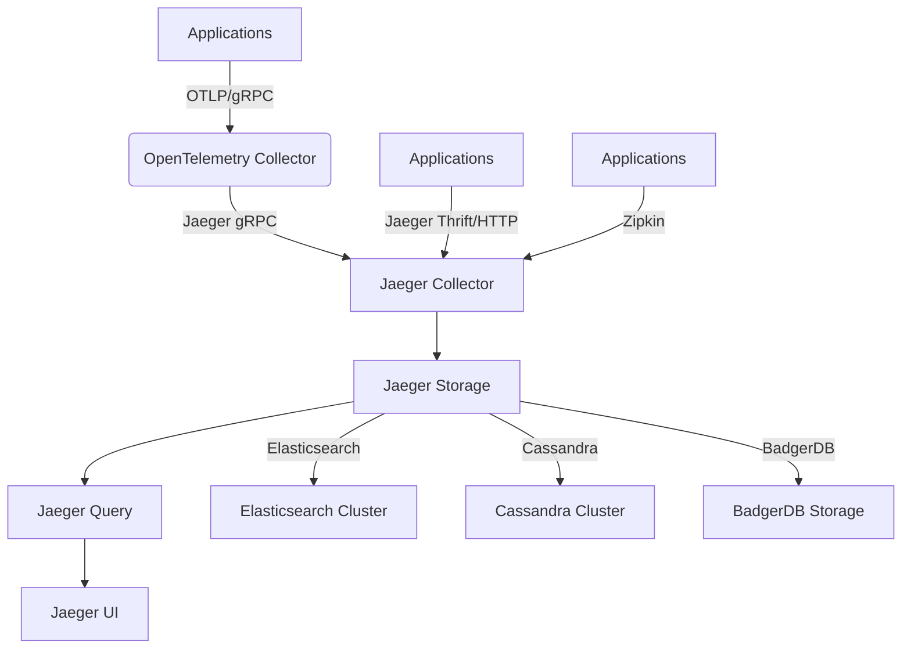

# Jaeger Setup Guide for MCP System Distributed Tracing

This document provides a comprehensive guide for setting up Jaeger as the distributed tracing backend for the MCP system.

---

## 1. Overview

### 1.1 What is Jaeger?

Jaeger is an open-source, end-to-end distributed tracing system that helps monitor and troubleshoot microservices-based distributed systems. It provides:

- **Distributed Context Propagation**: Tracks requests as they flow through multiple services
- **Performance Monitoring**: Identifies latency issues and bottlenecks
- **Root Cause Analysis**: Helps identify the source of problems in complex systems
- **Service Dependency Analysis**: Visualizes service dependencies and interactions

### 1.2 Jaeger Architecture



### 1.3 Integration with MCP System

The MCP system will use Jaeger as the primary distributed tracing backend, integrated with:

- **OpenTelemetry Collector**: For trace collection and processing
- **Elasticsearch**: For long-term trace storage
- **Grafana**: For trace visualization alongside metrics
- **Alertmanager**: For trace-based alerting

---

## 2. Deployment Options

### 2.1 All-in-One Deployment (Development)

```yaml
# docker-compose.jaeger.yml
version: '3.8'

services:
  jaeger:
    image: jaegertracing/all-in-one:1.50
    container_name: mcp-jaeger
    hostname: jaeger
    ports:
      - "16686:16686"  # Jaeger UI
      - "14268:14268"  # HTTP collector
      - "14250:14250"  # gRPC collector
      - "6831:6831/udp"  # UDP agent compact
      - "6832:6832/udp"  # UDP agent binary
      - "5778:5778"    # Service configs
    environment:
      - COLLECTOR_OTLP_ENABLED=true
      - COLLECTOR_ZIPKIN_HOST_PORT=:9411
    networks:
      - tracing
    restart: unless-stopped
    logging:
      driver: "json-file"
      options:
        max-size: "10m"
        max-file: "5"

networks:
  tracing:
    driver: bridge
    name: mcp-tracing
```

### 2.2 Production Deployment with Elasticsearch

```yaml
# docker-compose.jaeger-prod.yml
version: '3.8'

services:
  # Jaeger Collector
  collector:
    image: jaegertracing/jaeger-collector:1.50
    container_name: mcp-jaeger-collector
    hostname: collector
    command: [
      "--es.server-urls=http://elasticsearch:9200",
      "--es.username=elastic",
      "--es.password=changeme",
      "--es.index-prefix=jaeger",
      "--es.tags-as-fields.all=true",
      "--collector.otlp.enabled=true",
      "--collector.otlp.grpc.host-port=:14250",
      "--collector.otlp.http.host-port=:14268",
      "--collector.zipkin.host-port=:9411",
      "--sampling.strategies-file=/etc/jaeger/sampling.json"
    ]
    ports:
      - "14250:14250"  # gRPC
      - "14268:14268"  # HTTP
      - "9411:9411"    # Zipkin
    volumes:
      - ./jaeger/config/sampling.json:/etc/jaeger/sampling.json
    environment:
      - SPAN_STORAGE_TYPE=elasticsearch
    depends_on:
      - elasticsearch
    networks:
      - tracing
    restart: unless-stopped
    logging:
      driver: "json-file"
      options:
        max-size: "10m"
        max-file: "5"

  # Jaeger Query
  query:
    image: jaegertracing/jaeger-query:1.50
    container_name: mcp-jaeger-query
    hostname: query
    command: [
      "--es.server-urls=http://elasticsearch:9200",
      "--es.username=elastic",
      "--es.password=changeme",
      "--es.index-prefix=jaeger",
      "--es.tags-as-fields.all=true",
      "--query.base-path=/jaeger"
    ]
    ports:
      - "16686:16686"  # Jaeger UI
    environment:
      - SPAN_STORAGE_TYPE=elasticsearch
      - QUERY_BASE_PATH=/jaeger
    depends_on:
      - elasticsearch
    networks:
      - tracing
    restart: unless-stopped
    logging:
      driver: "json-file"
      options:
        max-size: "10m"
        max-file: "5"

  # Jaeger Agent
  agent:
    image: jaegertracing/jaeger-agent:1.50
    container_name: mcp-jaeger-agent
    hostname: agent
    command: [
      "--reporter.grpc.host-port=collector:14250",
      "--reporter.grpc.tls.enabled=false",
      "--processor.jaeger-compact.server-host-port=:6831",
      "--processor.jaeger-binary.server-host-port=:6832",
      "--processor.zipkin-compact.server-host-port=:5775",
      "--processor.zipkin-http.server-host-port=:5778"
    ]
    ports:
      - "5775:5775/udp"  # Zipkin compact
      - "6831:6831/udp"  # Jaeger compact
      - "6832:6832/udp"  # Jaeger binary
      - "5778:5778"     # Config server
    depends_on:
      - collector
    networks:
      - tracing
    restart: unless-stopped
    logging:
      driver: "json-file"
      options:
        max-size: "10m"
        max-file: "5"

  # Elasticsearch
  elasticsearch:
    image: docker.elastic.co/elasticsearch/elasticsearch:8.12.0
    container_name: mcp-jaeger-elasticsearch
    hostname: elasticsearch
    environment:
      - discovery.type=single-node
      - xpack.security.enabled=false
      - "ES_JAVA_OPTS=-Xms2g -Xmx2g"
      - cluster.name=jaeger-cluster
      - node.name=jaeger-node-1
      - network.host=0.0.0.0
    ports:
      - "9200:9200"
      - "9300:9300"
    volumes:
      - jaeger_es_data:/usr/share/elasticsearch/data
    networks:
      - tracing
    restart: unless-stopped
    logging:
      driver: "json-file"
      options:
        max-size: "10m"
        max-file: "5"

volumes:
  jaeger_es_data:
    driver: local

networks:
  tracing:
    driver: bridge
    name: mcp-tracing
```

### 2.3 Kubernetes Deployment

```yaml
# jaeger-kubernetes.yaml
apiVersion: v1
kind: Namespace
metadata:
  name: tracing
  labels:
    name: tracing

---
# Jaeger Operator
apiVersion: operators.coreos.com/v1alpha1
kind: Subscription
metadata:
  name: jaeger-product
  namespace: tracing
spec:
  channel: stable
  installPlanApproval: Automatic
  name: jaeger-product
  source: community-operators
  sourceNamespace: openshift-marketplace

---
# Jaeger Instance
apiVersion: jaegertracing.io/v1
kind: Jaeger
metadata:
  name: mcp-jaeger
  namespace: tracing
spec:
  strategy: production
  collector:
    replicas: 3
    image: jaegertracing/jaeger-collector:1.50
    options:
      log-level: info
      metrics-backend: prometheus
      collector.otlp.enabled: true
      es.server-urls: http://elasticsearch:9200
      es.username: elastic
      es.password: changeme
      es.index-prefix: jaeger
      es.tags-as-fields.all: true
    resources:
      limits:
        cpu: "2"
        memory: "4Gi"
      requests:
        cpu: "1"
        memory: "2Gi"
  query:
    replicas: 2
    image: jaegertracing/jaeger-query:1.50
    options:
      log-level: info
      query.base-path: /jaeger
      es.server-urls: http://elasticsearch:9200
      es.username: elastic
      es.password: changeme
      es.index-prefix: jaeger
      es.tags-as-fields.all: true
    resources:
      limits:
        cpu: "1"
        memory: "2Gi"
      requests:
        cpu: "500m"
        memory: "1Gi"
  agent:
    strategy: DaemonSet
    image: jaegertracing/jaeger-agent:1.50
    options:
      log-level: info
      reporter.grpc.host-port: mcp-jaeger-collector.tracing.svc:14250
      reporter.grpc.tls.enabled: false
      processor.jaeger-compact.server-host-port: 0.0.0.0:6831
      processor.jaeger-binary.server-host-port: 0.0.0.0:6832
    resources:
      limits:
        cpu: "500m"
        memory: "512Mi"
      requests:
        cpu: "200m"
        memory: "256Mi"
  ingress:
    enabled: true
    hosts:
      - jaeger.mcp.internal
    annotations:
      kubernetes.io/ingress.class: nginx
      cert-manager.io/cluster-issuer: letsencrypt-prod
  storage:
    type: elasticsearch
    options:
      es:
        server-urls: http://elasticsearch:9200
        username: elastic
        password: changeme
        index-prefix: jaeger
        tags-as-fields-all: true
```

---

## 3. Configuration

### 3.1 Sampling Strategies

```json
// sampling.json
{
  "service_strategies": [
    {
      "service": "model-router",
      "type": "probabilistic",
      "param": 1.0,
      "operation_strategies": [
        {
          "operation": "health_check",
          "type": "probabilistic",
          "param": 0.01
        }
      ]
    },
    {
      "service": "workflow-orchestrator",
      "type": "probabilistic",
      "param": 0.5,
      "operation_strategies": [
        {
          "operation": "workflow_execution",
          "type": "probabilistic",
          "param": 1.0
        }
      ]
    },
    {
      "service": "agent-collaboration",
      "type": "probabilistic",
      "param": 1.0
    },
    {
      "service": "frontend",
      "type": "rate_limiting",
      "param": 100
    }
  ],
  "default_strategy": {
    "type": "probabilistic",
    "param": 0.1
  }
}
```

### 3.2 Elasticsearch Index Template

```json
// jaeger-index-template.json
{
  "index_patterns": ["jaeger-span-*"],
  "settings": {
    "number_of_shards": 3,
    "number_of_replicas": 1,
    "index.refresh_interval": "5s",
    "index.codec": "best_compression"
  },
  "mappings": {
    "dynamic_templates": [
      {
        "strings": {
          "match_mapping_type": "string",
          "mapping": {
            "type": "keyword"
          }
        }
      }
    ],
    "properties": {
      "traceID": {
        "type": "keyword"
      },
      "spanID": {
        "type": "keyword"
      },
      "operationName": {
        "type": "keyword"
      },
      "startTime": {
        "type": "date"
      },
      "duration": {
        "type": "long"
      },
      "tags": {
        "type": "object",
        "dynamic": true
      },
      "logs": {
        "type": "object",
        "properties": {
          "timestamp": {
            "type": "date"
          },
          "fields": {
            "type": "object",
            "dynamic": true
          }
        }
      },
      "process": {
        "type": "object",
        "properties": {
          "serviceName": {
            "type": "keyword"
          },
          "tags": {
            "type": "object",
            "dynamic": true
          }
        }
      }
    }
  }
}
```

### 3.3 Jaeger Query Configuration

```yaml
# query-config.yaml
query:
  base-path: /jaeger
  ui:
    config-file: /etc/jaeger/ui-config.json
  metrics-backend: prometheus
  prometheus:
    server-url: http://prometheus:9090
    query:
      max-connections: 100
      timeout: 30s
```

### 3.4 UI Configuration

```json
// ui-config.json
{
  "menu": [
    {
      "label": "MCP System",
      "items": [
        {
          "label": "Service Dependencies",
          "url": "/jaeger/dependencies"
        },
        {
          "label": "System Architecture",
          "url": "/jaeger/architecture"
        }
      ]
    }
  ],
  "dependencies": {
    "menuEnabled": true,
    "dagMaxNumServices": 200,
    "defaultLookback": "1h"
  },
  "archiveEnabled": true,
  "tracking": {
    "gaID": "UA-00000000-0",
    "trackErrors": true
  }
}
```

---

## 4. Integration with OpenTelemetry

### 4.1 OpenTelemetry Collector Configuration

```yaml
# otel-collector-config.yaml
exporters:
  jaeger:
    endpoint: jaeger-collector:14250
    tls:
      insecure: true
    
  jaeger_exporter:
    endpoint: jaeger-collector:14250
    tls:
      insecure: true

service:
  pipelines:
    traces:
      exporters: [jaeger]
      processors: [batch, memory_limiter]
    traces/2:
      exporters: [jaeger_exporter]
      processors: [batch, memory_limiter]
```

### 4.2 Application Configuration

#### Python Services

```python
# tracing.py
from opentelemetry import trace
from opentelemetry.exporter.jaeger.thrift import JaegerExporter
from opentelemetry.sdk.resources import SERVICE_NAME, Resource
from opentelemetry.sdk.trace import TracerProvider
from opentelemetry.sdk.trace.export import BatchSpanProcessor

# Configure Jaeger exporter
jaeger_exporter = JaegerExporter(
    agent_host_name="jaeger-agent",
    agent_port=6831,
    # or use collector
    # collector_endpoint="http://jaeger-collector:14268/api/traces"
)

# Configure tracer provider
trace.set_tracer_provider(
    TracerProvider(
        resource=Resource.create({SERVICE_NAME: "model-router"})
    )
)

# Add span processor
tracer_provider = trace.get_tracer_provider()
span_processor = BatchSpanProcessor(jaeger_exporter)
tracer_provider.add_span_processor(span_processor)
```

#### JavaScript/Node.js Services

```javascript
// tracing.js
const { NodeSDK } = require('@opentelemetry/sdk-node');
const { JaegerExporter } = require('@opentelemetry/exporter-jaeger');
const { Resource } = require('@opentelemetry/resources');
const { SERVICE_NAME } = require('@opentelemetry/semantic-conventions');

// Configure Jaeger exporter
const jaegerExporter = new JaegerExporter({
  endpoint: 'http://jaeger-collector:14268/api/traces',
});

// Configure OpenTelemetry SDK
const sdk = new NodeSDK({
  resource: new Resource({
    [SERVICE_NAME]: 'frontend',
  }),
  traceExporter: jaegerExporter,
});

// Start the SDK
sdk.start();
```

---

## 5. Security Configuration

### 5.1 Authentication and Authorization

```yaml
# jaeger-security-config.yaml
security:
  enabled: true
  auth:
    type: oauth2
    oauth2:
      client-id: jaeger-ui
      client-secret: ${JAEGGER_CLIENT_SECRET}
      issuer-url: https://auth.mcp.internal
      scopes: ["openid", "profile", "email"]
  
  rbac:
    enabled: true
    roles:
      - name: admin
        permissions: ["read", "write", "delete"]
      - name: developer
        permissions: ["read", "write"]
      - name: viewer
        permissions: ["read"]
    
    role-bindings:
      - role: admin
        users: ["admin@mcp.internal"]
      - role: developer
        users: ["dev-team@mcp.internal"]
      - role: viewer
        users: ["*@mcp.internal"]
```

### 5.2 TLS Configuration

```yaml
# jaeger-tls-config.yaml
tls:
  enabled: true
  certificates:
    collector:
      cert: /etc/jaeger/certs/collector.crt
      key: /etc/jaeger/certs/collector.key
      ca: /etc/jaeger/certs/ca.crt
    
    agent:
      cert: /etc/jaeger/certs/agent.crt
      key: /etc/jaeger/certs/agent.key
      ca: /etc/jaeger/certs/ca.crt
    
    query:
      cert: /etc/jaeger/certs/query.crt
      key: /etc/jaeger/certs/query.key
      ca: /etc/jaeger/certs/ca.crt
```

---

## 6. Monitoring and Alerting

### 6.1 Prometheus Metrics

```yaml
# jaeger-metrics-config.yaml
metrics:
  enabled: true
  prometheus:
    enabled: true
    endpoint: /metrics
    namespace: jaeger
    
  custom_metrics:
    - name: jaeger_collector_spans_received_total
      type: counter
      help: Total number of spans received by collector
    - name: jaeger_collector_spans_processed_total
      type: counter
      help: Total number of spans processed by collector
    - name: jaeger_collector_spans_dropped_total
      type: counter
      help: Total number of spans dropped by collector
    - name: jaeger_query_requests_total
      type: counter
      help: Total number of requests to query service
    - name: jaeger_query_request_duration_seconds
      type: histogram
      help: Duration of requests to query service
```

### 6.2 Alerting Rules

```yaml
# jaeger-alerting-rules.yml
groups:
  - name: jaeger
    rules:
      - alert: JaegerCollectorDown
        expr: up{job="jaeger-collector"} == 0
        for: 5m
        labels:
          severity: critical
          service: jaeger
        annotations:
          summary: "Jaeger collector is down"
          description: "Jaeger collector has been down for more than 5 minutes"
      
      - alert: JaegerCollectorHighErrorRate
        expr: rate(jaeger_collector_spans_dropped_total[5m]) / rate(jaeger_collector_spans_received_total[5m]) > 0.1
        for: 5m
        labels:
          severity: warning
          service: jaeger
        annotations:
          summary: "Jaeger collector high error rate"
          description: "Jaeger collector is dropping more than 10% of spans"
      
      - alert: JaegerQueryHighLatency
        expr: histogram_quantile(0.95, jaeger_query_request_duration_seconds_bucket) > 5
        for: 5m
        labels:
          severity: warning
          service: jaeger
        annotations:
          summary: "Jaeger query high latency"
          description: "95th percentile query latency is above 5 seconds"
      
      - alert: JaegerStorageHighUsage
        expr: (elasticsearch_filesystem_data_available_bytes / elasticsearch_filesystem_data_size_bytes) < 0.2
        for: 5m
        labels:
          severity: warning
          service: jaeger
        annotations:
          summary: "Jaeger storage high usage"
          description: "Elasticsearch storage usage is above 80%"
```

---

## 7. Backup and Retention

### 7.1 Elasticsearch Snapshot Configuration

```yaml
# elasticsearch-snapshot.yml
snapshot:
  enabled: true
  repository:
    type: s3
    settings:
      bucket: mcp-jaeger-snapshots
      region: us-east-1
      access_key: ${AWS_ACCESS_KEY_ID}
      secret_key: ${AWS_SECRET_ACCESS_KEY}
  
  policy:
    name: jaeger-daily-snapshot
    schedule: "0 0 * * *"
    retention:
      keep: 30
      expire_after: 30d
    
    indices:
      - "jaeger-span-*"
      - "jaeger-service-*"
      - "jaeger-dependencies-*"
```

### 7.2 Index Lifecycle Management

```yaml
# index-lifecycle-policy.yml
lifecycle:
  enabled: true
  policies:
    - name: jaeger-spans
      phases:
        hot:
          min_age: 0ms
          actions:
            rollover:
              max_size: 50gb
              max_age: 7d
        warm:
          min_age: 7d
          actions:
            forcemerge:
              max_num_segments: 1
            shrink:
              number_of_shards: 1
        cold:
          min_age: 30d
          actions:
            freeze: {}
        delete:
          min_age: 90d
          actions:
            delete: {}
```

---

## 8. Performance Tuning

### 8.1 Collector Tuning

```yaml
# collector-performance.yaml
collector:
  replicas: 3
  resources:
    limits:
      cpu: "4"
      memory: "8Gi"
    requests:
      cpu: "2"
      memory: "4Gi"
  
  options:
    collector.num-workers: 50
    collector.queue-size: 10000
    collector.packet-size-limit: 65000
    collector.max-packet-size: 6500000
    
    es:
      bulk.size: 5000000
      bulk.flush-interval: 200ms
      bulk.workers: 8
      bulk.max-retries: 3
      bulk.timeout: 30s
```

### 8.2 Query Tuning

```yaml
# query-performance.yaml
query:
  replicas: 2
  resources:
    limits:
      cpu: "2"
      memory: "4Gi"
    requests:
      cpu: "1"
      memory: "2Gi"
  
  options:
    query:
      max-connections: 200
      timeout: 60s
      lookback: 7d
    
    ui:
      default-lookback: 1h
      max-lookback: 7d
```

---

## 9. Troubleshooting

### 9.1 Common Issues

#### Issue: Spans not appearing in Jaeger UI

**Symptoms:**
- No traces visible in Jaeger UI
- Services not appearing in service list

**Possible Causes:**
- Incorrect exporter configuration
- Network connectivity issues
- Sampling rate too low
- Authentication/authorization issues

**Solutions:**
1. Check OpenTelemetry exporter configuration
2. Verify network connectivity between services and Jaeger
3. Increase sampling rate for testing
4. Check authentication and authorization settings

#### Issue: High memory usage in Jaeger Collector

**Symptoms:**
- Collector pods being OOM killed
- High memory usage in collector

**Possible Causes:**
- High span ingestion rate
- Insufficient memory limits
- Memory leaks in collector

**Solutions:**
1. Increase memory limits for collector
2. Adjust sampling rates
3. Scale collector horizontally
4. Monitor memory usage and set up alerts

#### Issue: Slow query performance

**Symptoms:**
- Slow loading of traces in UI
- Timeout errors when querying traces

**Possible Causes:**
- Large index size in Elasticsearch
- Insufficient resources for query service
- Complex queries with many spans

**Solutions:**
1. Implement index lifecycle management
2. Scale query service horizontally
3. Optimize Elasticsearch queries
4. Use appropriate time ranges for queries

### 9.2 Debug Commands

```bash
# Check Jaeger collector logs
kubectl logs -f deployment/mcp-jaeger-collector -n tracing

# Check Jaeger query logs
kubectl logs -f deployment/mcp-jaeger-query -n tracing

# Check Jaeger agent logs
kubectl logs -f daemonset/mcp-jaeger-agent -n tracing

# Check Elasticsearch health
curl -X GET "localhost:9200/_cluster/health?pretty"

# Check Jaeger indices in Elasticsearch
curl -X GET "localhost:9200/_cat/indices/jaeger-*?v"

# Test Jaeger collector connectivity
curl -X POST "http://localhost:14268/api/traces" -H "Content-Type: application/json" -d '{}'

# Check OpenTelemetry exporter status
kubectl logs -f deployment/otel-collector -n monitoring
```

### 9.3 Health Checks

```yaml
# jaeger-healthcheck.yaml
healthChecks:
  collector:
    endpoint: /health
    interval: 30s
    timeout: 10s
    successThreshold: 1
    failureThreshold: 3
    
  query:
    endpoint: /health
    interval: 30s
    timeout: 10s
    successThreshold: 1
    failureThreshold: 3
    
  agent:
    endpoint: /health
    interval: 30s
    timeout: 10s
    successThreshold: 1
    failureThreshold: 3
```

---

## 10. Migration from Existing Systems

### 10.1 From Zipkin

```yaml
# zipkin-migration.yaml
migration:
  from: zipkin
  to: jaeger
  steps:
    - name: deploy-jaeger
      description: Deploy Jaeger alongside Zipkin
    - name: configure-dual-export
      description: Configure applications to export to both Zipkin and Jaeger
    - name: validate-data
      description: Validate that traces appear in both systems
    - name: switch-to-jaeger
      description: Switch applications to export only to Jaeger
    - name: decommission-zipkin
      description: Decommission Zipkin after validation period
```

### 10.2 From Jaeger v1 to v2

```yaml
# jaeger-version-migration.yaml
migration:
  from: jaeger-v1
  to: jaeger-v2
  steps:
    - name: backup-data
      description: Backup existing trace data
    - name: deploy-v2
      description: Deploy Jaeger v2 alongside v1
    - name: test-migration
      description: Test migration process in staging
    - name: migrate-data
      description: Migrate data from v1 to v2
    - name: switch-to-v2
      description: Switch traffic to v2
    - name: decommission-v1
      description: Decommission v1 after validation period
```

---

## 11. Best Practices

### 11.1 Production Deployment

- **High Availability**: Deploy multiple replicas of collector and query services
- **Resource Limits**: Set appropriate CPU and memory limits based on expected load
- **Monitoring**: Implement comprehensive monitoring and alerting
- **Security**: Enable authentication, authorization, and TLS encryption
- **Backup**: Regular backup of trace data
- **Documentation**: Maintain up-to-date documentation and runbooks

### 11.2 Performance Optimization

- **Sampling**: Implement appropriate sampling strategies to reduce overhead
- **Index Management**: Use index lifecycle management to manage storage
- **Query Optimization**: Optimize queries and use appropriate time ranges
- **Caching**: Implement caching for frequently accessed traces
- **Load Balancing**: Use load balancers to distribute traffic

### 11.3 Operational Excellence

- **Testing**: Regular testing of backup and restore procedures
- **Monitoring**: Monitor key metrics and set up alerts
- **Documentation**: Maintain operational runbooks and troubleshooting guides
- **Capacity Planning**: Regular capacity planning based on growth trends
- **Disaster Recovery**: Implement disaster recovery procedures