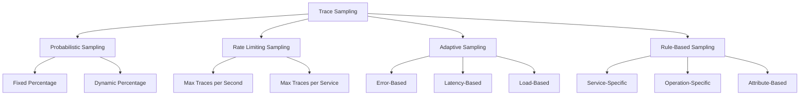

# Trace Sampling Strategies for MCP System

This document provides comprehensive guidance on configuring trace sampling strategies for the MCP system in production environments.

---

## 1. Overview

### 1.1 What is Trace Sampling?

Trace sampling is the process of selecting a subset of traces to collect and analyze, rather than collecting every trace. This is essential for:

- **Performance**: Reducing overhead on application performance
- **Cost**: Minimizing storage and processing costs
- **Manageability**: Making trace data more manageable and actionable
- **Signal-to-Noise Ratio**: Improving the quality of insights by focusing on relevant traces

### 1.2 Sampling Strategies Overview



---

## 2. Sampling Strategy Types

### 2.1 Probabilistic Sampling

#### Fixed Percentage Sampling

```yaml
# Fixed percentage sampling configuration
probabilistic_sampling:
  default_strategy:
    type: "probabilistic"
    param: 0.1  # 10% sampling rate
    
  service_strategies:
    - service: "model-router"
      type: "probabilistic"
      param: 1.0  # 100% sampling for critical service
      
    - service: "workflow-orchestrator"
      type: "probabilistic"
      param: 0.5  # 50% sampling
      
    - service: "frontend"
      type: "probabilistic"
      param: 0.05  # 5% sampling for high-traffic service
```

#### Dynamic Percentage Sampling

```yaml
# Dynamic percentage sampling based on load
dynamic_probabilistic_sampling:
  default_strategy:
    type: "probabilistic"
    param: 0.1
    
  adaptive_rules:
    - condition: "requests_per_second > 1000"
      action: "decrease_sampling_rate"
      adjustment: 0.5
      
    - condition: "requests_per_second < 100"
      action: "increase_sampling_rate"
      adjustment: 2.0
      
    - condition: "error_rate > 0.05"
      action: "increase_sampling_rate"
      adjustment: 2.0
```

### 2.2 Rate Limiting Sampling

#### Per-Second Rate Limiting

```yaml
# Rate limiting sampling configuration
rate_limiting_sampling:
  default_strategy:
    type: "rate_limiting"
    max_traces_per_second: 100
    
  service_strategies:
    - service: "model-router"
      type: "rate_limiting"
      max_traces_per_second: 50
      
    - service: "workflow-orchestrator"
      type: "rate_limiting"
      max_traces_per_second: 30
      
    - service: "frontend"
      type: "rate_limiting"
      max_traces_per_second: 200
```

#### Per-Operation Rate Limiting

```yaml
# Per-operation rate limiting
operation_rate_limiting:
  default_strategy:
    type: "rate_limiting"
    max_traces_per_second: 100
    
  operation_strategies:
    - operation: "health_check"
      type: "rate_limiting"
      max_traces_per_second: 1
      
    - operation: "agent_collaboration"
      type: "rate_limiting"
      max_traces_per_second: 50
      
    - operation: "model_inference"
      type: "rate_limiting"
      max_traces_per_second: 100
```

### 2.3 Adaptive Sampling

#### Error-Based Adaptive Sampling

```yaml
# Error-based adaptive sampling
error_adaptive_sampling:
  default_strategy:
    type: "probabilistic"
    param: 0.1
    
  adaptive_rules:
    - condition: "error_rate > 0.1"
      action: "increase_sampling"
      target_sampling_rate: 1.0
      duration: "5m"
      
    - condition: "error_rate > 0.05"
      action: "increase_sampling"
      target_sampling_rate: 0.5
      duration: "5m"
      
    - condition: "error_rate < 0.01"
      action: "decrease_sampling"
      target_sampling_rate: 0.1
      duration: "10m"
```

#### Latency-Based Adaptive Sampling

```yaml
# Latency-based adaptive sampling
latency_adaptive_sampling:
  default_strategy:
    type: "probabilistic"
    param: 0.1
    
  adaptive_rules:
    - condition: "p95_latency > 1000ms"
      action: "increase_sampling"
      target_sampling_rate: 1.0
      duration: "5m"
      
    - condition: "p95_latency > 500ms"
      action: "increase_sampling"
      target_sampling_rate: 0.5
      duration: "5m"
      
    - condition: "p95_latency < 100ms"
      action: "decrease_sampling"
      target_sampling_rate: 0.05
      duration: "10m"
```

#### Load-Based Adaptive Sampling

```yaml
# Load-based adaptive sampling
load_adaptive_sampling:
  default_strategy:
    type: "probabilistic"
    param: 0.1
    
  adaptive_rules:
    - condition: "cpu_usage > 80%"
      action: "decrease_sampling"
      target_sampling_rate: 0.05
      duration: "5m"
      
    - condition: "memory_usage > 80%"
      action: "decrease_sampling"
      target_sampling_rate: 0.05
      duration: "5m"
      
    - condition: "request_rate < 10"
      action: "increase_sampling"
      target_sampling_rate: 1.0
      duration: "10m"
```

### 2.4 Rule-Based Sampling

#### Service-Specific Rules

```yaml
# Service-specific sampling rules
service_rule_sampling:
  default_strategy:
    type: "probabilistic"
    param: 0.1
    
  service_strategies:
    - service: "model-router"
      type: "probabilistic"
      param: 1.0
      operation_strategies:
        - operation: "health_check"
          type: "probabilistic"
          param: 0.01
          
    - service: "workflow-orchestrator"
      type: "probabilistic"
      param: 0.5
      operation_strategies:
        - operation: "workflow_execution"
          type: "probabilistic"
          param: 1.0
          
    - service: "agent-collaboration"
      type: "probabilistic"
      param: 1.0
      
    - service: "frontend"
      type: "rate_limiting"
      max_traces_per_second: 100
```

#### Attribute-Based Rules

```yaml
# Attribute-based sampling rules
attribute_rule_sampling:
  default_strategy:
    type: "probabilistic"
    param: 0.1
    
  attribute_rules:
    - attribute: "http.status_code"
      operator: ">="
      value: 500
      action: "always_sample"
      
    - attribute: "http.status_code"
      operator: ">="
      value: 400
      action: "sample_with_rate"
      rate: 0.5
      
    - attribute: "user.tier"
      operator: "=="
      value: "premium"
      action: "always_sample"
      
    - attribute: "trace.duration_ms"
      operator: ">"
      value: 1000
      action: "always_sample"
```

---

## 3. OpenTelemetry Collector Sampling Configuration

### 3.1 Processor Configuration

```yaml
# otel-collector-sampling.yaml
processors:
  probabilistic_sampler:
    hash_seed: 22
    sampling_percentage: 10
    
  tail_sampling:
    decision_wait: 30s
    num_traces: 100
    expected_new_traces_per_sec: 10
    policies:
      [
        {
          name: always-sample-policy,
          type: always_sample,
          attributes: []
        },
        {
          name: error-policy,
          type: status_code,
          status_code: { status_codes: [ERROR] }
        },
        {
          name: latency-policy,
          type: latency,
          latency: { threshold_ms: 1000 }
        },
        {
          name: probabilistic-policy,
          type: probabilistic,
          probabilistic: { sampling_percentage: 10 }
        }
      ]
    
  filter:
    error_mode: ignore
    traces:
      # Sample traces with specific attributes
      - match_type: strict
        attributes:
          http.status_code: 500
        sample_rate: 1.0
        
      - match_type: strict
        attributes:
          user.tier: premium
        sample_rate: 1.0
        
      - match_type: strict
        attributes:
          trace.duration_ms: 1000
        sample_rate: 1.0
        
      # Default sampling
      - match_type: strict
        sample_rate: 0.1
```

### 3.2 Service-Specific Configuration

```yaml
# service-specific-sampling.yaml
processors:
  model_router_sampler:
    hash_seed: 22
    sampling_percentage: 100
    
  workflow_orchestrator_sampler:
    hash_seed: 22
    sampling_percentage: 50
    
  agent_collaboration_sampler:
    hash_seed: 22
    sampling_percentage: 100
    
  frontend_sampler:
    hash_seed: 22
    sampling_percentage: 5

service:
  pipelines:
    traces/model-router:
      receivers: [otlp]
      processors: [batch, model_router_sampler]
      exporters: [jaeger]
      
    traces/workflow-orchestrator:
      receivers: [otlp]
      processors: [batch, workflow_orchestrator_sampler]
      exporters: [jaeger]
      
    traces/agent-collaboration:
      receivers: [otlp]
      processors: [batch, agent_collaboration_sampler]
      exporters: [jaeger]
      
    traces/frontend:
      receivers: [otlp]
      processors: [batch, frontend_sampler]
      exporters: [jaeger]
```

---

## 4. Jaeger Sampling Configuration

### 4.1 Jaeger Collector Sampling

```json
// jaeger-sampling.json
{
  "service_strategies": [
    {
      "service": "model-router",
      "type": "probabilistic",
      "param": 1.0,
      "operation_strategies": [
        {
          "operation": "health_check",
          "type": "probabilistic",
          "param": 0.01
        },
        {
          "operation": "model_selection",
          "type": "probabilistic",
          "param": 0.5
        },
        {
          "operation": "model_inference",
          "type": "probabilistic",
          "param": 1.0
        }
      ]
    },
    {
      "service": "workflow-orchestrator",
      "type": "probabilistic",
      "param": 0.5,
      "operation_strategies": [
        {
          "operation": "workflow_execution",
          "type": "probabilistic",
          "param": 1.0
        },
        {
          "operation": "workflow_step",
          "type": "probabilistic",
          "param": 0.5
        }
      ]
    },
    {
      "service": "agent-collaboration",
      "type": "probabilistic",
      "param": 1.0
    },
    {
      "service": "frontend",
      "type": "rate_limiting",
      "param": 100
    }
  ],
  "default_strategy": {
    "type": "probabilistic",
    "param": 0.1
  }
}
```

### 4.2 Jaeger Agent Sampling

```yaml
# jaeger-agent-sampling.yaml
agent:
  sampling:
    strategies:
      default:
        type: probabilistic
        param: 0.1
      
      services:
        model-router:
          type: probabilistic
          param: 1.0
          
        workflow-orchestrator:
          type: probabilistic
          param: 0.5
          
        agent-collaboration:
          type: probabilistic
          param: 1.0
          
        frontend:
          type: rate_limiting
          param: 100
```

---

## 5. Environment-Specific Sampling Strategies

### 5.1 Development Environment

```yaml
# development-sampling.yaml
development_sampling:
  default_strategy:
    type: "probabilistic"
    param: 1.0  # 100% sampling for development
    
  service_strategies:
    - service: "*"
      type: "probabilistic"
      param: 1.0
      
  goals:
    - "Maximum visibility for debugging"
    - "Complete trace data for development"
    - "No performance constraints"
```

### 5.2 Staging Environment

```yaml
# staging-sampling.yaml
staging_sampling:
  default_strategy:
    type: "probabilistic"
    param: 0.5  # 50% sampling for staging
    
  service_strategies:
    - service: "model-router"
      type: "probabilistic"
      param: 1.0
      
    - service: "workflow-orchestrator"
      type: "probabilistic"
      param: 0.8
      
    - service: "agent-collaboration"
      type: "probabilistic"
      param: 1.0
      
    - service: "frontend"
      type: "probabilistic"
      param: 0.3
      
  goals:
    - "High visibility for testing"
    - "Realistic production-like sampling"
    - "Performance validation"
```

### 5.3 Production Environment

```yaml
# production-sampling.yaml
production_sampling:
  default_strategy:
    type: "probabilistic"
    param: 0.1  # 10% default sampling
    
  service_strategies:
    - service: "model-router"
      type: "probabilistic"
      param: 1.0
      operation_strategies:
        - operation: "health_check"
          type: "probabilistic"
          param: 0.01
          
    - service: "workflow-orchestrator"
      type: "probabilistic"
      param: 0.5
      operation_strategies:
        - operation: "workflow_execution"
          type: "probabilistic"
          param: 1.0
          
    - service: "agent-collaboration"
      type: "probabilistic"
      param: 1.0
      
    - service: "frontend"
      type: "rate_limiting"
      max_traces_per_second: 100
      
  adaptive_rules:
    - condition: "error_rate > 0.05"
      action: "increase_sampling"
      target_sampling_rate: 1.0
      duration: "5m"
      
    - condition: "p95_latency > 1000ms"
      action: "increase_sampling"
      target_sampling_rate: 1.0
      duration: "5m"
      
  goals:
    - "Optimal performance"
    - "Cost-effective storage"
    - "High-quality signal data"
    - "Adaptive to system conditions"
```

---

## 6. Advanced Sampling Techniques

### 6.1 Head-Based vs. Tail-Based Sampling

#### Head-Based Sampling

```yaml
# Head-based sampling (decision made at trace start)
head_based_sampling:
  description: "Sampling decision made at the beginning of the trace"
  advantages:
    - "Low overhead"
    - "Simple to implement"
    - "Predictable resource usage"
  disadvantages:
    - "Cannot sample based on trace outcome"
    - "May miss important traces"
    - "Fixed sampling rate"
  
  configuration:
    type: "probabilistic"
    param: 0.1
```

#### Tail-Based Sampling

```yaml
# Tail-based sampling (decision made at trace end)
tail_based_sampling:
  description: "Sampling decision made after trace completion"
  advantages:
    - "Can sample based on trace outcome"
    - "More intelligent sampling decisions"
    - "Better signal-to-noise ratio"
  disadvantages:
    - "Higher resource usage"
    - "More complex implementation"
    - "Requires trace buffering"
  
  configuration:
    decision_wait: "30s"
    num_traces: 1000
    policies:
      [
        {
          name: "error-policy",
          type: "status_code",
          status_code: { status_codes: [ERROR] }
        },
        {
          name: "latency-policy",
          type: "latency",
          latency: { threshold_ms: 1000 }
        },
        {
          name: "probabilistic-policy",
          type: "probabilistic",
          probabilistic: { sampling_percentage: 10 }
        }
      ]
```

### 6.2 Hybrid Sampling Approach

```yaml
# Hybrid sampling (combines head-based and tail-based)
hybrid_sampling:
  description: "Combines head-based and tail-based sampling"
  
  head_sampling:
    type: "probabilistic"
    param: 0.1
    
  tail_sampling:
    decision_wait: "30s"
    policies:
      [
        {
          name: "error-policy",
          type: "status_code",
          status_code: { status_codes: [ERROR] }
        },
        {
          name: "latency-policy",
          type: "latency",
          latency: { threshold_ms: 1000 }
        }
      ]
  
  combination_logic:
    - "If head-sampling decision is true, collect trace"
    - "Else, apply tail-sampling policies"
    - "Collect trace if any tail-sampling policy matches"
```

### 6.3 Dynamic Sampling with ML

```yaml
# ML-based adaptive sampling
ml_adaptive_sampling:
  description: "Machine learning-based adaptive sampling"
  
  model:
    type: "anomaly_detection"
    features:
      - "error_rate"
      - "latency_percentiles"
      - "request_rate"
      - "resource_usage"
      - "business_metrics"
    
    training:
      data_source: "prometheus"
      update_interval: "1h"
      retrain_interval: "24h"
  
  sampling_rules:
    - condition: "anomaly_detected"
      action: "increase_sampling"
      target_rate: 1.0
      duration: "1h"
      
    - condition: "performance_degradation"
      action: "increase_sampling"
      target_rate: 0.8
      duration: "30m"
      
    - condition: "normal_operation"
      action: "decrease_sampling"
      target_rate: 0.1
      duration: "1h"
```

---

## 7. Monitoring and Adjusting Sampling

### 7.1 Sampling Metrics

```yaml
# sampling-metrics.yaml
sampling_metrics:
  counters:
    - name: "traces_received_total"
      description: "Total number of traces received"
      labels: ["service", "operation"]
      
    - name: "traces_sampled_total"
      description: "Total number of traces sampled"
      labels: ["service", "operation", "sampling_decision"]
      
    - name: "traces_dropped_total"
      description: "Total number of traces dropped"
      labels: ["service", "operation", "drop_reason"]
  
  gauges:
    - name: "sampling_rate"
      description: "Current sampling rate"
      labels: ["service", "operation"]
      
    - name: "sampling_buffer_size"
      description: "Current size of sampling buffer"
      labels: ["service"]
  
  histograms:
    - name: "sampling_decision_time"
      description: "Time taken to make sampling decision"
      labels: ["service", "sampling_strategy"]
```

### 7.2 Sampling Adjustment Algorithms

```python
# sampling-adjustment.py
class SamplingAdjuster:
    def __init__(self):
        self.metrics_client = MetricsClient()
        self.sampling_config = SamplingConfig()
        
    def adjust_sampling_based_on_metrics(self):
        """Adjust sampling rates based on system metrics"""
        
        # Get current metrics
        error_rate = self.metrics_client.get_error_rate()
        p95_latency = self.metrics_client.get_p95_latency()
        request_rate = self.metrics_client.get_request_rate()
        
        # Adjust for error rate
        if error_rate > 0.05:
            self.sampling_config.increase_sampling_rate(
                target_rate=1.0,
                duration="5m"
            )
        elif error_rate > 0.02:
            self.sampling_config.increase_sampling_rate(
                target_rate=0.5,
                duration="5m"
            )
        else:
            self.sampling_config.reset_to_default()
        
        # Adjust for latency
        if p95_latency > 1000:
            self.sampling_config.increase_sampling_rate(
                target_rate=1.0,
                duration="5m"
            )
        elif p95_latency > 500:
            self.sampling_config.increase_sampling_rate(
                target_rate=0.5,
                duration="5m"
            )
        
        # Adjust for request rate
        if request_rate > 1000:
            self.sampling_config.decrease_sampling_rate(
                target_rate=0.05,
                duration="10m"
            )
        elif request_rate < 100:
            self.sampling_config.increase_sampling_rate(
                target_rate=1.0,
                duration="10m"
            )
```

### 7.3 Sampling Dashboards

```yaml
# sampling-dashboard.yaml
sampling_dashboard:
  title: "Trace Sampling Dashboard"
  panels:
    - title: "Sampling Rates by Service"
      type: "graph"
      targets:
        - expr: "rate(traces_sampled_total[5m]) / rate(traces_received_total[5m])"
          legend: "{{service}}"
      
    - title: "Traces Received vs Sampled"
      type: "graph"
      targets:
        - expr: "rate(traces_received_total[5m])"
          legend: "Received"
        - expr: "rate(traces_sampled_total[5m])"
          legend: "Sampled"
      
    - title: "Sampling Decision Time"
      type: "graph"
      targets:
        - expr: "histogram_quantile(0.95, sampling_decision_time_bucket[5m])"
          legend: "P95"
        - expr: "histogram_quantile(0.50, sampling_decision_time_bucket[5m])"
          legend: "P50"
      
    - title: "Sampling Buffer Size"
      type: "graph"
      targets:
        - expr: "sampling_buffer_size"
          legend: "{{service}}"
```

---

## 8. Best Practices

### 8.1 General Sampling Guidelines

1. **Start with conservative sampling rates** (1-10%) and adjust based on needs
2. **Sample critical services at higher rates** (50-100%)
3. **Use adaptive sampling** for dynamic environments
4. **Monitor sampling effectiveness** and adjust regularly
5. **Consider cost implications** of sampling decisions
6. **Balance signal quality** with system performance

### 8.2 Service-Specific Recommendations

```yaml
# service-sampling-recommendations.yaml
service_recommendations:
  model-router:
    sampling_rate: 100%
    rationale: "Critical service for AI model routing"
    exceptions:
      - operation: "health_check"
        sampling_rate: 1%
        
  workflow-orchestrator:
    sampling_rate: 50%
    rationale: "Important but high-volume service"
    exceptions:
      - operation: "workflow_execution"
        sampling_rate: 100%
        
  agent-collaboration:
    sampling_rate: 100%
    rationale: "Business-critical operations"
    
  frontend:
    sampling_rate: 5%
    rationale: "High-traffic service"
    strategy: "rate_limiting"
    max_traces_per_second: 100
    
  database:
    sampling_rate: 10%
    rationale: "Supporting service"
    
  cache:
    sampling_rate: 1%
    rationale: "High-volume, low-value traces"
```

### 8.3 Environment-Specific Recommendations

```yaml
# environment-sampling-recommendations.yaml
environment_recommendations:
  development:
    default_sampling_rate: 100%
    goals: ["Maximum visibility", "Debugging support"]
    
  staging:
    default_sampling_rate: 50%
    goals: ["Testing validation", "Performance testing"]
    adaptive_sampling: true
    
  production:
    default_sampling_rate: 10%
    goals: ["Performance", "Cost optimization"]
    adaptive_sampling: true
    critical_services: 100%
    
  load_testing:
    default_sampling_rate: 1%
    goals: ["Minimal overhead", "Peak performance"]
    rate_limiting: true
```

---

## 9. Troubleshooting Sampling Issues

### 9.1 Common Sampling Problems

#### Problem: Too Many Traces Sampled

**Symptoms:**
- High storage costs
- Performance degradation
- Overwhelming trace data

**Solutions:**
1. Reduce default sampling rate
2. Implement rate limiting
3. Add more restrictive sampling rules
4. Use adaptive sampling to reduce during high load

#### Problem: Too Few Traces Sampled

**Symptoms:**
- Missing important traces
- Insufficient data for debugging
- Poor signal-to-noise ratio

**Solutions:**
1. Increase sampling rates for critical services
2. Add more permissive sampling rules
3. Use adaptive sampling to increase during issues
4. Implement tail-based sampling for better decisions

#### Problem: Inconsistent Sampling

**Symptoms:**
- Incomplete traces
- Missing spans
- Inconsistent trace data

**Solutions:**
1. Ensure consistent sampling configuration across services
2. Use consistent sampling strategies
3. Implement proper trace context propagation
4. Validate sampling configuration regularly

### 9.2 Sampling Debug Commands

```bash
# Check sampling configuration
kubectl get configmap jaeger-sampling -n tracing -o yaml

# Check sampling metrics
curl -s "http://jaeger-collector:14268/metrics" | grep sampling

# Check OpenTelemetry collector sampling metrics
curl -s "http://otel-collector:8888/metrics" | grep sampling

# Validate sampling rules
kubectl exec -it jaeger-collector-0 -n tracing -- cat /etc/jaeger/sampling.json

# Test sampling with different rates
curl -X POST "http://localhost:14268/api/traces" -H "Content-Type: application/json" -d '{"sampling_rate": 0.1}'
```

### 9.3 Sampling Validation

```python
# sampling-validation.py
class SamplingValidator:
    def __init__(self):
        self.jaeger_client = JaegerClient()
        self.metrics_client = MetricsClient()
        
    def validate_sampling_rates(self):
        """Validate that sampling rates are within expected ranges"""
        
        services = ["model-router", "workflow-orchestrator", "agent-collaboration", "frontend"]
        
        for service in services:
            received = self.metrics_client.get_traces_received(service)
            sampled = self.metrics_client.get_traces_sampled(service)
            
            if received > 0:
                actual_rate = sampled / received
                expected_rate = self.get_expected_sampling_rate(service)
                
                if abs(actual_rate - expected_rate) > 0.1:
                    print(f"Warning: {service} sampling rate {actual_rate:.2f} differs from expected {expected_rate:.2f}")
    
    def validate_trace_completeness(self):
        """Validate that sampled traces are complete"""
        
        traces = self.jaeger_client.get_recent_traces(limit=100)
        
        for trace in traces:
            if len(trace.spans) < trace.expected_span_count:
                print(f"Warning: Trace {trace.trace_id} is incomplete")
    
    def validate_sampling_consistency(self):
        """Validate that sampling is consistent across services"""
        
        # Check that trace context is properly propagated
        traces = self.jaeger_client.get_traces_with_multiple_services()
        
        for trace in traces:
            services_in_trace = set(span.service_name for span in trace.spans)
            
            for service in services_in_trace:
                service_spans = [span for span in trace.spans if span.service_name == service]
                if not all(span.sampled for span in service_spans):
                    print(f"Warning: Inconsistent sampling in trace {trace.trace_id} for service {service}")
```

---

## 10. Future Enhancements

### 10.1 Machine Learning-Based Sampling

- **Anomaly Detection**: Use ML to detect anomalies and increase sampling
- **Predictive Sampling**: Predict which traces will be valuable and sample them
- **Automated Optimization**: Automatically optimize sampling rates based on business value

### 10.2 Business Context-Aware Sampling

- **User Tier-Based Sampling**: Sample more for premium users
- **Business Value Sampling**: Sample based on business transaction value
- **Customer Journey Sampling**: Sample complete customer journeys

### 10.3 Distributed Sampling Coordination

- **Global Sampling Policies**: Coordinate sampling across multiple clusters
- **Adaptive Load Balancing**: Distribute sampling load across collectors
- **Federated Sampling**: Coordinate sampling across different tracing systems