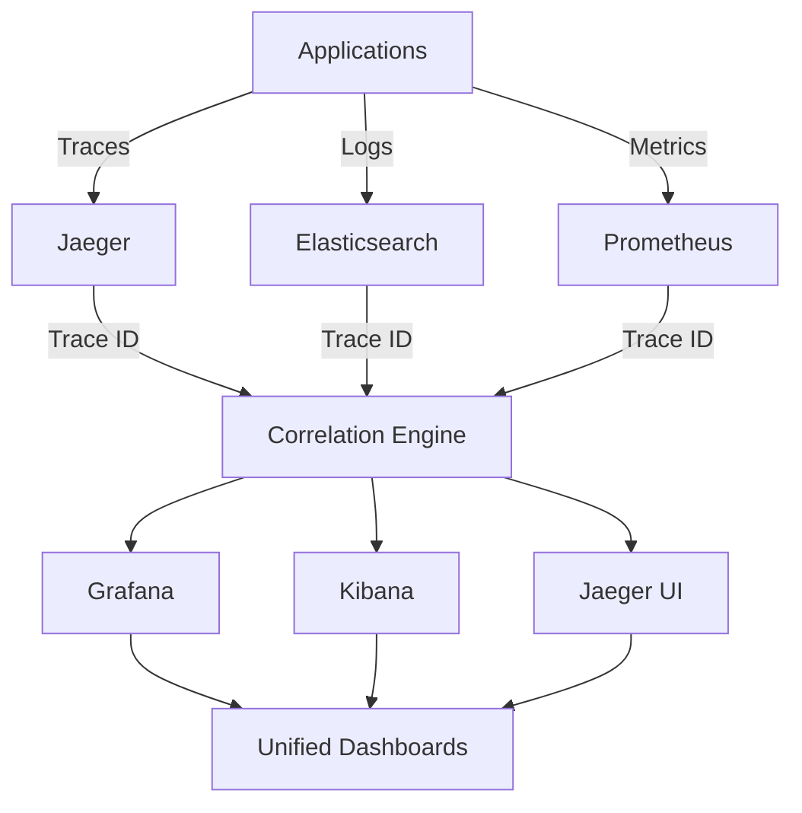

# Trace Correlation with Logs and Metrics for MCP System

This document provides comprehensive guidance on implementing trace correlation with existing logs and metrics in the MCP system.

---

## 1. Overview

### 1.1 What is Trace Correlation?

Trace correlation is the process of linking distributed traces with related logs and metrics to provide a unified view of system behavior. This enables:

- **Unified Observability**: Single view of traces, logs, and metrics
- **Faster Troubleshooting**: Quick identification of issues across all data types
- **Better Context**: Rich context for understanding system behavior
- **Improved Debugging**: Seamless navigation between different data types

### 1.2 Correlation Architecture



### 1.3 Correlation Identifiers

```yaml
correlation_identifiers:
  trace_id:
    description: "Unique identifier for a distributed trace"
    format: "UUID or 128-bit hex string"
    examples: ["123e4567-e89b-12d3-a456-426614174000", "80f198ee56343ba864fe8b2a57d3eff7"]
    
  span_id:
    description: "Unique identifier for a span within a trace"
    format: "64-bit hex string"
    examples: ["1234567890abcdef", "fedcba9876543210"]
    
  parent_span_id:
    description: "Identifier of the parent span"
    format: "64-bit hex string"
    examples: ["1234567890abcdef", "fedcba9876543210"]
    
  request_id:
    description: "Business-level request identifier"
    format: "UUID or custom string"
    examples: ["req-123456", "order-789012"]
    
  user_id:
    description: "User identifier for correlation"
    format: "UUID or custom string"
    examples: ["user-123456", "customer-789012"]
    
  session_id:
    description: "User session identifier"
    format: "UUID or custom string"
    examples: ["session-123456", "sess-789012"]
```

---

## 2. Log Correlation Implementation

### 2.1 Structured Logging with Trace Context

#### Python Implementation

```python
# trace_correlation_logging.py
import structlog
import logging
from opentelemetry import trace
from opentelemetry.trace import format_trace_id, format_span_id
from typing import Dict, Any, Optional

class TraceCorrelationLogger:
    """Logger that automatically includes trace context in all log entries"""
    
    def __init__(self, service_name: str):
        self.service_name = service_name
        self.logger = structlog.get_logger(service_name)
        self.tracer = trace.get_tracer(service_name)
        
    def _get_trace_context(self) -> Dict[str, Any]:
        """Extract trace context from current span"""
        current_span = trace.get_current_span()
        if current_span is None:
            return {}
            
        span_context = current_span.get_span_context()
        return {
            "trace_id": format_trace_id(span_context.trace_id),
            "span_id": format_span_id(span_context.span_id),
            "service_name": self.service_name,
            "trace_flags": span_context.trace_flags
        }
    
    def _enrich_log_context(self, context: Dict[str, Any]) -> Dict[str, Any]:
        """Enrich log context with trace information"""
        trace_context = self._get_trace_context()
        return {**trace_context, **context}
    
    def info(self, message: str, **kwargs):
        """Log info message with trace context"""
        enriched_context = self._enrich_log_context(kwargs)
        self.logger.info(message, **enriched_context)
    
    def warning(self, message: str, **kwargs):
        """Log warning message with trace context"""
        enriched_context = self._enrich_log_context(kwargs)
        self.logger.warning(message, **enriched_context)
    
    def error(self, message: str, **kwargs):
        """Log error message with trace context"""
        enriched_context = self._enrich_log_context(kwargs)
        self.logger.error(message, **enriched_context)
    
    def debug(self, message: str, **kwargs):
        """Log debug message with trace context"""
        enriched_context = self._enrich_log_context(kwargs)
        self.logger.debug(message, **enriched_context)
    
    def critical(self, message: str, **kwargs):
        """Log critical message with trace context"""
        enriched_context = self._enrich_log_context(kwargs)
        self.logger.critical(message, **enriched_context)

# Configure structlog
structlog.configure(
    processors=[
        structlog.stdlib.filter_by_level,
        structlog.stdlib.add_logger_name,
        structlog.stdlib.add_log_level,
        structlog.stdlib.PositionalArgumentsFormatter(),
        structlog.processors.TimeStamper(fmt="iso"),
        structlog.processors.StackInfoRenderer(),
        structlog.processors.format_exc_info,
        structlog.processors.UnicodeDecoder(),
        structlog.processors.JSONRenderer()
    ],
    context_class=dict,
    logger_factory=structlog.stdlib.LoggerFactory(),
    wrapper_class=structlog.stdlib.BoundLogger,
    cache_logger_on_first_use=True,
)

# Usage example
logger = TraceCorrelationLogger("model-router")

async def process_request(request_id: str, user_data: Dict[str, Any]):
    logger.info("Processing request started", request_id=request_id, user_id=user_data.get("user_id"))
    
    # Business logic here
    try:
        result = await perform_business_logic(user_data)
        logger.info("Request processed successfully", request_id=request_id, result=result)
        return result
    except Exception as e:
        logger.error("Request processing failed", request_id=request_id, error=str(e))
        raise
```

#### JavaScript/Node.js Implementation

```javascript
// trace-correlation-logging.js
const winston = require('winston');
const { trace } = require('@opentelemetry/api');

class TraceCorrelationLogger {
    constructor(serviceName) {
        this.serviceName = serviceName;
        this.logger = winston.createLogger({
            level: 'info',
            format: winston.format.combine(
                winston.format.timestamp(),
                winston.format.errors({ stack: true }),
                winston.format.json()
            ),
            defaultMeta: { service: serviceName },
            transports: [
                new winston.transports.Console()
            ]
        });
    }
    
    getTraceContext() {
        const currentSpan = trace.getActiveSpan();
        if (!currentSpan) {
            return {};
        }
        
        const spanContext = currentSpan.spanContext();
        return {
            trace_id: spanContext.traceId,
            span_id: spanContext.spanId,
            service_name: this.serviceName,
            trace_flags: spanContext.traceFlags
        };
    }
    
    enrichLogContext(context) {
        const traceContext = this.getTraceContext();
        return { ...traceContext, ...context };
    }
    
    info(message, context = {}) {
        const enrichedContext = this.enrichLogContext(context);
        this.logger.info(message, enrichedContext);
    }
    
    warn(message, context = {}) {
        const enrichedContext = this.enrichLogContext(context);
        this.logger.warn(message, enrichedContext);
    }
    
    error(message, context = {}) {
        const enrichedContext = this.enrichLogContext(context);
        this.logger.error(message, enrichedContext);
    }
    
    debug(message, context = {}) {
        const enrichedContext = this.enrichLogContext(context);
        this.logger.debug(message, enrichedContext);
    }
}

// Usage example
const logger = new TraceCorrelationLogger('model-router');

async function processRequest(requestId, userData) {
    logger.info('Processing request started', { request_id: requestId, user_id: userData.user_id });
    
    try {
        const result = await performBusinessLogic(userData);
        logger.info('Request processed successfully', { request_id: requestId, result });
        return result;
    } catch (error) {
        logger.error('Request processing failed', { request_id: requestId, error: error.message });
        throw error;
    }
}
```

### 2.2 Log Processing and Enrichment

#### Fluentd Configuration

```xml
<!-- fluentd-trace-correlation.conf -->
<filter mcp.**>
  @type trace_correlation_filter
  
  # Extract trace context from log entries
  <extract>
    trace_id trace_id
    span_id span_id
    service_name service_name
  </extract>
  
  # Add additional context
  <record>
    hostname "#{Socket.gethostname}"
    timestamp ${time.strftime('%Y-%m-%dT%H:%M:%S.%LZ')}
    environment "#{ENV['ENVIRONMENT'] || 'development'}"
    cluster_name "#{ENV['CLUSTER_NAME'] || 'mcp-cluster'}"
  </record>
  
  # Enrich with Kubernetes metadata
  <record>
    kubernetes.pod_name "#{ENV['POD_NAME']}"
    kubernetes.namespace "#{ENV['POD_NAMESPACE']}"
    kubernetes.node_name "#{ENV['NODE_NAME']}"
  </record>
</filter>

<!-- Enrich with trace data from Jaeger -->
<match mcp.**>
  @type elasticsearch
  
  host elasticsearch
  port 9200
  index_name mcp-logs-${Time.at(time).strftime('%Y.%m.%d')}
  
  # Add trace correlation fields
  <format>
    @type single_value
    message_key message
    add_tag true
  </format>
  
  # Include trace context in Elasticsearch document
  <buffer>
    @type file
    path /var/log/fluentd/buffer/elasticsearch
    flush_mode interval
    flush_interval 5s
    chunk_limit_size 8MB
    total_limit_size 32GB
    flush_thread_count 4
    overflow_action block
    retry_max_times 3
    retry_type exponential_backoff
    retry_wait 1s
    retry_max_interval 30s
    retry_randomize true
  </buffer>
</match>
```

#### Logstash Configuration

```ruby
# logstash-trace-correlation.conf
input {
  beats {
    port => 5044
  }
}

filter {
  # Parse JSON logs
  json {
    source => "message"
    target => "parsed"
  }
  
  # Extract trace context
  if [parsed][trace_id] {
    mutate {
      add_field => { "trace_id" => "%{[parsed][trace_id]}" }
    }
  }
  
  if [parsed][span_id] {
    mutate {
      add_field => { "span_id" => "%{[parsed][span_id]}" }
    }
  }
  
  # Add timestamp
  date {
    match => [ "timestamp", "ISO8601" ]
    target => "@timestamp"
  }
  
  # Add environment metadata
  mutate {
    add_field => {
      "environment" => "${ENVIRONMENT:development}"
      "cluster_name" => "${CLUSTER_NAME:mcp-cluster}"
    }
  }
  
  # Add Kubernetes metadata
  if [kubernetes] {
    mutate {
      add_field => {
        "kubernetes.pod_name" => "%{[kubernetes][pod][name]}"
        "kubernetes.namespace" => "%{[kubernetes][namespace]}"
        "kubernetes.node_name" => "%{[kubernetes][node][name]}"
      }
    }
  }
  
  # Enrich with trace data from Jaeger
  if [trace_id] {
    elasticsearch {
      hosts => ["elasticsearch:9200"]
      index => "jaeger-span-*"
      query => {
        query => {
          term => {
            "traceID" => "%{trace_id}"
          }
        }
      }
      fields => {
        "duration" => "trace.duration"
        "operationName" => "trace.operation_name"
        "tags" => "trace.tags"
      }
    }
  }
}

output {
  elasticsearch {
    hosts => ["elasticsearch:9200"]
    index => "mcp-logs-%{+YYYY.MM.dd}"
    template_name => "mcp-logs"
    template => "/etc/logstash/templates/mcp-logs-template.json"
    template_overwrite => true
  }
}
```

### 2.3 Elasticsearch Index Template

```json
{
  "index_patterns": ["mcp-logs-*"],
  "settings": {
    "number_of_shards": 3,
    "number_of_replicas": 1,
    "index.refresh_interval": "5s",
    "index.codec": "best_compression"
  },
  "mappings": {
    "dynamic_templates": [
      {
        "strings": {
          "match_mapping_type": "string",
          "mapping": {
            "type": "keyword"
          }
        }
      }
    ],
    "properties": {
      "timestamp": {
        "type": "date"
      },
      "level": {
        "type": "keyword"
      },
      "message": {
        "type": "text",
        "analyzer": "standard"
      },
      "trace_id": {
        "type": "keyword"
      },
      "span_id": {
        "type": "keyword"
      },
      "service_name": {
        "type": "keyword"
      },
      "request_id": {
        "type": "keyword"
      },
      "user_id": {
        "type": "keyword"
      },
      "session_id": {
        "type": "keyword"
      },
      "environment": {
        "type": "keyword"
      },
      "cluster_name": {
        "type": "keyword"
      },
      "hostname": {
        "type": "keyword"
      },
      "kubernetes": {
        "properties": {
          "pod_name": {
            "type": "keyword"
          },
          "namespace": {
            "type": "keyword"
          },
          "node_name": {
            "type": "keyword"
          }
        }
      },
      "trace": {
        "properties": {
          "duration": {
            "type": "long"
          },
          "operation_name": {
            "type": "keyword"
          },
          "tags": {
            "type": "object",
            "dynamic": true
          }
        }
      },
      "error": {
        "properties": {
          "type": {
            "type": "keyword"
          },
          "message": {
            "type": "text",
            "analyzer": "standard"
          },
          "stack_trace": {
            "type": "text",
            "analyzer": "standard"
          }
        }
      }
    }
  }
}
```

---

## 3. Metrics Correlation Implementation

### 3.1 Prometheus Metrics with Trace Context

#### Python Implementation

```python
# trace_correlation_metrics.py
from prometheus_client import Counter, Histogram, Gauge, Info
from prometheus_client import generate_latest, CONTENT_TYPE_LATEST
from opentelemetry import trace
from opentelemetry.trace import format_trace_id, format_span_id
from typing import Dict, Any, Optional
import time

class TraceCorrelationMetrics:
    """Metrics that automatically include trace context"""
    
    def __init__(self, service_name: str):
        self.service_name = service_name
        self.tracer = trace.get_tracer(service_name)
        
        # Define metrics with trace context
        self.request_counter = Counter(
            'mcp_requests_total',
            'Total number of requests',
            ['service_name', 'trace_id', 'span_id', 'endpoint', 'method', 'status']
        )
        
        self.request_duration = Histogram(
            'mcp_request_duration_seconds',
            'Request duration in seconds',
            ['service_name', 'trace_id', 'span_id', 'endpoint', 'method', 'status'],
            buckets=[0.1, 0.5, 1.0, 2.0, 5.0, 10.0, 30.0, 60.0, 300.0]
        )
        
        self.active_requests = Gauge(
            'mcp_active_requests',
            'Number of active requests',
            ['service_name', 'endpoint', 'method']
        )
        
        self.error_counter = Counter(
            'mcp_errors_total',
            'Total number of errors',
            ['service_name', 'trace_id', 'span_id', 'endpoint', 'method', 'error_type']
        )
        
        self.business_metrics = Counter(
            'mcp_business_operations_total',
            'Total number of business operations',
            ['service_name', 'trace_id', 'span_id', 'operation_type', 'tenant_id']
        )
        
        self.performance_metrics = Histogram(
            'mcp_operation_duration_seconds',
            'Operation duration in seconds',
            ['service_name', 'trace_id', 'span_id', 'operation_type', 'tenant_id'],
            buckets=[0.01, 0.05, 0.1, 0.5, 1.0, 2.0, 5.0, 10.0]
        )
    
    def _get_trace_context(self) -> Dict[str, str]:
        """Extract trace context from current span"""
        current_span = trace.get_current_span()
        if current_span is None:
            return {"trace_id": "", "span_id": ""}
            
        span_context = current_span.get_span_context()
        return {
            "trace_id": format_trace_id(span_context.trace_id),
            "span_id": format_span_id(span_context.span_id)
        }
    
    def record_request(self, endpoint: str, method: str, status: str, duration: float):
        """Record request metrics with trace context"""
        trace_context = self._get_trace_context()
        
        self.request_counter.labels(
            service_name=self.service_name,
            trace_id=trace_context["trace_id"],
            span_id=trace_context["span_id"],
            endpoint=endpoint,
            method=method,
            status=status
        ).inc()
        
        self.request_duration.labels(
            service_name=self.service_name,
            trace_id=trace_context["trace_id"],
            span_id=trace_context["span_id"],
            endpoint=endpoint,
            method=method,
            status=status
        ).observe(duration)
    
    def record_error(self, endpoint: str, method: str, error_type: str):
        """Record error metrics with trace context"""
        trace_context = self._get_trace_context()
        
        self.error_counter.labels(
            service_name=self.service_name,
            trace_id=trace_context["trace_id"],
            span_id=trace_context["span_id"],
            endpoint=endpoint,
            method=method,
            error_type=error_type
        ).inc()
    
    def record_business_operation(self, operation_type: str, tenant_id: str, duration: float):
        """Record business operation metrics with trace context"""
        trace_context = self._get_trace_context()
        
        self.business_metrics.labels(
            service_name=self.service_name,
            trace_id=trace_context["trace_id"],
            span_id=trace_context["span_id"],
            operation_type=operation_type,
            tenant_id=tenant_id
        ).inc()
        
        self.performance_metrics.labels(
            service_name=self.service_name,
            trace_id=trace_context["trace_id"],
            span_id=trace_context["span_id"],
            operation_type=operation_type,
            tenant_id=tenant_id
        ).observe(duration)
    
    def increment_active_requests(self, endpoint: str, method: str):
        """Increment active requests gauge"""
        self.active_requests.labels(
            service_name=self.service_name,
            endpoint=endpoint,
            method=method
        ).inc()
    
    def decrement_active_requests(self, endpoint: str, method: str):
        """Decrement active requests gauge"""
        self.active_requests.labels(
            service_name=self.service_name,
            endpoint=endpoint,
            method=method
        ).dec()

# Usage example
metrics = TraceCorrelationMetrics("model-router")

async def process_request(request):
    endpoint = request.path
    method = request.method
    tenant_id = request.headers.get("X-Tenant-ID", "default")
    
    metrics.increment_active_requests(endpoint, method)
    start_time = time.time()
    
    try:
        result = await perform_business_logic(request)
        duration = time.time() - start_time
        
        metrics.record_request(endpoint, method, "success", duration)
        metrics.record_business_operation("model_inference", tenant_id, duration)
        
        return result
    except Exception as e:
        duration = time.time() - start_time
        error_type = type(e).__name__
        
        metrics.record_request(endpoint, method, "error", duration)
        metrics.record_error(endpoint, method, error_type)
        
        raise
    finally:
        metrics.decrement_active_requests(endpoint, method)
```

#### JavaScript/Node.js Implementation

```javascript
// trace-correlation-metrics.js
const client = require('prom-client');
const { trace } = require('@opentelemetry/api');

class TraceCorrelationMetrics {
    constructor(serviceName) {
        this.serviceName = serviceName;
        
        // Create a registry for metrics
        this.registry = new client.Registry();
        
        // Define metrics with trace context
        this.requestCounter = new client.Counter({
            name: 'mcp_requests_total',
            help: 'Total number of requests',
            labelNames: ['service_name', 'trace_id', 'span_id', 'endpoint', 'method', 'status'],
            registers: [this.registry]
        });
        
        this.requestDuration = new client.Histogram({
            name: 'mcp_request_duration_seconds',
            help: 'Request duration in seconds',
            labelNames: ['service_name', 'trace_id', 'span_id', 'endpoint', 'method', 'status'],
            buckets: [0.1, 0.5, 1, 2, 5, 10, 30, 60, 300],
            registers: [this.registry]
        });
        
        this.activeRequests = new client.Gauge({
            name: 'mcp_active_requests',
            help: 'Number of active requests',
            labelNames: ['service_name', 'endpoint', 'method'],
            registers: [this.registry]
        });
        
        this.errorCounter = new client.Counter({
            name: 'mcp_errors_total',
            help: 'Total number of errors',
            labelNames: ['service_name', 'trace_id', 'span_id', 'endpoint', 'method', 'error_type'],
            registers: [this.registry]
        });
        
        this.businessMetrics = new client.Counter({
            name: 'mcp_business_operations_total',
            help: 'Total number of business operations',
            labelNames: ['service_name', 'trace_id', 'span_id', 'operation_type', 'tenant_id'],
            registers: [this.registry]
        });
        
        this.performanceMetrics = new client.Histogram({
            name: 'mcp_operation_duration_seconds',
            help: 'Operation duration in seconds',
            labelNames: ['service_name', 'trace_id', 'span_id', 'operation_type', 'tenant_id'],
            buckets: [0.01, 0.05, 0.1, 0.5, 1, 2, 5, 10],
            registers: [this.registry]
        });
    }
    
    getTraceContext() {
        const currentSpan = trace.getActiveSpan();
        if (!currentSpan) {
            return { trace_id: '', span_id: '' };
        }
        
        const spanContext = currentSpan.spanContext();
        return {
            trace_id: spanContext.traceId,
            span_id: spanContext.spanId
        };
    }
    
    recordRequest(endpoint, method, status, duration) {
        const traceContext = this.getTraceContext();
        
        this.requestCounter.inc({
            service_name: this.serviceName,
            trace_id: traceContext.trace_id,
            span_id: traceContext.span_id,
            endpoint,
            method,
            status
        });
        
        this.requestDuration.observe(duration, {
            service_name: this.serviceName,
            trace_id: traceContext.trace_id,
            span_id: traceContext.span_id,
            endpoint,
            method,
            status
        });
    }
    
    recordError(endpoint, method, errorType) {
        const traceContext = this.getTraceContext();
        
        this.errorCounter.inc({
            service_name: this.serviceName,
            trace_id: traceContext.trace_id,
            span_id: traceContext.span_id,
            endpoint,
            method,
            error_type: errorType
        });
    }
    
    recordBusinessOperation(operationType, tenantId, duration) {
        const traceContext = this.getTraceContext();
        
        this.businessMetrics.inc({
            service_name: this.serviceName,
            trace_id: traceContext.trace_id,
            span_id: traceContext.span_id,
            operation_type: operationType,
            tenant_id: tenantId
        });
        
        this.performanceMetrics.observe(duration, {
            service_name: this.serviceName,
            trace_id: traceContext.trace_id,
            span_id: traceContext.span_id,
            operation_type: operationType,
            tenant_id: tenantId
        });
    }
    
    incrementActiveRequests(endpoint, method) {
        this.activeRequests.inc({
            service_name: this.serviceName,
            endpoint,
            method
        });
    }
    
    decrementActiveRequests(endpoint, method) {
        this.activeRequests.dec({
            service_name: this.serviceName,
            endpoint,
            method
        });
    }
    
    getMetrics() {
        return this.registry.metrics();
    }
}

// Usage example
const metrics = new TraceCorrelationMetrics('model-router');

async function processRequest(request) {
    const endpoint = request.path;
    const method = request.method;
    const tenantId = request.headers['x-tenant-id'] || 'default';
    
    metrics.incrementActiveRequests(endpoint, method);
    const startTime = Date.now();
    
    try {
        const result = await performBusinessLogic(request);
        const duration = (Date.now() - startTime) / 1000;
        
        metrics.recordRequest(endpoint, method, 'success', duration);
        metrics.recordBusinessOperation('model_inference', tenantId, duration);
        
        return result;
    } catch (error) {
        const duration = (Date.now() - startTime) / 1000;
        const errorType = error.constructor.name;
        
        metrics.recordRequest(endpoint, method, 'error', duration);
        metrics.recordError(endpoint, method, errorType);
        
        throw error;
    } finally {
        metrics.decrementActiveRequests(endpoint, method);
    }
}
```

### 3.2 Prometheus Recording Rules

```yaml
# prometheus-recording-rules.yml
groups:
  - name: trace_correlation
    interval: 30s
    rules:
      # Calculate error rate by trace
      - record: mcp_error_rate_by_trace
        expr: |
          sum(rate(mcp_errors_total[5m])) by (trace_id, service_name) 
          / 
          sum(rate(mcp_requests_total[5m])) by (trace_id, service_name)
        
      # Calculate average request duration by trace
      - record: mcp_avg_request_duration_by_trace
        expr: |
          sum(rate(mcp_request_duration_seconds_sum[5m])) by (trace_id, service_name)
          /
          sum(rate(mcp_request_duration_seconds_count[5m])) by (trace_id, service_name)
        
      # Count unique traces per service
      - record: mcp_unique_traces_per_service
        expr: |
          count(count(mcp_requests_total) by (trace_id, service_name)) by (service_name)
        
      # Calculate business operation rate by trace
      - record: mcp_business_operation_rate_by_trace
        expr: |
          sum(rate(mcp_business_operations_total[5m])) by (trace_id, operation_type, tenant_id)
        
      # Calculate business operation duration by trace
      - record: mcp_business_operation_duration_by_trace
        expr: |
          histogram_quantile(0.95, 
            sum(rate(mcp_operation_duration_seconds_bucket[5m])) by (trace_id, le, operation_type, tenant_id)
          )
```

### 3.3 Prometheus Alerting Rules

```yaml
# prometheus-alerting-rules.yml
groups:
  - name: trace_correlation_alerts
    interval: 30s
    rules:
      # High error rate for specific trace
      - alert: HighErrorRateForTrace
        expr: mcp_error_rate_by_trace > 0.5
        for: 5m
        labels:
          severity: warning
          category: trace_correlation
        annotations:
          summary: "High error rate for trace {{ $labels.trace_id }}"
          description: "Trace {{ $labels.trace_id }} has error rate of {{ $value }}%"
          runbook_url: "https://docs.example.com/runbooks/trace-error-rate"
        
      # Slow request duration for specific trace
      - alert: SlowRequestDurationForTrace
        expr: mcp_avg_request_duration_by_trace > 5
        for: 5m
        labels:
          severity: warning
          category: trace_correlation
        annotations:
          summary: "Slow request duration for trace {{ $labels.trace_id }}"
          description: "Trace {{ $labels.trace_id }} has average request duration of {{ $value }}s"
          runbook_url: "https://docs.example.com/runbooks/trace-slow-duration"
        
      # High number of unique traces (potential tracing storm)
      - alert: HighUniqueTraces
        expr: mcp_unique_traces_per_service > 1000
        for: 5m
        labels:
          severity: warning
          category: trace_correlation
        annotations:
          summary: "High number of unique traces for service {{ $labels.service_name }}"
          description: "Service {{ $labels.service_name }} has {{ $value }} unique traces in the last 5 minutes"
          runbook_url: "https://docs.example.com/runbooks/high-trace-count"
```

---

## 4. Unified Correlation Dashboard

### 4.1 Grafana Dashboard Configuration

```json
{
  "dashboard": {
    "id": null,
    "title": "MCP Trace Correlation Dashboard",
    "description": "Unified dashboard for traces, logs, and metrics correlation",
    "tags": ["mcp", "tracing", "correlation"],
    "timezone": "browser",
    "panels": [
      {
        "id": 1,
        "title": "Traces Overview",
        "type": "table",
        "targets": [
          {
            "expr": "sum(rate(mcp_requests_total[5m])) by (trace_id, service_name)",
            "legendFormat": "{{trace_id}} - {{service_name}}"
          }
        ],
        "columns": [
          { "text": "Trace ID", "value": "trace_id" },
          { "text": "Service", "value": "service_name" },
          { "text": "Request Rate", "value": "Value" }
        ]
      },
      {
        "id": 2,
        "title": "Error Rate by Trace",
        "type": "graph",
        "targets": [
          {
            "expr": "mcp_error_rate_by_trace",
            "legendFormat": "{{trace_id}} - {{service_name}}"
          }
        ],
        "yaxes": [
          { "format": "percentunit" }
        ]
      },
      {
        "id": 3,
        "title": "Request Duration by Trace",
        "type": "graph",
        "targets": [
          {
            "expr": "mcp_avg_request_duration_by_trace",
            "legendFormat": "{{trace_id}} - {{service_name}}"
          }
        ],
        "yaxes": [
          { "format": "s" }
        ]
      },
      {
        "id": 4,
        "title": "Logs with Trace Context",
        "type": "logs",
        "targets": [
          {
            "expr": "{job=\"mcp-*\"} | json",
            "legendFormat": "{{trace_id}}"
          }
        ],
        "fields": [
          "timestamp",
          "level",
          "message",
          "trace_id",
          "span_id",
          "service_name"
        ]
      },
      {
        "id": 5,
        "title": "Business Operations by Trace",
        "type": "graph",
        "targets": [
          {
            "expr": "mcp_business_operation_rate_by_trace",
            "legendFormat": "{{trace_id}} - {{operation_type}}"
          }
        ],
        "yaxes": [
          { "format": "ops" }
        ]
      },
      {
        "id": 6,
        "title": "Trace Details",
        "type": "text",
        "content": "Click on a trace ID to view detailed trace information in Jaeger",
        "mode": "markdown"
      }
    ],
    "templating": {
      "list": [
        {
          "name": "trace_id",
          "type": "query",
          "query": "label_values(mcp_requests_total, trace_id)",
          "refresh": 1,
          "includeAll": false
        },
        {
          "name": "service_name",
          "type": "query",
          "query": "label_values(mcp_requests_total, service_name)",
          "refresh": 1,
          "includeAll": true
        }
      ]
    },
    "links": [
      {
        "title": "View in Jaeger",
        "url": "http://jaeger:16686/trace/${trace_id}",
        "icon": "external link"
      },
      {
        "title": "View Logs in Kibana",
        "url": "http://kibana:5601/app/discover#/?_a=(query:(language:lucene,query:'trace_id:${trace_id}'))",
        "icon": "external link"
      }
    ]
  }
}
```

### 4.2 Kibana Dashboard Configuration

```json
{
  "dashboard": {
    "id": "mcp-trace-correlation",
    "title": "MCP Trace Correlation Dashboard",
    "description": "Kibana dashboard for trace correlation with logs",
    "panelsJSON": "[{\"id\":\"1\",\"type\":\"search\",\"title\":\"Logs by Trace ID\",\"gridData\":{\"x\":0,\"y\":0,\"w\":24,\"h\":12},\"panelIndex\":1,\"version\":\"7.10.0\",\"config\":{\"query\":{\"language\":\"lucene\",\"query\":\"trace_id:*\"},\"fields\":[\"timestamp\",\"level\",\"message\",\"trace_id\",\"span_id\",\"service_name\"],\"sort\":[\"timestamp\",\"desc\"]}},{\"id\":\"2\",\"type\":\"search\",\"title\":\"Error Logs by Trace ID\",\"gridData\":{\"x\":0,\"y\":12,\"w\":24,\"h\":12},\"panelIndex\":2,\"version\":\"7.10.0\",\"config\":{\"query\":{\"language\":\"lucene\",\"query\":\"level:error AND trace_id:*\"},\"fields\":[\"timestamp\",\"level\",\"message\",\"trace_id\",\"span_id\",\"service_name\",\"error.type\",\"error.message\"],\"sort\":[\"timestamp\",\"desc\"]}},{\"id\":\"3\",\"type\":\"search\",\"title\":\"Business Operations by Trace ID\",\"gridData\":{\"x\":0,\"y\":24,\"w\":24,\"h\":12},\"panelIndex\":3,\"version\":\"7.10.0\",\"config\":{\"query\":{\"language\":\"lucene\",\"query\":\"operation_type:* AND trace_id:*\"},\"fields\":[\"timestamp\",\"operation_type\",\"tenant_id\",\"trace_id\",\"span_id\",\"service_name\"],\"sort\":[\"timestamp\",\"desc\"]}}]",
    "optionsJSON": "{\"useMargins\":true}",
    "uiStateJSON": "{}",
    "timeRestore": false,
    "kibanaSavedObjectMeta": {
      "searchSourceJSON": "{\"query\":{\"query\":\"\",\"language\":\"lucene\"},\"filter\":[]}"
    }
  }
}
```

---

## 5. Correlation API and Tools

### 5.1 Correlation Query API

#### Python Implementation

```python
# correlation_api.py
from fastapi import FastAPI, HTTPException, Query
from typing import List, Dict, Any, Optional
import requests
import json

app = FastAPI(title="MCP Trace Correlation API")

class CorrelationAPI:
    def __init__(self):
        self.jaeger_url = "http://jaeger:16686"
        self.elasticsearch_url = "http://elasticsearch:9200"
        self.prometheus_url = "http://prometheus:9090"
    
    async def get_trace_by_id(self, trace_id: str) -> Dict[str, Any]:
        """Get trace details from Jaeger"""
        try:
            response = requests.get(f"{self.jaeger_url}/api/traces/{trace_id}")
            response.raise_for_status()
            return response.json()
        except requests.RequestException as e:
            raise HTTPException(status_code=500, detail=f"Failed to get trace: {str(e)}")
    
    async def get_logs_by_trace_id(self, trace_id: str) -> List[Dict[str, Any]]:
        """Get logs by trace ID from Elasticsearch"""
        try:
            query = {
                "query": {
                    "term": {
                        "trace_id": trace_id
                    }
                },
                "sort": [
                    {"timestamp": {"order": "asc"}}
                ]
            }
            
            response = requests.post(
                f"{self.elasticsearch_url}/mcp-logs-*/_search",
                json=query
            )
            response.raise_for_status()
            
            hits = response.json()["hits"]["hits"]
            return [hit["_source"] for hit in hits]
        except requests.RequestException as e:
            raise HTTPException(status_code=500, detail=f"Failed to get logs: {str(e)}")
    
    async def get_metrics_by_trace_id(self, trace_id: str) -> Dict[str, Any]:
        """Get metrics by trace ID from Prometheus"""
        try:
            # Get request metrics
            request_query = f'sum(rate(mcp_requests_total{{trace_id="{trace_id}"}}[5m])) by (service_name, endpoint, method, status)'
            response = requests.get(
                f"{self.prometheus_url}/api/v1/query",
                params={"query": request_query}
            )
            response.raise_for_status()
            request_metrics = response.json()
            
            # Get error metrics
            error_query = f'sum(rate(mcp_errors_total{{trace_id="{trace_id}"}}[5m])) by (service_name, endpoint, method, error_type)'
            response = requests.get(
                f"{self.prometheus_url}/api/v1/query",
                params={"query": error_query}
            )
            response.raise_for_status()
            error_metrics = response.json()
            
            # Get duration metrics
            duration_query = f'histogram_quantile(0.95, sum(rate(mcp_request_duration_seconds_bucket{{trace_id="{trace_id}"}}[5m])) by (le, service_name, endpoint, method))'
            response = requests.get(
                f"{self.prometheus_url}/api/v1/query",
                params={"query": duration_query}
            )
            response.raise_for_status()
            duration_metrics = response.json()
            
            return {
                "request_metrics": request_metrics,
                "error_metrics": error_metrics,
                "duration_metrics": duration_metrics
            }
        except requests.RequestException as e:
            raise HTTPException(status_code=500, detail=f"Failed to get metrics: {str(e)}")
    
    async def get_correlated_data(self, trace_id: str) -> Dict[str, Any]:
        """Get correlated data (traces, logs, metrics) by trace ID"""
        try:
            # Get data from all sources in parallel
            trace_data = await self.get_trace_by_id(trace_id)
            logs_data = await self.get_logs_by_trace_id(trace_id)
            metrics_data = await self.get_metrics_by_trace_id(trace_id)
            
            return {
                "trace_id": trace_id,
                "trace": trace_data,
                "logs": logs_data,
                "metrics": metrics_data,
                "correlation_summary": {
                    "total_spans": len(trace_data.get("data", [{}])[0].get("spans", [])),
                    "total_logs": len(logs_data),
                    "total_metrics": len(metrics_data.get("request_metrics", {}).get("data", {}).get("result", []))
                }
            }
        except Exception as e:
            raise HTTPException(status_code=500, detail=f"Failed to get correlated data: {str(e)}")
    
    async def search_traces_by_criteria(self, 
                                      service_name: Optional[str] = None,
                                      operation_name: Optional[str] = None,
                                      tags: Optional[Dict[str, str]] = None,
                                      start_time: Optional[str] = None,
                                      end_time: Optional[str] = None,
                                      limit: int = 100) -> List[Dict[str, Any]]:
        """Search traces by criteria"""
        try:
            params = {"limit": limit}
            
            if service_name:
                params["service"] = service_name
            if operation_name:
                params["operation"] = operation_name
            if start_time:
                params["start"] = start_time
            if end_time:
                params["end"] = end_time
            if tags:
                params["tags"] = json.dumps(tags)
            
            response = requests.get(
                f"{self.jaeger_url}/api/traces",
                params=params
            )
            response.raise_for_status()
            
            return response.json().get("data", [])
        except requests.RequestException as e:
            raise HTTPException(status_code=500, detail=f"Failed to search traces: {str(e)}")

correlation_api = CorrelationAPI()

@app.get("/api/correlation/trace/{trace_id}")
async def get_correlated_data(trace_id: str):
    """Get correlated data by trace ID"""
    return await correlation_api.get_correlated_data(trace_id)

@app.get("/api/correlation/traces/search")
async def search_traces(
    service_name: Optional[str] = Query(None, description="Service name"),
    operation_name: Optional[str] = Query(None, description="Operation name"),
    start_time: Optional[str] = Query(None, description="Start time (RFC3339)"),
    end_time: Optional[str] = Query(None, description="End time (RFC3339)"),
    limit: int = Query(100, description="Maximum number of results")
):
    """Search traces by criteria"""
    return await correlation_api.search_traces_by_criteria(
        service_name=service_name,
        operation_name=operation_name,
        start_time=start_time,
        end_time=end_time,
        limit=limit
    )

@app.get("/api/correlation/logs/{trace_id}")
async def get_logs_by_trace_id(trace_id: str):
    """Get logs by trace ID"""
    return await correlation_api.get_logs_by_trace_id(trace_id)

@app.get("/api/correlation/metrics/{trace_id}")
async def get_metrics_by_trace_id(trace_id: str):
    """Get metrics by trace ID"""
    return await correlation_api.get_metrics_by_trace_id(trace_id)

@app.get("/health")
async def health_check():
    """Health check endpoint"""
    return {"status": "healthy"}
```

### 5.2 Correlation CLI Tool

```python
# correlation_cli.py
import click
import requests
import json
import sys
from typing import Dict, Any, List

class CorrelationCLI:
    def __init__(self, api_url: str = "http://localhost:8000"):
        self.api_url = api_url
    
    def get_correlated_data(self, trace_id: str) -> Dict[str, Any]:
        """Get correlated data by trace ID"""
        try:
            response = requests.get(f"{self.api_url}/api/correlation/trace/{trace_id}")
            response.raise_for_status()
            return response.json()
        except requests.RequestException as e:
            click.echo(f"Error: Failed to get correlated data: {str(e)}", err=True)
            sys.exit(1)
    
    def search_traces(self, **kwargs) -> List[Dict[str, Any]]:
        """Search traces by criteria"""
        try:
            response = requests.get(f"{self.api_url}/api/correlation/traces/search", params=kwargs)
            response.raise_for_status()
            return response.json()
        except requests.RequestException as e:
            click.echo(f"Error: Failed to search traces: {str(e)}", err=True)
            sys.exit(1)
    
    def get_logs_by_trace_id(self, trace_id: str) -> List[Dict[str, Any]]:
        """Get logs by trace ID"""
        try:
            response = requests.get(f"{self.api_url}/api/correlation/logs/{trace_id}")
            response.raise_for_status()
            return response.json()
        except requests.RequestException as e:
            click.echo(f"Error: Failed to get logs: {str(e)}", err=True)
            sys.exit(1)
    
    def get_metrics_by_trace_id(self, trace_id: str) -> Dict[str, Any]:
        """Get metrics by trace ID"""
        try:
            response = requests.get(f"{self.api_url}/api/correlation/metrics/{trace_id}")
            response.raise_for_status()
            return response.json()
        except requests.RequestException as e:
            click.echo(f"Error: Failed to get metrics: {str(e)}", err=True)
            sys.exit(1)

@click.group()
@click.option('--api-url', default='http://localhost:8000', help='API URL')
@click.pass_context
def cli(ctx, api_url):
    """MCP Trace Correlation CLI"""
    ctx.ensure_object(dict)
    ctx.obj['api_url'] = api_url

@cli.command()
@click.argument('trace_id')
@click.pass_context
def get_trace(ctx, trace_id):
    """Get correlated data by trace ID"""
    api = CorrelationCLI(ctx.obj['api_url'])
    data = api.get_correlated_data(trace_id)
    click.echo(json.dumps(data, indent=2))

@cli.command()
@click.option('--service', help='Service name')
@click.option('--operation', help='Operation name')
@click.option('--start-time', help='Start time (RFC3339)')
@click.option('--end-time', help='End time (RFC3339)')
@click.option('--limit', default=100, help='Maximum number of results')
@click.pass_context
def search_traces(ctx, service, operation, start_time, end_time, limit):
    """Search traces by criteria"""
    api = CorrelationCLI(ctx.obj['api_url'])
    kwargs = {}
    if service:
        kwargs['service_name'] = service
    if operation:
        kwargs['operation_name'] = operation
    if start_time:
        kwargs['start_time'] = start_time
    if end_time:
        kwargs['end_time'] = end_time
    if limit:
        kwargs['limit'] = limit
    
    traces = api.search_traces(**kwargs)
    click.echo(json.dumps(traces, indent=2))

@cli.command()
@click.argument('trace_id')
@click.pass_context
def get_logs(ctx, trace_id):
    """Get logs by trace ID"""
    api = CorrelationCLI(ctx.obj['api_url'])
    logs = api.get_logs_by_trace_id(trace_id)
    click.echo(json.dumps(logs, indent=2))

@cli.command()
@click.argument('trace_id')
@click.pass_context
def get_metrics(ctx, trace_id):
    """Get metrics by trace ID"""
    api = CorrelationCLI(ctx.obj['api_url'])
    metrics = api.get_metrics_by_trace_id(trace_id)
    click.echo(json.dumps(metrics, indent=2))

if __name__ == '__main__':
    cli()
```

---

## 6. Best Practices

### 6.1 Correlation Implementation Guidelines

1. **Consistent Trace Context**: Ensure trace context is consistently propagated across all services
2. **Standardized Logging**: Use structured logging with consistent field names
3. **Metrics with Context**: Include trace context in all relevant metrics
4. **Performance Considerations**: Balance correlation overhead with observability benefits
5. **Data Retention**: Implement appropriate retention policies for correlated data

### 6.2 Performance Optimization

```yaml
# performance-optimization.yaml
optimization_strategies:
  logging:
    - "Use efficient log formats (JSON)"
    - "Implement log sampling for high-volume services"
    - "Use asynchronous logging"
    - "Optimize log parsing and indexing"
  
  metrics:
    - "Use efficient metric types (Counter, Histogram)"
    - "Implement metric sampling for high-cardinality labels"
    - "Use appropriate metric buckets"
    - "Optimize metric collection intervals"
  
  tracing:
    - "Use appropriate sampling strategies"
    - "Implement efficient span context propagation"
    - "Use efficient span storage and retrieval"
    - "Optimize trace query performance"
  
  correlation:
    - "Use efficient correlation algorithms"
    - "Implement correlation caching"
    - "Use efficient data structures for correlation"
    - "Optimize correlation query performance"
```

### 6.3 Security Considerations

```yaml
# security-considerations.yaml
security_measures:
  data_privacy:
    - "Implement data masking for sensitive information"
    - "Use appropriate access controls for correlation data"
    - "Implement data retention policies"
    - "Use encryption for data at rest and in transit"
  
  access_control:
    - "Implement role-based access control"
    - "Use appropriate authentication mechanisms"
    - "Implement audit logging for correlation access"
    - "Use appropriate authorization mechanisms"
  
  compliance:
    - "Ensure compliance with relevant regulations"
    - "Implement appropriate data governance"
    - "Use appropriate audit trails"
    - "Implement appropriate compliance reporting"
```

---

## 7. Troubleshooting

### 7.1 Common Correlation Issues

#### Problem: Missing Trace Context in Logs

**Symptoms:**
- Logs missing trace_id and span_id fields
- Inability to correlate logs with traces

**Solutions:**
1. Ensure proper OpenTelemetry instrumentation
2. Verify trace context propagation
3. Check logging configuration
4. Validate log processing pipeline

#### Problem: Metrics Without Trace Context

**Symptoms:**
- Metrics missing trace_id and span_id labels
- Inability to correlate metrics with traces

**Solutions:**
1. Ensure proper metrics instrumentation
2. Verify trace context extraction in metrics
3. Check metrics collection configuration
4. Validate metrics processing pipeline

#### Problem: Performance Degradation

**Symptoms:**
- High CPU/memory usage in correlation components
- Slow query performance
- System instability

**Solutions:**
1. Optimize correlation algorithms
2. Implement appropriate sampling strategies
3. Scale correlation components
4. Optimize data storage and retrieval

### 7.2 Debug Commands

```bash
# Check trace context in logs
curl -s "http://elasticsearch:9200/mcp-logs-*/_search?q=trace_id:*&pretty"

# Check metrics with trace context
curl -s "http://prometheus:9090/api/v1/label/trace_id/values"

# Check correlation API health
curl -s "http://correlation-api:8000/health"

# Test trace correlation
curl -s "http://correlation-api:8000/api/correlation/trace/123e4567-e89b-12d3-a456-426614174000"

# Check Jaeger trace data
curl -s "http://jaeger:16686/api/traces/123e4567-e89b-12d3-a456-426614174000"

# Check Prometheus metrics
curl -s "http://prometheus:9090/api/v1/query?query=mcp_requests_total"
```

---

## 8. Future Enhancements

### 8.1 Advanced Correlation Techniques

- **Machine Learning-Based Correlation**: Use ML to identify patterns and correlations
- **Predictive Correlation**: Predict potential issues based on correlation patterns
- **Automated Root Cause Analysis**: Automatically identify root causes using correlation data
- **Intelligent Alerting**: Use correlation data to improve alert accuracy

### 8.2 Enhanced Visualization

- **3D Trace Visualization**: Advanced visualization of trace relationships
- **Interactive Correlation Maps**: Interactive maps showing correlation relationships
- **Real-time Correlation Streaming**: Real-time streaming of correlation data
- **Augmented Reality Visualization**: AR-based visualization of correlation data

### 8.3 Cross-System Correlation

- **Multi-Cluster Correlation**: Correlate traces across multiple clusters
- **Cross-Cloud Correlation**: Correlate traces across different cloud providers
- **Hybrid Environment Correlation**: Correlate traces across hybrid environments
- **Edge Computing Correlation**: Correlate traces across edge computing environments