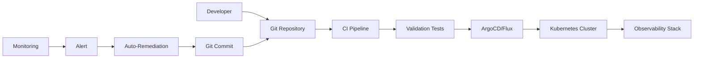

# Comprehensive Observability as Code Architecture Strategy
## MCP System Enterprise-Grade Observability Design

---

## Executive Summary

This document defines a comprehensive Observability as Code (OaC) architecture strategy for the MCP (Multimodal Content Processor) system. The design builds upon the existing strong foundation while addressing critical gaps to create an enterprise-grade, production-ready observability solution that supports multi-tenant environments, compliance requirements, and advanced operational intelligence.

---

## 1. Overall Architecture Strategy

### 1.1 Observability as Code Principles

#### Core Principles
- **Everything as Code**: All observability components versioned, tested, and deployed through GitOps
- **Shift-Left Observability**: Observability concerns integrated from development through production
- **Three Pillars Integration**: Unified approach to metrics, logs, and traces with correlation
- **Business Context Awareness**: Technical metrics tied to business outcomes and SLOs
- **Privacy by Design**: Observability respects data privacy and compliance requirements
- **Self-Healing Systems**: Automated remediation based on observability signals

#### Design Patterns
```yaml
observability_patterns:
  instrumentation:
    - auto_instrumentation: "OpenTelemetry agents for zero-code instrumentation"
    - manual_instrumentation: "Custom business metrics and traces"
    - semantic_conventions: "Consistent naming and tagging across services"
    
  data_collection:
    - push_model: "Services push metrics to collectors"
    - pull_model: "Prometheus scraping for infrastructure metrics"
    - streaming: "Real-time log and trace streaming"
    
  storage_strategy:
    - hot_storage: "Recent data for real-time alerting and dashboards"
    - warm_storage: "Medium-term data for analysis and trending"
    - cold_storage: "Long-term retention for compliance and forensics"
    
  correlation:
    - trace_id_propagation: "End-to-end request tracing"
    - service_topology: "Dynamic service dependency mapping"
    - business_context: "User journey and business process correlation"
```

### 1.2 Directory Structure for Observability Components

```
observability/
├── README.md                          # Observability overview and getting started
├── architecture/                      # Architecture documentation
│   ├── diagrams/                     # Mermaid and architectural diagrams
│   ├── decisions/                    # Architecture decision records (ADRs)
│   └── patterns/                     # Observability design patterns
├── infrastructure/                    # Infrastructure as Code
│   ├── terraform/                    # Terraform modules for cloud resources
│   │   ├── modules/
│   │   │   ├── prometheus/           # Prometheus infrastructure
│   │   │   ├── grafana/              # Grafana infrastructure
│   │   │   ├── jaeger/               # Jaeger tracing infrastructure
│   │   │   ├── elasticsearch/        # Elasticsearch logging infrastructure
│   │   │   └── alertmanager/         # Alertmanager infrastructure
│   │   ├── environments/
│   │   │   ├── dev/                  # Development environment
│   │   │   ├── staging/              # Staging environment
│   │   │   └── prod/                 # Production environment
│   │   └── shared/                   # Shared infrastructure components
│   ├── kubernetes/                   # Kubernetes manifests
│   │   ├── operators/                # Operator deployments
│   │   │   ├── prometheus-operator/
│   │   │   ├── grafana-operator/
│   │   │   └── jaeger-operator/
│   │   ├── monitoring/               # Monitoring stack deployments
│   │   │   ├── prometheus/
│   │   │   ├── grafana/
│   │   │   ├── jaeger/
│   │   │   ├── elasticsearch/
│   │   │   └── alertmanager/
│   │   ├── service-monitors/         # ServiceMonitor CRDs
│   │   ├── pod-monitors/             # PodMonitor CRDs
│   │   └── network-policies/         # Network security policies
│   └── helm/                         # Helm charts
│       ├── observability-stack/     # Complete observability stack
│       ├── prometheus-stack/        # Prometheus monitoring stack
│       ├── logging-stack/           # Logging infrastructure stack
│       └── tracing-stack/           # Distributed tracing stack
├── configuration/                    # Configuration as Code
│   ├── prometheus/                   # Prometheus configuration
│   │   ├── rules/                    # Recording and alerting rules
│   │   │   ├── infrastructure.yml    # Infrastructure alerting rules
│   │   │   ├── application.yml       # Application alerting rules
│   │   │   ├── business.yml          # Business logic alerting rules
│   │   │   └── slo.yml              # SLO-based alerting rules
│   │   ├── targets/                  # Service discovery configurations
│   │   └── federation/               # Multi-cluster federation config
│   ├── grafana/                      # Grafana configuration
│   │   ├── dashboards/               # Dashboard definitions
│   │   │   ├── infrastructure/       # Infrastructure dashboards
│   │   │   ├── application/          # Application dashboards
│   │   │   ├── business/             # Business metrics dashboards
│   │   │   └── slo/                  # SLO dashboards
│   │   ├── datasources/              # Data source configurations
│   │   ├── plugins/                  # Plugin configurations
│   │   └── provisioning/             # Automated provisioning configs
│   ├── jaeger/                       # Jaeger tracing configuration
│   │   ├── sampling/                 # Sampling strategies
│   │   ├── storage/                  # Storage configurations
│   │   └── collectors/               # Collector configurations
│   ├── elasticsearch/                # Elasticsearch configuration
│   │   ├── indices/                  # Index templates and policies
│   │   ├── pipelines/                # Ingest pipelines
│   │   └── security/                 # Security and access control
│   ├── fluentd/                      # Fluentd logging configuration
│   │   ├── inputs/                   # Input source configurations
│   │   ├── filters/                  # Log processing filters
│   │   ├── outputs/                  # Output destination configurations
│   │   └── parsers/                  # Log parsing configurations
│   └── alertmanager/                 # Alertmanager configuration
│       ├── routing/                  # Alert routing rules
│       ├── receivers/                # Notification receivers
│       ├── inhibition/               # Alert inhibition rules
│       └── templates/                # Notification templates
├── instrumentation/                  # Application instrumentation
│   ├── opentelemetry/                # OpenTelemetry configurations
│   │   ├── auto-instrumentation/    # Auto-instrumentation configs
│   │   ├── manual-instrumentation/  # Manual instrumentation examples
│   │   ├── collectors/               # OTel collector configurations
│   │   └── exporters/                # Exporter configurations
│   ├── custom-metrics/               # Custom metrics definitions
│   │   ├── business-metrics/         # Business logic metrics
│   │   ├── performance-metrics/      # Performance metrics
│   │   └── security-metrics/         # Security-related metrics
│   ├── service-mesh/                 # Service mesh observability
│   │   ├── istio/                    # Istio observability configs
│   │   └── envoy/                    # Envoy proxy configurations
│   └── agents/                       # Monitoring agents
│       ├── node-exporter/            # Node exporter configurations
│       ├── cadvisor/                 # Container metrics
│       └── custom-exporters/         # Custom Prometheus exporters
├── slo/                              # Service Level Objectives
│   ├── definitions/                  # SLO definitions
│   │   ├── infrastructure-slos.yml   # Infrastructure SLOs
│   │   ├── application-slos.yml      # Application SLOs
│   │   └── business-slos.yml         # Business process SLOs
│   ├── error-budgets/                # Error budget configurations
│   ├── burn-rate/                    # Burn rate alerting
│   └── reports/                      # SLO reporting configurations
├── dashboards/                       # Dashboard as Code
│   ├── grafana/                      # Grafana dashboards
│   │   ├── infrastructure/           # Infrastructure monitoring
│   │   │   ├── kubernetes-cluster.json
│   │   │   ├── node-metrics.json
│   │   │   ├── network-performance.json
│   │   │   └── storage-metrics.json
│   │   ├── application/              # Application monitoring
│   │   │   ├── mcp-overview.json
│   │   │   ├── model-router.json
│   │   │   ├── workflow-orchestrator.json
│   │   │   ├── plan-management.json
│   │   │   └── verification-feedback.json
│   │   ├── business/                 # Business metrics
│   │   │   ├── user-experience.json
│   │   │   ├── agent-collaboration.json
│   │   │   ├── llm-performance.json
│   │   │   └── cost-optimization.json
│   │   ├── security/                 # Security monitoring
│   │   │   ├── threat-detection.json
│   │   │   ├── compliance-monitoring.json
│   │   │   └── audit-trails.json
│   │   └── slo/                      # SLO dashboards
│   │       ├── service-reliability.json
│   │       ├── error-budgets.json
│   │       └── burn-rate-alerts.json
│   ├── kibana/                       # Kibana dashboards
│   │   ├── log-analysis/
│   │   ├── security-logs/
│   │   └── audit-logs/
│   └── custom/                       # Custom dashboard solutions
├── alerts/                           # Alerting as Code
│   ├── prometheus/                   # Prometheus alerting rules
│   │   ├── infrastructure/           # Infrastructure alerts
│   │   │   ├── kubernetes.yml
│   │   │   ├── networking.yml
│   │   │   ├── storage.yml
│   │   │   └── compute.yml
│   │   ├── application/              # Application alerts
│   │   │   ├── mcp-services.yml
│   │   │   ├── performance.yml
│   │   │   ├── errors.yml
│   │   │   └── availability.yml
│   │   ├── business/                 # Business logic alerts
│   │   │   ├── user-experience.yml
│   │   │   ├── agent-performance.yml
│   │   │   └── cost-thresholds.yml
│   │   └── security/                 # Security alerts
│   │       ├── intrusion-detection.yml
│   │       ├── compliance-violations.yml
│   │       └── audit-anomalies.yml
│   ├── alertmanager/                 # Alertmanager configurations
│   │   ├── routing.yml               # Alert routing configuration
│   │   ├── receivers.yml             # Notification receivers
│   │   └── templates/                # Alert templates
│   └── runbooks/                     # Incident response runbooks
│       ├── infrastructure/
│       ├── application/
│       └── security/
├── testing/                          # Observability testing
│   ├── chaos-engineering/            # Chaos engineering tests
│   │   ├── network-failures/
│   │   ├── service-failures/
│   │   ├── resource-exhaustion/
│   │   └── data-corruption/
│   ├── synthetic-monitoring/         # Synthetic tests
│   │   ├── api-tests/
│   │   ├── ui-tests/
│   │   └── workflow-tests/
│   ├── load-testing/                 # Performance testing
│   │   ├── scenarios/
│   │   ├── metrics-collection/
│   │   └── analysis/
│   └── validation/                   # Observability validation
│       ├── metrics-validation/
│       ├── dashboard-validation/
│       └── alert-validation/
├── automation/                       # Automation scripts
│   ├── deployment/                   # Deployment automation
│   │   ├── terraform-apply.sh
│   │   ├── kubernetes-deploy.sh
│   │   └── helm-upgrade.sh
│   ├── maintenance/                  # Maintenance automation
│   │   ├── data-retention.sh
│   │   ├── index-cleanup.sh
│   │   └── backup-restore.sh
│   ├── incident-response/            # Incident response automation
│   │   ├── auto-remediation/
│   │   ├── escalation/
│   │   └── post-incident/
│   └── reporting/                    # Automated reporting
│       ├── slo-reports/
│       ├── capacity-planning/
│       └── cost-analysis/
├── security/                         # Security and compliance
│   ├── rbac/                         # Role-based access control
│   │   ├── grafana-rbac.yml
│   │   ├── prometheus-rbac.yml
│   │   └── elasticsearch-rbac.yml
│   ├── network-policies/             # Network security policies
│   ├── encryption/                   # Encryption configurations
│   │   ├── tls-certificates/
│   │   └── data-encryption/
│   ├── audit/                        # Audit configurations
│   │   ├── access-logs/
│   │   ├── change-tracking/
│   │   └── compliance-reports/
│   └── privacy/                      # Privacy protection
│       ├── data-masking/
│       ├── retention-policies/
│       └── gdpr-compliance/
├── docs/                             # Documentation
│   ├── getting-started/              # Getting started guides
│   ├── runbooks/                     # Operational runbooks
│   ├── troubleshooting/              # Troubleshooting guides
│   ├── best-practices/               # Best practices documentation
│   └── api/                          # API documentation
└── tools/                            # Observability tools
    ├── cli/                          # Command-line tools
    ├── scripts/                      # Utility scripts
    ├── generators/                   # Configuration generators
    └── validators/                   # Configuration validators
```

### 1.3 Deployment and Versioning Strategies

#### GitOps Workflow


#### Versioning Strategy
- **Semantic Versioning**: All observability components follow semver
- **Environment Promotion**: Dev → Staging → Production with automated testing
- **Rollback Capability**: Automated rollback on deployment failures
- **Configuration Drift Detection**: Continuous monitoring of configuration drift

---

## 2. Metrics & Monitoring Architecture

### 2.1 Kubernetes Monitoring Implementation

#### Prometheus Operator Integration
```yaml
prometheus_operator_config:
  deployment:
    high_availability: true
    replicas: 3
    storage:
      class: "fast-ssd"
      size: "100Gi"
      retention: "30d"
    
  service_discovery:
    kubernetes:
      - role: "endpoints"
        namespaces:
          names: ["mcp-system", "monitoring", "istio-system"]
      - role: "pod"
        namespaces:
          names: ["mcp-system"]
      - role: "service"
        namespaces:
          names: ["mcp-system", "monitoring"]
    
  federation:
    enabled: true
    clusters:
      - name: "mcp-prod"
        url: "https://prometheus.prod.mcp.internal"
      - name: "mcp-staging"
        url: "https://prometheus.staging.mcp.internal"
```

#### Custom Resource Definitions
```yaml
# ServiceMonitor for MCP services
apiVersion: monitoring.coreos.com/v1
kind: ServiceMonitor
metadata:
  name: mcp-services
  namespace: mcp-system
spec:
  selector:
    matchLabels:
      app.kubernetes.io/part-of: mcp-system
  endpoints:
  - port: metrics
    interval: 15s
    path: /metrics
    honorLabels: true
```

### 2.2 Service Discovery and Metric Collection

#### Multi-Layer Service Discovery
```yaml
service_discovery_layers:
  kubernetes_native:
    - service_monitors: "Kubernetes services with metrics endpoints"
    - pod_monitors: "Direct pod monitoring for specialized cases"
    - ingress_monitors: "Ingress controller metrics"
    
  consul_integration:
    - service_catalog: "Consul service catalog integration"
    - health_checks: "Consul health check integration"
    - metadata_enrichment: "Service metadata from Consul"
    
  custom_discovery:
    - file_based: "Static configuration for external services"
    - dns_based: "DNS-based service discovery"
    - cloud_provider: "Cloud provider service discovery"
```

### 2.3 Custom Metrics Integration

#### Business Metrics Framework
```python
# Example: Custom business metrics for MCP services
from prometheus_client import Counter, Histogram, Gauge, Info
from opentelemetry import metrics

# Business-specific metrics
agent_collaboration_success = Counter(
    'mcp_agent_collaboration_success_total',
    'Total successful agent collaborations',
    ['collaboration_type', 'agents_involved', 'tenant_id']
)

llm_token_usage = Counter(
    'mcp_llm_token_usage_total',
    'Total LLM tokens consumed',
    ['model', 'operation_type', 'tenant_id', 'cost_center']
)

workflow_execution_time = Histogram(
    'mcp_workflow_execution_duration_seconds',
    'Time spent executing workflows',
    ['workflow_type', 'complexity_level', 'tenant_id'],
    buckets=[0.1, 0.5, 1.0, 2.0, 5.0, 10.0, 30.0, 60.0, 300.0]
)

# Real-time business KPIs
active_user_sessions = Gauge(
    'mcp_active_user_sessions',
    'Current number of active user sessions',
    ['tenant_id', 'user_tier']
)

# Service health and performance
service_info = Info(
    'mcp_service_info',
    'Service information and metadata'
)
```

---

## 3. Distributed Tracing Design

### 3.1 OpenTelemetry Instrumentation Strategy

#### Auto-Instrumentation Configuration
```yaml
opentelemetry_auto_instrumentation:
  languages:
    python:
      packages:
        - fastapi
        - requests
        - sqlalchemy
        - redis
        - pika  # RabbitMQ
      configuration:
        OTEL_PYTHON_LOG_CORRELATION: "true"
        OTEL_PYTHON_LOGGING_AUTO_INSTRUMENTATION_ENABLED: "true"
    
    javascript:
      packages:
        - "@opentelemetry/auto-instrumentations-node"
        - "@opentelemetry/instrumentation-http"
        - "@opentelemetry/instrumentation-express"
      configuration:
        OTEL_NODE_ENABLED_INSTRUMENTATIONS: "http,express,fs"
    
  collectors:
    deployment_mode: "sidecar"  # or "daemonset" for node-level collection
    processors:
      - batch:
          timeout: 1s
          send_batch_size: 1024
      - memory_limiter:
          limit_mib: 512
      - resource:
          attributes:
            - key: "service.namespace"
              value: "mcp-system"
            - key: "deployment.environment"
              from_attribute: "ENVIRONMENT"
```

#### Manual Instrumentation Patterns
```python
# Example: Custom tracing for MCP agent collaboration
from opentelemetry import trace
from opentelemetry.trace import Status, StatusCode

tracer = trace.get_tracer(__name__)

class AgentCollaborationTracer:
    @staticmethod
    def trace_collaboration(collaboration_type: str, agents: List[str]):
        with tracer.start_as_current_span(
            "agent_collaboration",
            attributes={
                "collaboration.type": collaboration_type,
                "collaboration.agents": ",".join(agents),
                "collaboration.agent_count": len(agents)
            }
        ) as span:
            try:
                # Collaboration logic here
                result = perform_collaboration(collaboration_type, agents)
                
                span.set_attributes({
                    "collaboration.success": True,
                    "collaboration.consensus_time": result.consensus_time,
                    "collaboration.iterations": result.iterations
                })
                
                return result
            except Exception as e:
                span.set_status(Status(StatusCode.ERROR, str(e)))
                span.record_exception(e)
                raise
```

### 3.2 Trace Sampling and Propagation

#### Adaptive Sampling Strategy
```yaml
sampling_strategies:
  default_strategy:
    type: "probabilistic"
    param: 0.1  # 10% sampling rate
    
  per_service_strategies:
    - service: "model-router"
      type: "probabilistic"
      param: 1.0  # 100% sampling for critical service
      
    - service: "frontend"
      type: "rate_limiting"
      max_traces_per_second: 100
      
    - service: "llm-*"
      type: "adaptive"
      target_samples_per_second: 50
      delta: 0.1
      
  per_operation_strategies:
    - operation: "health_check"
      type: "probabilistic"
      param: 0.01  # 1% sampling for health checks
      
    - operation: "agent_collaboration"
      type: "probabilistic"
      param: 1.0  # 100% sampling for business-critical operations
```

### 3.3 Trace Data Storage and Retention

#### Multi-Tier Storage Strategy
```yaml
trace_storage:
  hot_tier:
    backend: "elasticsearch"
    retention: "7d"
    indices:
      - name: "jaeger-span-{date}"
        settings:
          number_of_shards: 3
          number_of_replicas: 1
          refresh_interval: "1s"
    
  warm_tier:
    backend: "elasticsearch"
    retention: "30d"
    indices:
      - name: "jaeger-span-archive-{date}"
        settings:
          number_of_shards: 1
          number_of_replicas: 0
          refresh_interval: "30s"
    
  cold_tier:
    backend: "s3"
    retention: "1y"
    compression: "gzip"
    encryption: "AES256"
```

---

## 4. Logging Architecture

### 4.1 Structured Logging Framework

#### Logging Standards
```python
# Standardized logging configuration for all MCP services
import structlog
from pythonjsonlogger import jsonlogger

# Configure structured logging
structlog.configure(
    processors=[
        structlog.stdlib.filter_by_level,
        structlog.stdlib.add_logger_name,
        structlog.stdlib.add_log_level,
        structlog.stdlib.PositionalArgumentsFormatter(),
        structlog.processors.TimeStamper(fmt="iso"),
        structlog.processors.StackInfoRenderer(),
        structlog.processors.format_exc_info,
        structlog.processors.UnicodeDecoder(),
        structlog.processors.JSONRenderer()
    ],
    context_class=dict,
    logger_factory=structlog.stdlib.LoggerFactory(),
    wrapper_class=structlog.stdlib.BoundLogger,
    cache_logger_on_first_use=True,
)

# Standard log fields for all services
STANDARD_LOG_FIELDS = {
    "service_name": "model-router",
    "service_version": "1.0.0",
    "environment": "production",
    "tenant_id": None,  # Set per request
    "trace_id": None,   # Set per request
    "span_id": None,    # Set per request
    "user_id": None,    # Set per request
}
```

#### Log Correlation Strategy
```yaml
log_correlation:
  trace_integration:
    - trace_id_injection: "Automatic trace ID injection into all log entries"
    - span_context: "Include span context in structured logs"
    - baggage_propagation: "Propagate business context through baggage"
    
  business_context:
    - tenant_isolation: "Tenant ID in all log entries"
    - user_journey: "User session tracking across services"
    - workflow_correlation: "Workflow execution correlation"
    
  technical_context:
    - service_metadata: "Service name, version, instance ID"
    - request_metadata: "Request ID, method, path, user agent"
    - performance_metadata: "Response time, resource usage"
```

### 4.2 Log Aggregation Pipeline Enhancement

#### Multi-Stage Processing Pipeline
```yaml
log_pipeline:
  collection:
    agents:
      - fluentd:
          deployment: "daemonset"
          inputs:
            - docker_logs: "/var/lib/docker/containers"
            - kubernetes_logs: "/var/log/pods"
            - application_logs: "/app/logs"
          
      - filebeat:
          deployment: "sidecar"
          inputs:
            - application_logs: "/app/logs/*.json"
            - audit_logs: "/app/audit/*.log"
    
  processing:
    stages:
      - parsing:
          json_parser: "Parse JSON structured logs"
          regex_parser: "Parse unstructured logs with regex"
          grok_parser: "Parse complex log formats"
          
      - enrichment:
          kubernetes_metadata: "Add pod, namespace, node metadata"
          service_metadata: "Add service discovery metadata"
          geo_location: "Add geographic location for IP addresses"
          
      - filtering:
          noise_reduction: "Filter out noisy log entries"
          sensitive_data: "Mask sensitive information"
          compliance: "Apply compliance-specific filtering"
          
      - routing:
          by_severity: "Route by log level"
          by_service: "Route by service name"
          by_tenant: "Route by tenant ID"
    
  storage:
    elasticsearch:
      hot_indices:
        - pattern: "mcp-logs-{date}"
          retention: "7d"
          shards: 3
          replicas: 1
          
      warm_indices:
        - pattern: "mcp-logs-archive-{date}"
          retention: "30d"
          shards: 1
          replicas: 0
          
      cold_storage:
        - backend: "s3"
          retention: "1y"
          compression: "gzip"
```

### 4.3 Log Parsing and Enrichment

#### Intelligent Log Processing
```yaml
log_processing:
  parsers:
    application_logs:
      - name: "mcp_service_logs"
        pattern: |
          {
            "timestamp": "%{TIMESTAMP_ISO8601:timestamp}",
            "level": "%{WORD:level}",
            "service": "%{WORD:service}",
            "trace_id": "%{UUID:trace_id}",
            "span_id": "%{WORD:span_id}",
            "message": "%{GREEDYDATA:message}"
          }
    
    audit_logs:
      - name: "security_audit"
        pattern: |
          %{TIMESTAMP_ISO8601:timestamp} \[%{WORD:severity}\] %{WORD:event_type} user=%{WORD:user_id} action=%{WORD:action} resource=%{URIPATH:resource} result=%{WORD:result}
    
    performance_logs:
      - name: "performance_metrics"
        pattern: |
          %{TIMESTAMP_ISO8601:timestamp} %{WORD:service} %{WORD:operation} duration=%{NUMBER:duration:float} status=%{NUMBER:status_code:int}
  
  enrichment:
    kubernetes:
      - pod_metadata: "Add pod name, namespace, labels"
      - node_metadata: "Add node name, zone, instance type"
      - service_metadata: "Add service name, version, deployment"
    
    business_context:
      - tenant_lookup: "Resolve tenant information"
      - user_context: "Add user role and permissions"
      - cost_center: "Add cost center and billing information"
    
    security:
      - threat_intelligence: "Enrich with threat intelligence data"
      - geo_location: "Add geographic location for IP addresses"
      - risk_scoring: "Calculate risk scores for events"
```

---

## 5. Alerting & SLO Framework

### 5.1 Comprehensive Alerting Strategy

#### Multi-Tier Alerting Architecture
```yaml
alerting_architecture:
  tiers:
    infrastructure:
      scope: "Hardware, network, Kubernetes cluster health"
      tools: ["prometheus", "node-exporter", "kube-state-metrics"]
      escalation: "infrastructure-team"
      
    platform:
      scope: "Platform services, databases, message queues"
      tools: ["prometheus", "custom-exporters"]
      escalation: "platform-team"
      
    application:
      scope: "MCP services, APIs, business logic"
      tools: ["prometheus", "jaeger", "custom-metrics"]
      escalation: "development-team"
      
    business:
      scope: "SLOs, user experience, business KPIs"
      tools: ["prometheus", "grafana", "custom-dashboards"]
      escalation: "product-team"
  
  alert_types:
    immediate:
      severity: "critical"
      response_time: "5m"
      escalation: "immediate"
      
    urgent:
      severity: "warning"
      response_time: "15m"
      escalation: "business-hours"
      
    informational:
      severity: "info"
      response_time: "24h"
      escalation: "next-business-day"
```

#### Alert Rules Framework
```yaml
# Infrastructure Alerts
infrastructure_alerts:
  - alert: "KubernetesNodeDown"
    expr: "up{job='kubernetes-nodes'} == 0"
    for: "5m"
    labels:
      severity: "critical"
      team: "infrastructure"
    annotations:
      summary: "Kubernetes