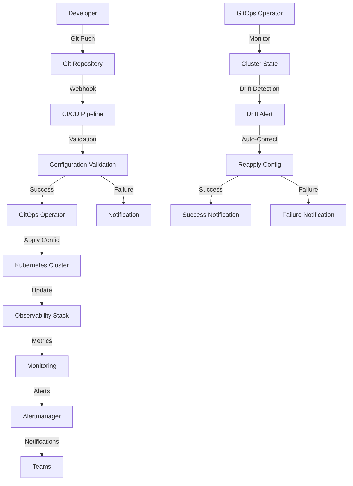

# Observability as Code GitOps Workflow for Tracing Configuration

This document provides comprehensive guidance on implementing a GitOps workflow for managing distributed tracing configuration as code in the MCP system.

---

## 1. Overview

### 1.1 Purpose

This guide provides:

- **GitOps Strategy**: Comprehensive GitOps approach for observability configuration
- **Workflow Design**: End-to-end workflow for configuration management
- **Automation**: Automated deployment and validation processes
- **Best Practices**: Industry best practices for GitOps implementation
- **Integration**: Integration with existing CI/CD pipelines

### 1.2 GitOps Principles

The GitOps workflow for observability configuration follows these principles:

- **Declarative Configuration**: All configuration is declared in code
- **Version Control**: All changes are tracked in Git
- **Automated Deployment**: Changes are automatically deployed
- **Continuous Validation**: Configuration is continuously validated
- **Immutable Infrastructure**: Configuration changes are immutable

---

## 2. GitOps Architecture

### 2.1 Overall Architecture



### 2.2 Repository Structure

```yaml
# repository-structure.yaml
repository_structure:
  observability:
    tracing:
      # OpenTelemetry Configuration
      opentelemetry:
        collector:
          - config/
            - collector-config.yaml
            - gateway-config.yaml
            - agent-config.yaml
          - deployments/
            - collector-deployment.yaml
            - gateway-deployment.yaml
            - agent-daemonset.yaml
          - services/
            - collector-service.yaml
            - gateway-service.yaml
          - helm/
            - Chart.yaml
            - values.yaml
            - templates/
            
        # Auto-instrumentation
        auto-instrumentation:
          - python/
            - instrumentation.yaml
            - configmap.yaml
          - javascript/
            - instrumentation.yaml
            - configmap.yaml
          - java/
            - instrumentation.yaml
            - configmap.yaml
            
        # Custom instrumentation
        custom-instrumentation:
          - mcp-python/
            - instrumentation.py
            - requirements.txt
          - mcp-javascript/
            - instrumentation.js
            - package.json
            
      # Jaeger Configuration
      jaeger:
        collector:
          - deployment.yaml
          - configmap.yaml
          - service.yaml
        query:
          - deployment.yaml
          - configmap.yaml
          - service.yaml
          - ingress.yaml
        agent:
          - daemonset.yaml
          - configmap.yaml
        storage:
          - elasticsearch/
            - configmap.yaml
            - deployment.yaml
          - cassandra/
            - configmap.yaml
            - statefulset.yaml
        helm/
          - Chart.yaml
          - values.yaml
          - templates/
          
      # Sampling Configuration
      sampling:
        - strategies/
          - probabilistic-sampling.yaml
          - adaptive-sampling.yaml
          - rule-based-sampling.yaml
        - configmaps/
          - sampling-configmap.yaml
        - deployments/
          - sampling-deployment.yaml
          
      # Grafana Dashboards
      grafana:
        dashboards/
          - distributed-tracing/
            - dashboard.json
            - configmap.yaml
          - trace-performance/
            - dashboard.json
            - configmap.yaml
          - service-dependency/
            - dashboard.json
            - configmap.yaml
        datasources/
          - prometheus.yaml
          - jaeger.yaml
        provisioning/
          - dashboards.yaml
          - datasources.yaml
          
      # Alerting Configuration
      alerting:
        rules/
          - trace-based-alerts.yaml
          - anomaly-detection-alerts.yaml
          - business-impact-alerts.yaml
        alertmanager/
          - config.yaml
          - templates/
            - notification.tmpl
        runbooks/
          - high-latency.md
          - error-rate.md
          - trace-loss.md
          
      # Testing Configuration
      testing:
        unit/
          - test-instrumentation.py
          - test-context-propagation.py
          - test-sampling.py
        integration/
          - test-collector.py
          - test-jaeger.py
          - test-grafana.py
        e2e/
          - test-full-trace.py
          - test-cross-service.py
          - test-business-process.py
        performance/
          - test-load.py
          - test-stress.py
          - test-scalability.py
          
      # Documentation
      docs/
        architecture.md
        deployment.md
        operations.md
        troubleshooting.md
        best-practices.md
        
      # CI/CD Configuration
      ci-cd/
        github-actions/
          - validate.yml
          - deploy.yml
          - test.yml
        jenkins/
          - Jenkinsfile
          - pipeline.groovy
        gitlab-ci/
          - .gitlab-ci.yml
          
      # GitOps Configuration
      gitops/
        argocd/
          - application.yaml
          - project.yaml
        flux/
          - kustomization.yaml
          - helm-release.yaml
        operators/
          - gitops-operator.yaml
```

---

## 3. GitOps Workflow Implementation

### 3.1 CI/CD Pipeline Configuration

#### 3.1.1 GitHub Actions Workflow

```yaml
# .github/workflows/observability-gitops.yml
name: Observability GitOps Workflow

on:
  push:
    branches: [main]
    paths: 
      - 'observability/**'
  pull_request:
    branches: [main]
    paths: 
      - 'observability/**'

env:
  REGISTRY: ghcr.io
  IMAGE_NAME: ${{ github.repository }}

jobs:
  validate:
    name: Validate Configuration
    runs-on: ubuntu-latest
    outputs:
      validation-success: ${{ steps.validation.outputs.success }}
    
    steps:
    - name: Checkout code
      uses: actions/checkout@v3
      
    - name: Set up Python
      uses: actions/setup-python@v4
      with:
        python-version: '3.9'
        
    - name: Install dependencies
      run: |
        pip install pyyaml
        pip install kubernetes
        pip install prometheus-client
        
    - name: Validate YAML syntax
      run: |
        python -c "
        import yaml
        import sys
        import os
        
        def validate_yaml_files(directory):
            for root, dirs, files in os.walk(directory):
                for file in files:
                    if file.endswith('.yaml') or file.endswith('.yml'):
                        file_path = os.path.join(root, file)
                        try:
                            with open(file_path, 'r') as f:
                                yaml.safe_load(f)
                            print(f'✓ {file_path}')
                        except yaml.YAMLError as e:
                            print(f'✗ {file_path}: {e}')
                            sys.exit(1)
        
        validate_yaml_files('observability')
        "
        
    - name: Validate Kubernetes manifests
      run: |
        python -c "
        import yaml
        import sys
        import os
        from kubernetes import client, utils
        
        def validate_k8s_manifests(directory):
            for root, dirs, files in os.walk(directory):
                for file in files:
                    if file.endswith('.yaml') or file.endswith('.yml'):
                        file_path = os.path.join(root, file)
                        try:
                            with open(file_path, 'r') as f:
                                docs = yaml.safe_load_all(f)
                                for doc in docs:
                                    if doc and 'kind' in doc:
                                        print(f'✓ {file_path}: {doc[\"kind\"]}')
                        except Exception as e:
                            print(f'✗ {file_path}: {e}')
                            sys.exit(1)
        
        validate_k8s_manifests('observability')
        "
        
    - name: Validate Prometheus rules
      run: |
        python -c "
        import yaml
        import sys
        import os
        from prometheus_client import parser
        
        def validate_prometheus_rules(directory):
            for root, dirs, files in os.walk(directory):
                for file in files:
                    if 'alert' in file and (file.endswith('.yaml') or file.endswith('.yml')):
                        file_path = os.path.join(root, file)
                        try:
                            with open(file_path, 'r') as f:
                                data = yaml.safe_load(f)
                                if 'groups' in data:
                                    for group in data['groups']:
                                        if 'rules' in group:
                                            for rule in group['rules']:
                                                if 'expr' in rule:
                                                    # Try to parse the expression
                                                    parser.parse_string(rule['expr'])
                            print(f'✓ {file_path}')
                        except Exception as e:
                            print(f'✗ {file_path}: {e}')
                            sys.exit(1)
        
        validate_prometheus_rules('observability/alerting/rules')
        "
        
    - name: Validate Grafana dashboards
      run: |
        python -c "
        import json
        import sys
        import os
        
        def validate_grafana_dashboards(directory):
            for root, dirs, files in os.walk(directory):
                for file in files:
                    if file.endswith('.json'):
                        file_path = os.path.join(root, file)
                        try:
                            with open(file_path, 'r') as f:
                                dashboard = json.load(f)
                                if 'panels' in dashboard:
                                    for panel in dashboard['panels']:
                                        if 'targets' in panel:
                                            for target in panel['targets']:
                                                if 'expr' in target:
                                                    # Basic validation
                                                    if not target['expr']:
                                                        raise ValueError('Empty expression')
                            print(f'✓ {file_path}')
                        except Exception as e:
                            print(f'✗ {file_path}: {e}')
                            sys.exit(1)
        
        validate_grafana_dashboards('observability/grafana/dashboards')
        "
        
    - name: Set validation output
      id: validation
      run: echo "success=true" >> $GITHUB_OUTPUT

  test:
    name: Run Tests
    runs-on: ubuntu-latest
    needs: validate
    if: needs.validate.outputs.validation-success == 'true'
    
    steps:
    - name: Checkout code
      uses: actions/checkout@v3
      
    - name: Set up Python
      uses: actions/setup-python@v4
      with:
        python-version: '3.9'
        
    - name: Install dependencies
      run: |
        pip install pytest
        pip install pytest-cov
        pip install requests
        pip install opentelemetry-api
        pip install opentelemetry-sdk
        
    - name: Run unit tests
      run: |
        pytest observability/testing/unit/ -v --cov=observability/testing/unit --cov-report=xml
        
    - name: Run integration tests
      run: |
        pytest observability/testing/integration/ -v --cov=observability/testing/integration --cov-report=xml
        
    - name: Upload coverage to Codecov
      uses: codecov/codecov-action@v3
      with:
        file: ./coverage.xml
        flags: unittests
        name: codecov-umbrella

  security-scan:
    name: Security Scan
    runs-on: ubuntu-latest
    needs: validate
    if: needs.validate.outputs.validation-success == 'true'
    
    steps:
    - name: Checkout code
      uses: actions/checkout@v3
      
    - name: Run Trivy vulnerability scanner
      uses: aquasecurity/trivy-action@master
      with:
        scan-type: 'config'
        scan-ref: 'observability'
        format: 'sarif'
        output: 'trivy-results.sarif'
        
    - name: Upload Trivy scan results to GitHub Security tab
      uses: github/codeql-action/upload-sarif@v2
      with:
        sarif_file: 'trivy-results.sarif'

  deploy-staging:
    name: Deploy to Staging
    runs-on: ubuntu-latest
    needs: [test, security-scan]
    if: github.ref == 'refs/heads/main'
    environment: staging
    
    steps:
    - name: Checkout code
      uses: actions/checkout@v3
      
    - name: Set up kubectl
      uses: azure/setup-kubectl@v3
      with:
        version: '1.25.0'
        
    - name: Configure kubeconfig
      run: |
        mkdir -p $HOME/.kube
        echo "${{ secrets.KUBE_CONFIG_STAGING }}" | base64 -d > $HOME/.kube/config
        chmod 600 $HOME/.kube/config
        
    - name: Deploy to staging
      run: |
        kubectl apply -f observability/tracing/opentelemetry/collector/
        kubectl apply -f observability/tracing/jaeger/
        kubectl apply -f observability/tracing/sampling/
        kubectl apply -f observability/grafana/
        kubectl apply -f observability/alerting/
        
    - name: Verify deployment
      run: |
        kubectl wait --for=condition=ready pod -l app=opentelemetry-collector -n monitoring --timeout=300s
        kubectl wait --for=condition=ready pod -l app=jaeger-query -n monitoring --timeout=300s
        kubectl wait --for=condition=ready pod -l app=grafana -n monitoring --timeout=300s
        
    - name: Run smoke tests
      run: |
        python observability/testing/e2e/test-smoke.py

  deploy-production:
    name: Deploy to Production
    runs-on: ubuntu-latest
    needs: deploy-staging
    if: github.ref == 'refs/heads/main'
    environment: production
    
    steps:
    - name: Checkout code
      uses: actions/checkout@v3
      
    - name: Set up kubectl
      uses: azure/setup-kubectl@v3
      with:
        version: '1.25.0'
        
    - name: Configure kubeconfig
      run: |
        mkdir -p $HOME/.kube
        echo "${{ secrets.KUBE_CONFIG_PRODUCTION }}" | base64 -d > $HOME/.kube/config
        chmod 600 $HOME/.kube/config
        
    - name: Deploy to production
      run: |
        kubectl apply -f observability/tracing/opentelemetry/collector/
        kubectl apply -f observability/tracing/jaeger/
        kubectl apply -f observability/tracing/sampling/
        kubectl apply -f observability/grafana/
        kubectl apply -f observability/alerting/
        
    - name: Verify deployment
      run: |
        kubectl wait --for=condition=ready pod -l app=opentelemetry-collector -n monitoring --timeout=300s
        kubectl wait --for=condition=ready pod -l app=jaeger-query -n monitoring --timeout=300s
        kubectl wait --for=condition=ready pod -l app=grafana -n monitoring --timeout=300s
        
    - name: Run acceptance tests
      run: |
        python observability/testing/e2e/test-acceptance.py
```

### 3.2 GitOps Operator Configuration

#### 3.2.1 ArgoCD Application Configuration

```yaml
# gitops/argocd/application.yaml
apiVersion: argoproj.io/v1alpha1
kind: Application
metadata:
  name: observability-tracing
  namespace: argocd
spec:
  project: observability
  
  source:
    repoURL: https://github.com/your-org/mcp-system.git
    targetRevision: HEAD
    path: observability
    
  destination:
    server: https://kubernetes.default.svc
    namespace: monitoring
    
  syncPolicy:
    automated:
      prune: true
      selfHeal: true
      allowEmpty: false
    syncOptions:
    - CreateNamespace=true
    - PruneLast=true
    
  ignoreDifferences:
  - group: apps
    kind: Deployment
    jsonPointers:
    - /spec/replicas
    
  retry:
    limit: 5
    backoff:
      duration: 5s
      factor: 2
      maxDuration: 3m
```

#### 3.2.2 Flux Kustomization Configuration

```yaml
# gitops/flux/kustomization.yaml
apiVersion: kustomize.toolkit.fluxcd.io/v1beta2
kind: Kustomization
metadata:
  name: observability-tracing
  namespace: flux-system
spec:
  interval: 5m
  path: ./observability
  prune: true
  sourceRef:
    kind: GitRepository
    name: mcp-system
  validation: client
  healthChecks:
  - kind: Deployment
    name: opentelemetry-collector
    namespace: monitoring
  - kind: Deployment
    name: jaeger-query
    namespace: monitoring
  - kind: Deployment
    name: grafana
    namespace: monitoring
  - kind: Service
    name: jaeger-query
    namespace: monitoring
  - kind: Service
    name: grafana
    namespace: monitoring
```

---

## 4. Configuration Management

### 4.1 Environment Management

#### 4.1.1 Environment-Specific Configuration

```yaml
# observability/config/environments.yaml
environments:
  development:
    name: development
    namespace: monitoring-dev
    
    # OpenTelemetry Collector Configuration
    opentelemetry:
      collector:
        replicas: 1
        resources:
          limits:
            cpu: 500m
            memory: 512Mi
          requests:
            cpu: 100m
            memory: 128Mi
        
      # Sampling Configuration
      sampling:
        rate: 1.0  # 100% sampling in development
        
      # Auto-instrumentation
      auto_instrumentation:
        enabled: true
        inject_java: true
        inject_python: true
        inject_nodejs: true
    
    # Jaeger Configuration
    jaeger:
      collector:
        replicas: 1
        resources:
          limits:
            cpu: 500m
            memory: 1Gi
          requests:
            cpu: 100m
            memory: 256Mi
      
      query:
        replicas: 1
        resources:
          limits:
            cpu: 200m
            memory: 256Mi
          requests:
            cpu: 50m
            memory: 64Mi
      
      storage:
        type: memory
        elasticsearch:
          enabled: false
        cassandra:
          enabled: false
    
    # Grafana Configuration
    grafana:
      replicas: 1
      resources:
        limits:
          cpu: 200m
          memory: 256Mi
        requests:
          cpu: 50m
          memory: 64Mi
      
      admin_password: admin123
      
    # Alerting Configuration
    alerting:
      enabled: true
      receivers:
        email:
          enabled: false
        slack:
          enabled: false
        webhook:
          enabled: false

  staging:
    name: staging
    namespace: monitoring-staging
    
    # OpenTelemetry Collector Configuration
    opentelemetry:
      collector:
        replicas: 2
        resources:
          limits:
            cpu: 1000m
            memory: 1Gi
          requests:
            cpu: 200m
            memory: 256Mi
        
      # Sampling Configuration
      sampling:
        rate: 0.5  # 50% sampling in staging
        
      # Auto-instrumentation
      auto_instrumentation:
        enabled: true
        inject_java: true
        inject_python: true
        inject_nodejs: true
    
    # Jaeger Configuration
    jaeger:
      collector:
        replicas: 2
        resources:
          limits:
            cpu: 1000m
            memory: 2Gi
          requests:
            cpu: 200m
            memory: 512Mi
      
      query:
        replicas: 2
        resources:
          limits:
            cpu: 500m
            memory: 512Mi
          requests:
            cpu: 100m
            memory: 128Mi
      
      storage:
        type: elasticsearch
        elasticsearch:
          enabled: true
          replicas: 3
          resources:
            limits:
              cpu: 2000m
              memory: 4Gi
            requests:
              cpu: 500m
              memory: 1Gi
        cassandra:
          enabled: false
    
    # Grafana Configuration
    grafana:
      replicas: 2
      resources:
        limits:
          cpu: 500m
          memory: 512Mi
        requests:
          cpu: 100m
          memory: 128Mi
      
      admin_password: ${GRAFANA_ADMIN_PASSWORD}
      
    # Alerting Configuration
    alerting:
      enabled: true
      receivers:
        email:
          enabled: true
          to: "staging-alerts@example.com"
        slack:
          enabled: true
          webhook_url: ${SLACK_WEBHOOK_URL}
        webhook:
          enabled: true
          url: ${WEBHOOK_URL}

  production:
    name: production
    namespace: monitoring
    
    # OpenTelemetry Collector Configuration
    opentelemetry:
      collector:
        replicas: 3
        resources:
          limits:
            cpu: 2000m
            memory: 2Gi
          requests:
            cpu: 500m
            memory: 512Mi
        
      # Sampling Configuration
      sampling:
        rate: 0.1  # 10% sampling in production
        
      # Auto-instrumentation
      auto_instrumentation:
        enabled: true
        inject_java: true
        inject_python: true
        inject_nodejs: true
    
    # Jaeger Configuration
    jaeger:
      collector:
        replicas: 3
        resources:
          limits:
            cpu: 2000m
            memory: 4Gi
          requests:
            cpu: 500m
            memory: 1Gi
      
      query:
        replicas: 3
        resources:
          limits:
            cpu: 1000m
            memory: 1Gi
          requests:
            cpu: 200m
            memory: 256Mi
      
      storage:
        type: elasticsearch
        elasticsearch:
          enabled: true
          replicas: 5
          resources:
            limits:
              cpu: 4000m
              memory: 8Gi
            requests:
              cpu: 1000m
              memory: 2Gi
        cassandra:
          enabled: false
    
    # Grafana Configuration
    grafana:
      replicas: 3
      resources:
        limits:
          cpu: 1000m
          memory: 1Gi
        requests:
          cpu: 200m
          memory: 256Mi
      
      admin_password: ${GRAFANA_ADMIN_PASSWORD}
      
    # Alerting Configuration
    alerting:
      enabled: true
      receivers:
        email:
          enabled: true
          to: "production-alerts@example.com"
        slack:
          enabled: true
          webhook_url: ${SLACK_WEBHOOK_URL}
        webhook:
          enabled: true
          url: ${WEBHOOK_URL}
        pagerduty:
          enabled: true
          service_key: ${PAGERDUTY_SERVICE_KEY}
```

### 4.2 Configuration Templates

#### 4.2.1 OpenTelemetry Collector Template

```yaml
# observability/templates/opentelemetry-collector.yaml
apiVersion: v1
kind: ConfigMap
metadata:
  name: otel-collector-config
  namespace: {{ .Values.namespace }}
data:
  collector-config.yaml: |
    receivers:
      otlp:
        protocols:
          grpc:
            endpoint: 0.0.0.0:4317
          http:
            endpoint: 0.0.0.0:4318
      jaeger:
        protocols:
          thrift_compact:
            endpoint: 0.0.0.0:6831
          thrift_binary:
            endpoint: 0.0.0.0:6832
          grpc:
            endpoint: 0.0.0.0:14250
          thrift_http:
            endpoint: 0.0.0.0:14268
    
    processors:
      batch:
        timeout: 5s
        send_batch_size: 1000
      memory_limiter:
        check_interval: 1s
        limit_mib: {{ .Values.collector.memory_limit }}
      resource:
        attributes:
          - key: environment
            value: {{ .Values.environment }}
          - key: cluster
            value: {{ .Values.cluster }}
    
    exporters:
      jaeger:
        endpoint: jaeger-collector:14250
        tls:
          insecure: true
      logging:
        loglevel: info
      prometheus:
        endpoint: 0.0.0.0:8888
        namespace: {{ .Values.namespace }}
    
    service:
      pipelines:
        traces:
          receivers: [otlp, jaeger]
          processors: [memory_limiter, batch, resource]
          exporters: [jaeger, logging]
        metrics:
          receivers: [otlp]
          processors: [memory_limiter, batch, resource]
          exporters: [prometheus, logging]
---
apiVersion: apps/v1
kind: Deployment
metadata:
  name: otel-collector
  namespace: {{ .Values.namespace }}
spec:
  replicas: {{ .Values.collector.replicas }}
  selector:
    matchLabels:
      app: otel-collector
  template:
    metadata:
      labels:
        app: otel-collector
    spec:
      containers:
      - name: otel-collector
        image: otel/opentelemetry-collector-contrib:{{ .Values.collector.version }}
        args: ["--config=/conf/collector-config.yaml"]
        resources:
          limits:
            cpu: {{ .Values.collector.resources.limits.cpu }}
            memory: {{ .Values.collector.resources.limits.memory }}
          requests:
            cpu: {{ .Values.collector.resources.requests.cpu }}
            memory: {{ .Values.collector.resources.requests.memory }}
        ports:
        - containerPort: 4317
        - containerPort: 4318
        - containerPort: 6831
        - containerPort: 6832
        - containerPort: 14250
        - containerPort: 14268
        - containerPort: 8888
        volumeMounts:
        - name: collector-config
          mountPath: /conf
      volumes:
      - name: collector-config
        configMap:
          name: otel-collector-config
---
apiVersion: v1
kind: Service
metadata:
  name: otel-collector
  namespace: {{ .Values.namespace }}
spec:
  selector:
    app: otel-collector
  ports:
  - name: otlp-grpc
    port: 4317
    targetPort: 4317
  - name: otlp-http
    port: 4318
    targetPort: 4318
  - name: jaeger-compact
    port: 6831
    targetPort: 6831
    protocol: UDP
  - name: jaeger-binary
    port: 6832
    targetPort: 6832
    protocol: UDP
  - name: jaeger-grpc
    port: 14250
    targetPort: 14250
  - name: jaeger-http
    port: 14268
    targetPort: 14268
  - name: metrics
    port: 8888
    targetPort: 8888
```

#### 4.2.2 Jaeger Deployment Template

```yaml
# observability/templates/jaeger.yaml
apiVersion: v1
kind: ConfigMap
metadata:
  name: jaeger-config
  namespace: {{ .Values.namespace }}
data:
  collector-config.yaml: |
    ---
    collector:
      zipkin:
        host-port: :9411
      http:
        host-port: :14268
    ---
    query:
      base-path: /
    
---
apiVersion: apps/v1
kind: Deployment
metadata:
  name: jaeger-collector
  namespace: {{ .Values.namespace }}
spec:
  replicas: {{ .Values.jaeger.collector.replicas }}
  selector:
    matchLabels:
      app: jaeger-collector
  template:
    metadata:
      labels:
        app: jaeger-collector
    spec:
      containers:
      - name: jaeger-collector
        image: jaegertracing/jaeger-collector:{{ .Values.jaeger.version }}
        env:
        - name: SPAN_STORAGE_TYPE
          value: {{ .Values.jaeger.storage.type }}
        - name: ES_SERVER_URLS
          value: http://elasticsearch:9200
        - name: ES_USERNAME
          value: {{ .Values.jaeger.storage.elasticsearch.username }}
        - name: ES_PASSWORD
          valueFrom:
            secretKeyRef:
              name: elasticsearch-secret
              key: password
        resources:
          limits:
            cpu: {{ .Values.jaeger.collector.resources.limits.cpu }}
            memory: {{ .Values.jaeger.collector.resources.limits.memory }}
          requests:
            cpu: {{ .Values.jaeger.collector.resources.requests.cpu }}
            memory: {{ .Values.jaeger.collector.resources.requests.memory }}
        ports:
        - containerPort: 9411
        - containerPort: 14268
        volumeMounts:
        - name: jaeger-config
          mountPath: /etc/jaeger
      volumes:
      - name: jaeger-config
        configMap:
          name: jaeger-config
---
apiVersion: apps/v1
kind: Deployment
metadata:
  name: jaeger-query
  namespace: {{ .Values.namespace }}
spec:
  replicas: {{ .Values.jaeger.query.replicas }}
  selector:
    matchLabels:
      app: jaeger-query
  template:
    metadata:
      labels:
        app: jaeger-query
    spec:
      containers:
      - name: jaeger-query
        image: jaegertracing/jaeger-query:{{ .Values.jaeger.version }}
        env:
        - name: SPAN_STORAGE_TYPE
          value: {{ .Values.jaeger.storage.type }}
        - name: ES_SERVER_URLS
          value: http://elasticsearch:9200
        - name: ES_USERNAME
          value: {{ .Values.jaeger.storage.elasticsearch.username }}
        - name: ES_PASSWORD
          valueFrom:
            secretKeyRef:
              name: elasticsearch-secret
              key: password
        resources:
          limits:
            cpu: {{ .Values.jaeger.query.resources.limits.cpu }}
            memory: {{ .Values.jaeger.query.resources.limits.memory }}
          requests:
            cpu: {{ .Values.jaeger.query.resources.requests.cpu }}
            memory: {{ .Values.jaeger.query.resources.requests.memory }}
        ports:
        - containerPort: 16686
        - containerPort: 16687
        volumeMounts:
        - name: jaeger-config
          mountPath: /etc/jaeger
      volumes:
      - name: jaeger-config
        configMap:
          name: jaeger-config
---
apiVersion: v1
kind: Service
metadata:
  name: jaeger-query
  namespace: {{ .Values.namespace }}
spec:
  selector:
    app: jaeger-query
  ports:
  - name: query
    port: 16686
    targetPort: 16686
  - name: metrics
    port: 16687
    targetPort: 16687
```

---

## 5. Validation and Testing

### 5.1 Configuration Validation

#### 5.1.1 Pre-Commit Hooks

```yaml
# .pre-commit-config.yaml
repos:
  - repo: https://github.com/pre-commit/pre-commit-hooks
    rev: v4.4.0
    hooks:
      - id: trailing-whitespace
      - id: end-of-file-fixer
      - id: check-yaml
        args: [--allow-multiple-documents]
      - id: check-json
      - id: check-merge-conflict
      - id: check-added-large-files
        args: [--maxkb=1000]

  - repo: https://github.com/adrienverge/yamllint
    rev: v1.29.0
    hooks:
      - id: yamllint
        args: [-d, relaxed]

  - repo: https://github.com/gruntwork-io/pre-commit
    rev: v0.1.22
    hooks:
      - id: helmlint

  - repo: local
    hooks:
      - id: validate-kubernetes-manifests
        name: Validate Kubernetes manifests
        entry: python .github/scripts/validate-k8s.py
        language: python
        files: \.(yaml|yml)$
        additional_dependencies: [kubernetes, pyyaml]

      - id: validate-prometheus-rules
        name: Validate Prometheus rules
        entry: python .github/scripts/validate-prometheus.py
        language: python
        files: observability/alerting/rules/.*\.(yaml|yml)$
        additional_dependencies: [prometheus-client, pyyaml]

      - id: validate-grafana-dashboards
        name: Validate Grafana dashboards
        entry: python .github/scripts/validate-grafana.py
        language: python
        files: observability/grafana/dashboards/.*\.json$
        additional_dependencies: [jsonschema]
```

#### 5.1.2 Validation Scripts

```python
# .github/scripts/validate-k8s.py
#!/usr/bin/env python3
"""
Validate Kubernetes manifests using the Kubernetes Python client.
"""

import yaml
import sys
import os
from kubernetes import client, utils

def validate_k8s_manifests(file_path):
    """Validate a Kubernetes manifest file."""
    try:
        with open(file_path, 'r') as f:
            docs = yaml.safe_load_all(f)
            for doc in docs:
                if doc and 'kind' in doc:
                    # Create a Kubernetes API client
                    k8s_client = client.ApiClient()
                    
                    # Try to validate the manifest
                    utils.create_from_dict(k8s_client, doc, dry_run=True)
                    
                    print(f"✓ Validated: {file_path} ({doc['kind']})")
    except Exception as e:
        print(f"✗ Validation failed: {file_path}")
        print(f"  Error: {e}")
        sys.exit(1)

def main():
    """Main validation function."""
    if len(sys.argv) > 1:
        # Validate specific files
        for file_path in sys.argv[1:]:
            if os.path.exists(file_path):
                validate_k8s_manifests(file_path)
            else:
                print(f"✗ File not found: {file_path}")
                sys.exit(1)
    else:
        # Validate all YAML files in the observability directory
        for root, dirs, files in os.walk('observability'):
            for file in files:
                if file.endswith('.yaml') or file.endswith('.yml'):
                    file_path = os.path.join(root, file)
                    validate_k8s_manifests(file_path)

if __name__ == '__main__':
    main()
```

```python
# .github/scripts/validate-prometheus.py
#!/usr/bin/env python3
"""
Validate Prometheus alerting rules using the Prometheus client library.
"""

import yaml
import sys
import os
from prometheus_client import parser

def validate_prometheus_rules(file_path):
    """Validate Prometheus alerting rules."""
    try:
        with open(file_path, 'r') as f:
            data = yaml.safe_load(f)
            
            if 'groups' in data:
                for group in data['groups']:
                    if 'rules' in group:
                        for rule in group['rules']:
                            if 'expr' in rule:
                                # Try to parse the expression
                                parser.parse_string(rule['expr'])
                                
                                # Validate required fields
                                if 'alert' in rule:
                                    if 'for' not in rule:
                                        rule['for'] = '0m'
                                    if 'labels' not in rule:
                                        rule['labels'] = {'severity': 'warning'}
                                    if 'annotations' not in rule:
                                        rule['annotations'] = {'summary': 'Alert summary'}
                                
                                print(f"✓ Validated rule: {rule.get('alert', 'recording rule')} in {file_path}")
    except Exception as e:
        print(f"✗ Validation failed: {file_path}")
        print(f"  Error: {e}")
        sys.exit(1)

def main():
    """Main validation function."""
    if len(sys.argv) > 1:
        # Validate specific files
        for file_path in sys.argv[1:]:
            if os.path.exists(file_path):
                validate_prometheus_rules(file_path)
            else:
                print(f"✗ File not found: {file_path}")
                sys.exit(1)
    else:
        # Validate all rule files in the observability directory
        for root, dirs, files in os.walk('observability/alerting/rules'):
            for file in files:
                if file.endswith('.yaml') or file.endswith('.yml'):
                    file_path = os.path.join(root, file)
                    validate_prometheus_rules(file_path)

if __name__ == '__main__':
    main()
```

### 5.2 Automated Testing

#### 5.2.1 End-to-End Testing

```python
# observability/testing/e2e/test-gitops-workflow.py
import pytest
import requests
import time
import subprocess
import yaml
from kubernetes import client, config

class TestGitOpsWorkflow:
    @pytest.fixture
    def k8s_client(self):
        """Set up Kubernetes client."""
        config.load_kube_config()
        return client.CoreV1Api()
    
    @pytest.fixture
    def custom_objects_client(self):
        """Set up Kubernetes custom objects client."""
        config.load_kube_config()
        return client.CustomObjectsApi()
    
    def test_opentelemetry_collector_deployment(self, k8s_client):
        """Test OpenTelemetry collector deployment."""
        # Check if deployment exists
        deployments = k8s_client.list_namespaced_deployment(
            namespace="monitoring",
            label_selector="app=opentelemetry-collector"
        )
        
        assert len(deployments.items) > 0, "OpenTelemetry collector deployment not found"
        
        # Check if pods are running
        pods = k8s_client.list_namespaced_pod(
            namespace="monitoring",
            label_selector="app=opentelemetry-collector"
        )
        
        assert len(pods.items) > 0, "OpenTelemetry collector pods not found"
        
        # Check pod status
        for pod in pods.items:
            assert pod.status.phase == "Running", f"Pod {pod.metadata.name} is not running"
    
    def test_jaeger_deployment(self, k8s_client):
        """Test Jaeger deployment."""
        # Check if collector deployment exists
        collector_deployments = k8s_client.list_namespaced_deployment(
            namespace="monitoring",
            label_selector="app=jaeger-collector"
        )
        
        assert len(collector_deployments.items) > 0, "Jaeger collector deployment not found"
        
        # Check if query deployment exists
        query_deployments = k8s_client.list_namespaced_deployment(
            namespace="monitoring",
            label_selector="app=jaeger-query"
        )
        
        assert len(query_deployments.items) > 0, "Jaeger query deployment not found"
        
        # Check if query service is accessible
        services = k8s_client.list_namespaced_service(
            namespace="monitoring",
            label_selector="app=jaeger-query"
        )
        
        assert len(services.items) > 0, "Jaeger query service not found"
        
        # Test service accessibility
        query_service = services.items[0]
        if query_service.spec.type == "LoadBalancer":
            # Wait for external IP
            timeout = 300
            start_time = time.time()
            
            while time.time() - start_time < timeout:
                service = k8s_client.read_namespaced_service(
                    name=query_service.metadata.name,
                    namespace="monitoring"
                )
                
                if service.status.load_balancer.ingress:
                    external_ip = service.status.load_balancer.ingress[0].ip or service.status.load_balancer.ingress[0].hostname
                    break
                
                time.sleep(5)
            else:
                pytest.fail("Timed out waiting for external IP")
            
            # Test Jaeger query endpoint
            response = requests.get(f"http://{external_ip}:16686/api/services")
            assert response.status_code == 200, "Jaeger query API not accessible"
    
    def test_grafana_deployment(self, k8s_client):
        """Test Grafana deployment."""
        # Check if deployment exists
        deployments = k8s_client.list_namespaced_deployment(
            namespace="monitoring",
            label_selector="app=grafana"
        )
        
        assert len(deployments.items) > 0, "Grafana deployment not found"
        
        # Check if service is accessible
        services = k8s_client.list_namespaced_service(
            namespace="monitoring",
            label_selector="app=grafana"
        )
        
        assert len(services.items) > 0, "Grafana service not found"
        
        # Test service accessibility
        grafana_service = services.items[0]
        if grafana_service.spec.type == "LoadBalancer":
            # Wait for external IP
            timeout = 300
            start_time = time.time()
            
            while time.time() - start_time < timeout:
                service = k8s_client.read_namespaced_service(
                    name=grafana_service.metadata.name,
                    namespace="monitoring"
                )
                
                if service.status.load_balancer.ingress:
                    external_ip = service.status.load_balancer.ingress[0].ip or service.status.load_balancer.ingress[0].hostname
                    break
                
                time.sleep(5)
            else:
                pytest.fail("Timed out waiting for external IP")
            
            # Test Grafana health endpoint
            response = requests.get(f"http://{external_ip}:3000/api/health")
            assert response.status_code == 200, "Grafana API not accessible"
    
    def test_alerting_configuration(self, k8s_client):
        """Test alerting configuration."""
        # Check if PrometheusRule exists
        custom_objects_client = client.CustomObjectsApi()
        
        try:
            prometheus_rules = custom_objects_client.list_namespaced_custom_object(
                group="monitoring.coreos.com",
                version="v1",
                namespace="monitoring",
                plural="prometheusrules"
            )
            
            assert len(prometheus_rules['items']) > 0, "Prometheus rules not found"
            
            # Check if Alertmanager config exists
            configmaps = k8s_client.list_namespaced_config_map(
                namespace="monitoring",
                label_selector="app=alertmanager"
            )
            
            assert len(configmaps.items) > 0, "Alertmanager config not found"
            
        except Exception as e:
            pytest.fail(f"Failed to check alerting configuration: {e}")
    
    def test_trace_collection(self, k8s_client):
        """Test trace collection end-to-end."""
        # This test would typically involve:
        # 1. Deploying a test application with tracing
        # 2. Generating some test traces
        # 3. Verifying traces are collected and stored
        # 4. Querying traces from Jaeger
        
        # For now, we'll just check if the collector is receiving metrics
        services = k8s_client.list_namespaced_service(
            namespace="monitoring",
            label_selector="app=opentelemetry-collector"
        )
        
        assert len(services.items) > 0, "OpenTelemetry collector service not found"
        
        collector_service = services.items[0]
        
        # Test metrics endpoint
        if collector_service.spec.type == "ClusterIP":
            # Port forward to access the service
            port_forward = subprocess.Popen([
                "kubectl", "port-forward",
                "-n", "monitoring",
                f"svc/{collector_service.metadata.name}",
                "8888:8888"
            ], stdout=subprocess.PIPE, stderr=subprocess.PIPE)
            
            try:
                # Wait for port forward to be ready
                time.sleep(5)
                
                # Test metrics endpoint
                response = requests.get("http://localhost:8888/metrics")
                assert response.status_code == 200, "Collector metrics endpoint not accessible"
                
                # Check for expected metrics
                metrics_text = response.text
                assert "otelcol_receiver_accepted_spans" in metrics_text, "Expected span metrics not found"
                
            finally:
                port_forward.terminate()
                port_forward.wait()
```

---

## 6. Monitoring and Alerting

### 6.1 GitOps Monitoring

#### 6.1.1 GitOps Metrics Dashboard

```json
{
  "dashboard": {
    "id": null,