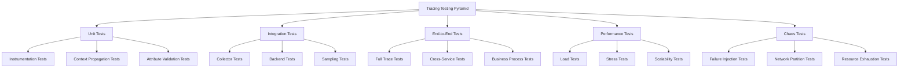

# Automated Testing for Tracing Implementation

This document provides comprehensive guidance on implementing automated testing for distributed tracing in the MCP system.

---

## 1. Overview

### 1.1 Purpose

This guide provides:

- **Testing Strategies**: Comprehensive testing approaches for tracing implementation
- **Test Automation**: Automated testing frameworks and tools
- **Validation Methods**: Techniques for validating tracing data
- **Performance Testing**: Testing tracing system performance
- **Integration Testing**: Testing tracing integration with other systems

### 1.2 Testing Goals

The automated testing for tracing implementation aims to:

- **Validate Correctness**: Ensure tracing data is accurate and complete
- **Test Performance**: Verify tracing system performance meets requirements
- **Check Integration**: Validate integration with other observability components
- **Ensure Reliability**: Verify tracing system reliability and resilience
- **Maintain Quality**: Ensure consistent quality across updates

---

## 2. Testing Strategy

### 2.1 Testing Pyramid



### 2.2 Testing Categories

```yaml
# testing-categories.yaml
testing_categories:
  unit_tests:
    - "Instrumentation validation"
    - "Context propagation testing"
    - "Attribute validation"
    - "Sampling logic testing"
    - "Configuration validation"
    
  integration_tests:
    - "Collector integration"
    - "Backend connectivity"
    - "Data format validation"
    - "Protocol compatibility"
    - "Configuration integration"
    
  end_to_end_tests:
    - "Full trace validation"
    - "Cross-service tracing"
    - "Business process tracing"
    - "Trace completeness"
    - "Trace accuracy"
    
  performance_tests:
    - "Load testing"
    - "Stress testing"
    - "Scalability testing"
    - "Latency testing"
    - "Throughput testing"
    
  chaos_tests:
    - "Failure injection"
    - "Network partitioning"
    - "Resource exhaustion"
    - "Component failure"
    - "Data loss simulation"
```

---

## 3. Unit Testing

### 3.1 Instrumentation Testing

```python
# tests/unit/test_instrumentation.py
import pytest
from opentelemetry import trace
from opentelemetry.sdk.trace import TracerProvider
from opentelemetry.sdk.trace.export import SimpleSpanProcessor, ConsoleSpanExporter
from mcp_tracing.instrumentation import MCPInstrumentation

class TestMCPInstrumentation:
    @pytest.fixture
    def tracer(self):
        """Set up tracer for testing."""
        provider = TracerProvider()
        processor = SimpleSpanProcessor(ConsoleSpanExporter())
        provider.add_span_processor(processor)
        trace.set_tracer_provider(provider)
        return trace.get_tracer(__name__)
    
    @pytest.fixture
    def instrumentation(self):
        """Set up MCP instrumentation."""
        return MCPInstrumentation()
    
    def test_span_creation(self, tracer, instrumentation):
        """Test that spans are created correctly."""
        with tracer.start_as_current_span("test_span") as span:
            span.set_attribute("test.attribute", "test_value")
            assert span.is_recording()
            assert span.name == "test_span"
            assert span.attributes["test.attribute"] == "test_value"
    
    def test_context_propagation(self, tracer, instrumentation):
        """Test that context is propagated correctly."""
        with tracer.start_as_current_span("parent_span") as parent:
            parent.set_attribute("parent.attribute", "parent_value")
            
            with tracer.start_as_current_span("child_span") as child:
                assert child.context.trace_id == parent.context.trace_id
                assert child.parent.span_id == parent.context.span_id
    
    def test_attribute_validation(self, tracer, instrumentation):
        """Test that attributes are validated correctly."""
        with tracer.start_as_current_span("test_span") as span:
            # Test valid attributes
            span.set_attribute("string.attr", "test")
            span.set_attribute("number.attr", 42)
            span.set_attribute("boolean.attr", True)
            
            # Test invalid attributes
            with pytest.raises(ValueError):
                span.set_attribute("invalid.attr", object())
    
    def test_error_handling(self, tracer, instrumentation):
        """Test that errors are handled correctly."""
        with tracer.start_as_current_span("test_span") as span:
            try:
                raise ValueError("Test error")
            except ValueError as e:
                span.record_exception(e)
                assert span.status.status_code == trace.StatusCode.ERROR
```

### 3.2 Context Propagation Testing

```python
# tests/unit/test_context_propagation.py
import pytest
from opentelemetry import trace, context
from opentelemetry.trace.propagation import TraceContextTextMapPropagator
from mcp_tracing.context import MCPContextPropagator

class TestContextPropagation:
    @pytest.fixture
    def propagator(self):
        """Set up MCP context propagator."""
        return MCPContextPropagator()
    
    def test_trace_context_injection(self, propagator):
        """Test that trace context is injected correctly."""
        carrier = {}
        ctx = trace.set_span_in_context(trace.DefaultSpan(trace.INVALID_SPAN_CONTEXT))
        
        propagator.inject(carrier, context=ctx)
        
        assert "traceparent" in carrier
        assert "tracestate" in carrier
    
    def test_trace_context_extraction(self, propagator):
        """Test that trace context is extracted correctly."""
        carrier = {
            "traceparent": "00-12345678901234567890123456789012-1234567890123456-01",
            "tracestate": "key1=value1,key2=value2"
        }
        
        ctx = propagator.extract(carrier)
        
        assert ctx is not None
        span_context = trace.get_current_span(ctx).context
        assert span_context.trace_id == 0x12345678901234567890123456789012
        assert span_context.span_id == 0x1234567890123456
    
    def test_baggage_propagation(self, propagator):
        """Test that baggage is propagated correctly."""
        carrier = {}
        ctx = context.set_baggage("test.key", "test.value")
        
        propagator.inject(carrier, context=ctx)
        
        assert "baggage" in carrier
        assert "test.key=test.value" in carrier["baggage"]
    
    def test_cross_process_propagation(self, propagator):
        """Test that context is propagated across processes."""
        # Simulate HTTP headers
        headers = {}
        ctx = trace.set_span_in_context(trace.DefaultSpan(trace.INVALID_SPAN_CONTEXT))
        
        propagator.inject(headers, context=ctx)
        
        # Extract in different process
        extracted_ctx = propagator.extract(headers)
        
        assert extracted_ctx is not None
        span_context = trace.get_current_span(extracted_ctx).context
        assert span_context.trace_id == trace.get_current_span(ctx).context.trace_id
```

### 3.3 Sampling Testing

```python
# tests/unit/test_sampling.py
import pytest
from mcp_tracing.sampling import MCPSampler

class TestMCPSampler:
    @pytest.fixture
    def sampler(self):
        """Set up MCP sampler."""
        return MCPSampler()
    
    def test_probabilistic_sampling(self, sampler):
        """Test probabilistic sampling."""
        # Test with 100% sampling
        sampler.sampling_rate = 1.0
        assert sampler.should_sample(None, None, None, None, None, None)[0] == trace.SamplingResult.DECISION_RECORD_AND_SAMPLE
        
        # Test with 0% sampling
        sampler.sampling_rate = 0.0
        assert sampler.should_sample(None, None, None, None, None, None)[0] == trace.SamplingResult.DECISION_DROP
    
    def test_rule_based_sampling(self, sampler):
        """Test rule-based sampling."""
        # Add sampling rule
        sampler.add_rule("service.name == 'critical-service'", 1.0)
        
        # Test matching service
        context = {"service.name": "critical-service"}
        result = sampler.should_sample(None, None, None, None, None, context)
        assert result[0] == trace.SamplingResult.DECISION_RECORD_AND_SAMPLE
        
        # Test non-matching service
        context = {"service.name": "normal-service"}
        result = sampler.should_sample(None, None, None, None, None, context)
        assert result[0] == trace.SamplingResult.DECISION_DROP
    
    def test_adaptive_sampling(self, sampler):
        """Test adaptive sampling."""
        # Set up adaptive sampling
        sampler.enable_adaptive_sampling = True
        sampler.target_samples_per_second = 100
        
        # Simulate high traffic
        for i in range(1000):
            sampler.should_sample(None, None, None, None, None, None)
        
        # Check that sampling rate adjusted
        assert sampler.current_sampling_rate < 1.0
    
    def test_sampling_consistency(self, sampler):
        """Test that sampling is consistent for the same trace."""
        trace_id = 123456789
        
        # Test multiple times with same trace ID
        results = []
        for _ in range(10):
            result = sampler.should_sample(trace_id, None, None, None, None, None)
            results.append(result[0])
        
        # All results should be the same
        assert all(r == results[0] for r in results)
```

---

## 4. Integration Testing

### 4.1 Collector Integration Testing

```python
# tests/integration/test_collector_integration.py
import pytest
import requests
import time
from opentelemetry import trace
from opentelemetry.sdk.trace import TracerProvider
from opentelemetry.sdk.trace.export import SimpleSpanProcessor
from mcp_tracing.exporter import MCPExporter

class TestCollectorIntegration:
    @pytest.fixture
    def collector_url(self):
        """Collector URL for testing."""
        return "http://localhost:4318"
    
    @pytest.fixture
    def tracer(self, collector_url):
        """Set up tracer with collector exporter."""
        provider = TracerProvider()
        exporter = MCPExporter(endpoint=f"{collector_url}/v1/traces")
        processor = SimpleSpanProcessor(exporter)
        provider.add_span_processor(processor)
        trace.set_tracer_provider(provider)
        return trace.get_tracer(__name__)
    
    def test_collector_connectivity(self, collector_url):
        """Test that collector is reachable."""
        response = requests.get(f"{collector_url}/health")
        assert response.status_code == 200
    
    def test_trace_export(self, tracer, collector_url):
        """Test that traces are exported to collector."""
        with tracer.start_as_current_span("test_span") as span:
            span.set_attribute("test.attribute", "test_value")
        
        # Wait for export
        time.sleep(1)
        
        # Verify trace was received
        response = requests.get(f"{collector_url}/api/traces")
        assert response.status_code == 200
        traces = response.json()
        assert len(traces) > 0
    
    def test_batch_export(self, tracer, collector_url):
        """Test that batch export works correctly."""
        # Create multiple spans
        for i in range(10):
            with tracer.start_as_current_span(f"test_span_{i}") as span:
                span.set_attribute("span.index", i)
        
        # Wait for export